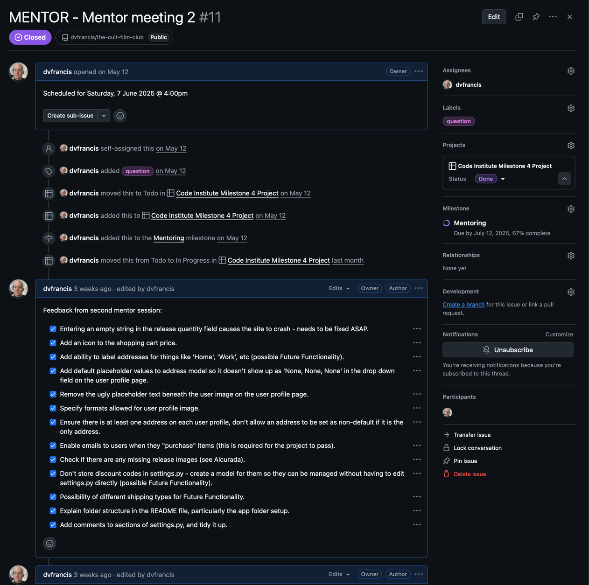
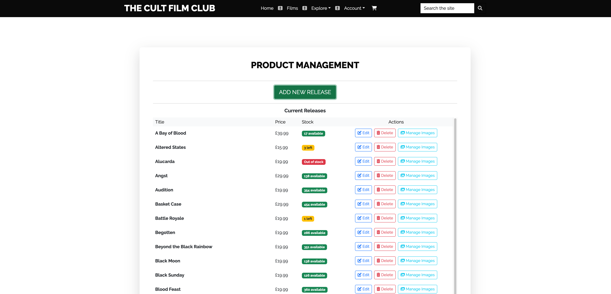
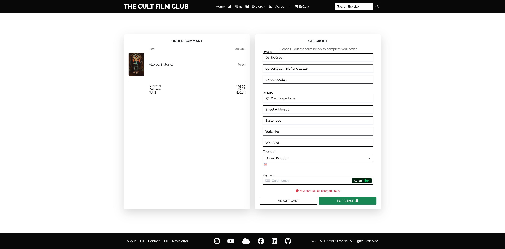

# DRAFT (NOT YET FINALISED)

# The Cult Film Club

## Overview

### Where Physical Media Reigns  

**Rewind the Past. Collect the Future.**  

Streaming might be convenient, but at **The Cult Film Club**, we believe that real movie lovers deserve more than temporary access. Digital films can vanish at the whim of licensing agreements, but physical media? That’s **<u>forever</u>.**  

We’re not just an e-commerce site — we’re a movement dedicated to preserving and celebrating cinema in tangible form. Whether it's obscure horror gems, arthouse oddities, midnight-movie madness, or beloved B-movie classics, **The Cult Film Club** is here to help you build a collection that lasts a lifetime.  

### Why Physical Media?  

With the rise of streaming, countless cult classics remain locked away, inaccessible or lost in the digital shuffle. At **The Cult Film Club**, we believe films should be **owned, not just borrowed** - ensuring that your favourite movies remain in your hands, not in the hands of corporations. No sudden removals. No low-bitrate compression. Just the purest cinematic experience, exactly as it was meant to be seen.

### What We Offer  

- **Curated Selection** – from ultra-rare finds to must-have classics, our shop is packed with DVDs, Blu-rays, and 4K releases tailored for serious collectors and passionate newcomers alike.  
- **Exclusive & Limited Editions** – discover collector’s items with special packaging, and releases you won’t find in mainstream retail stores.  
- **Loyalty Scheme** – The Cult Film Club Card lets you save money, collect points, and exchange them for discounts on future purchases.  
- **Secure Shopping & Fast Delivery** – browse with ease, pay securely, and have your next cinematic obsession delivered straight to your door.  

### Features That Make Collecting Easier  

- **Comprehensive Product Catalogue** – a fully searchable database of cult films with detailed descriptions, pricing, and availability.  
- **User Accounts & Authentication** – secure user registration, customer order management, and “Collector’s Vault” wish-list features.  
- **Streamlined Shopping Experience** – basket management, discount codes, loyalty points, and free shipping on larger orders.  
- **Robust Admin Dashboard** – inventory management, sales tracking, and seamless order fulfilment.  
- **Community Connection** – share your collection and discoveries with fellow fans across social media.  

### Join the Movement  

At its core, **The Cult Film Club** is built on a love of cinema that refuses to conform. Some films transcend simple entertainment; they provoke thought, spark discussion, and earn their place in history. **Physical media ensures that these treasures are never lost to the whims of streaming services.**  

For casual moviegoers curious about diving into the world of cult cinema, **this is your gateway**. For seasoned collectors, **this is your sanctuary**.  

**It’s time to take ownership of the movies you love**  

Welcome to **The Cult Film Club**, where films find their forever home.

### Site Preview


### Site Link

[live site]: https://the-cult-film-club-82f85068dd71.herokuapp.com
Heroku is the host of the [live site].

### GitHub Repository
[here]: https://github.com/dvfrancis/the-cult-film-club
The GitHub repository is [here].

## Index

1. [Overview](#overview)
    1. [Site Preview](#site-preview)
    2. [Site Link](#site-link)
    3. [GitHub Repository](#github-repository)
2. [User Experience Design](#user-experience-design)
    1. [Project Board](#project-board)
    2. [Strategy](#strategy)
        1. [Key Business Goals](#key-business-goals)
        2. [Key User Goals](#key-user-goals)
        3. [User Experience](#user-experience)
        4. [User Expectations](#user-expectations)
        5. [User Stories](#user-stories)
        6. [User Personas](#user-personas)
    3. [Scope](#scope)
        1. [Existing Features](#existing-features)
        2. [Future Features](#future-features)
    4. [Structure](#structure)
        1. [User Flow Diagram](#user-flow-diagram)
        2. [Database Architecture](#database-architecture)
            1. [C R U D Fulfilment](#c-r-u-d-fulfilment)
    5. [Skeleton](#skeleton)
        1. [Wireframes](#wireframes)
            1. [Mobile](#mobile)
            2. [Tablet](#tablet)
            3. [Desktop](#desktop)
    6. [Surface](#surface)
        1. [Colours](#colours)
        2. [Typography](#typography)
        3. [Media](#media)
        4. [Content](#content)
3. [Testing](#testing)
4. [Technologies Used](#technologies-used)
5. [Deployment](#deployment)
    1. [Database Creation](#postgresql-database-creation-and-management)
    2. [Local](#local-deployment)
    3. [Heroku](#heroku-deployment)
6. [Credits and References](#credits-and-references)
7. [Acknowledgements](#acknowledgements)

## User Experience Design

### Project Structure

With this project, I've chosen a non-standard folder structure that I believe is more effective and easier to navigate than the typical Django layout.

All Django apps are organised within a dedicated subfolder named `apps`, inside the main project directory.

This approach keeps the project structure tidy and makes it easier to locate and manage individual apps, resulting in a clearer and more maintainable codebase.

### Project Board

- The entire implementation process was guided through a dedicated GitHub [project board](https://github.com/users/dvfrancis/projects/4). Amongst other things, it was used to track tasks, feature additions, bugs, and user stories.

   <details>
    <summary>Click to view a screenshot of the project board</summary>
            
    
    </details>

- Each task was assigned to a milestone, with relevant labels and [MoSCoW](https://en.wikipedia.org/wiki/MoSCoW_method) categories.
- The MoSCoW project split was as follows:

| Type | Total | % Total |
| --- | --- | --- |
| Must Have | 55 | 60% |
| Should Have | 18 | 20% |
| Could Have | 3 | 3% |
| Won't Have | 5 | 5% |
| Uncategorised | 11 | 12% |
| TOTALS | 92 | 100% |

<details>
  <summary>Click to view a screenshot of a project task</summary>

  
</details>

### Strategy

#### Key Business Goals

- Grow a loyal customer base through brand identity, implementation of a loyalty scheme, and fostering an engaged community.
- Drive revenue through website sales by offering exclusive editions, optimised pricing strategies, and continual expansion of the core product catalogue.
- Improve shopping experience via an easy but secure checkout process, user interface optimisation, and fast and reliable shipping (including free delivery for larger orders, and priority shipping for loyalty scheme members).
- Expand market reach and brand awareness through digital marketing and SEO practices, partnering with film distributors, and building a name in forums, on social media, and in film communities.
- Establish a sustainable business model through streamlined inventory management, cost-effective supply chain, and exploration of subscription models.

#### Key User Goals

- Discover and explore cult films via a curated collection, searchable by keyword / genre / format, learning about individual films through their detailed item information.
- Build a personal collection through purchase and by maintaining a wish-list that can be used to track special editions and other releases.
- Maximise opportunities to earn rewards by making regular purchases and redeeming accumulated reward points.
- Connect with other film enthusiasts by sharing film information on social media, and discovering hidden gems based on user ratings.
- Shop with confidence via a hassle-free checkout experience utilising a secure, reliable payment service.

#### User Experience

- Target audience:
    - Film enthusiasts (aged 18+) who appreciate unconventional, offbeat, and genre-defining films.
    - Users may identify as a cult cinema enthusiast, serious / casual collector, fan of a specific genre, person driven by nostalgia, movie buff, social sharer, member of an alternative subculture communities.
    - May have an interest in rare or limited edition releases.
    - Values physical ownership over digital streaming.
    - Engages in movie discussions, reviews, and fan theories.
 
#### User Expectations

- A carefully curated, but wide, selection of authentic cult films, including rare editions.
- A smooth, engaging, and visually appealing browsing experience with intuitive navigation and comprehensive search / filtering functionality. Product descriptions should be comprehensive and engaging.
- Secure and hassle-free shopping experience with orders processed efficiently via a secure checkout, while being able to easily redeem and track loyalty points balance.
- High-quality physical media, in a wide variety of formats, which are well-packaged (with a focus on film preservation), include bonus content, and have collectible value.
- Community engagement and social features allow users to share discoveries, recommend, and discuss films with others.
- Reliable customer service through responsive support, and efficient handling of returns and refunds. Loyalty card members may also receive exclusive perks and priority assistance.

#### User Stories

##### First time visitor goals

First-time visitors to The Cult Film Club will likely have different goals compared to returning customers or seasoned collectors:

- "What is The Cult Film Club about?”
- "What films are available?"
- “Which films are classed as 'Cult Classics'?”
- "How much do different films cost?"
- “Does the website accept discount codes?”
- "Do I get rewarded for multiple purchases?"
- "How do other users of the site rate the films?"
        
##### Returning visitor goals

Returning visitors to The Cult Film Club will likely have already explored the site, so their goals will be more focused on engagement, purchases, and expanding their collection:
    
- “What new films are available?”
- "Is it possible to bookmark films for later purchase?"
- "How do I share my favourite films wth others?"
- "How do I pay for my purchases?"
- "Where can I see a list of my orders?"
    
##### Frequent visitor goals

Frequent visitors to The Cult Film Club will have more refined goals than first-time or returning visitors. These users are highly engaged and likely see the site as their go-to destination for cult cinema:
    
- "Are there any special, or limited, editions available?"
- "How many loyalty points do I have?"
- "How many copies are available of a particular film?"
- "Can I get priority shipping for my purchase?"
- "Do you have a website newsletter I can join?"

#### User Personas

#### User 1

Male, aged 48, life-long film enthusiast with a deep passion for cult cinema. He owns a large collection of films and wants to better track upcoming releases and items on his wish-list:

“As a dedicated collector, I want to find rare and exclusive releases so that I can expand my collection with unique items.”

##### Acceptance Criteria

- Users can filter products by limited edition, collector’s sets, and special packaging ([see issue #67](https://github.com/dvfrancis/the-cult-film-club/issues/67)).
- Detailed descriptions include bonus features, remastered quality, and exclusive content ([see issue #68](https://github.com/dvfrancis/the-cult-film-club/issues/68)).
- Users receive notifications for pre-orders and restocks of highly sought-after films ([see issue #69](https://github.com/dvfrancis/the-cult-film-club/issues/69)).
    
##### Tasks

- Implement a filtering system for exclusive releases, special packaging, and remastered editions.
- Add detailed information about each release, including bonus features and collector’s notes.
- Set up an email newsletter to inform users of latest releases, and items being restocked.

#### User 2

Female, aged 32, devoted to a specific genre. Frustrated when cult subgenres are ignored and wants better curation for niche categories:

“As a horror/sci-fi/arthouse enthusiast, I want deep-cut recommendations so that I can discover obscure films in my favourite genre.”

##### Acceptance Criteria

- Users can filter by specific subgenres (for example, “Grindhouse”, “Psychological Horror", or “Surreal Sci-Fi”) ([see issue #70](https://github.com/dvfrancis/the-cult-film-club/issues/70)).
- Users can filter films by decade (for example, 1970s) ([see issue #71](https://github.com/dvfrancis/the-cult-film-club/issues/71)).
- Users can sign up to a genre-specific newsletter that highlights rare or obscure films ([see issue #72](https://github.com/dvfrancis/the-cult-film-club/issues/72)).
    
##### Tasks

- Implement a subgenre-based filtering system for deep-cut movie discovery.
- Implement a decade-based filter for users to explore films by era.
- Add ability to select a genre when signing up for the website newsletter.

#### User 3

Male, aged 29, wants to move away from streaming services and embrace physical media. Frustrated when streaming services remove or censor films, but needs educating about formats, restoration quality, and the benefits of physical media:

“As a film collector moving away from streaming, I want to build a physical media library so that I can ensure my favourite movies don’t become unavailable.”

##### Acceptance Criteria

- A “Why Own Physical Media?” section explains the benefits of physical media, over streaming ([see issue #73](https://github.com/dvfrancis/the-cult-film-club/issues/73)).
- Users can browse a “Collector’s Vault” wish-list to track films they plan to own ([see issue #74](https://github.com/dvfrancis/the-cult-film-club/issues/74)).
- Releases highlight whether a film was / has been censored ([see issue #75](https://github.com/dvfrancis/the-cult-film-club/issues/75)).
    
##### Tasks

- Write and design a “Why Own Physical Media?” information page.
- Develop a wish-list system ("Collector’s Vault") for tracking future purchases.
- Ensure film listings clearly highlight where films have been previously censored.

#### User 4

Male, aged 22, loves discussing his favourite films in cult film communities. Wants an easy way to share information to social media, and cheaper pricing options (not interested in collector editions):

“As a social film enthusiast, I want to share my favourite discoveries so that I can introduce my friends to cult cinema.”

##### Acceptance Criteria

- Users can share film listings directly to any social media platform ([see issue #78](https://github.com/dvfrancis/the-cult-film-club/issues/78)).
- Users can rate any film on the website ([see issue #77](https://github.com/dvfrancis/the-cult-film-club/issues/77)).
- Users can sort and filter by film rating ([see issue #76](https://github.com/dvfrancis/the-cult-film-club/issues/76)).
    
##### Tasks

- Implement social media sharing buttons for easy film recommendations.
- Develop a rating system so users can leave feedback. 
- Add filtering / sorting by film rating.

### Scope

#### Existing Features

- All screenshots (unless stated) are from the website's desktop version.

- General

    - The site should be responsive and adapt seamlessly to various screen sizes.
    - The site should include a recognisable favicon displayed in the browser tab. This favicon will also appear alongside the bookmarked link, helping users easily identify the site among other bookmarks.

        <details>
        <summary>Click to view a preview of the site favicon</summary>
            
        
        </details>

#### Base Template

##### base.html

- The `base.html` file contains the site header and footer, and is shared amongst all pages on the site.

- Header
    
    <details>
    <summary>Click to view how the site header appears on a desktop device</summary>
            
    
    </details>

    <details>
    <summary>Click to see how the site header appears on a mobile device</summary>
            
    
    </details>

    - The header stays fixed at the top of the page, giving users continuous access to the navigation bar. This ensures easy site navigation at all times. The high contrast between the header and text improves readability while maintaining a sleek, modern look.
    - The website name is placed in the header, reinforcing the brand's presence and helping users instantly recognize the site.
    - Navigation links are clearly visible, making it simple for visitors to find and explore key sections of the site:
        - *Home* - return to the homepage and access main site features.
        - *Films* - browse and view available films.
        - *Explore* - filter films based on various criteria for better discovery:
            - Rating (Low-High) - sorts films from lowest to highest rating.
            - Rating (High-Low) - sorts films from highest to lowest rating.
            - Price (Low-High) - sorts films from lowest to highest price.
            - Price (High-Low) - sorts films from highest to lowest price.
            - Copies (Low-High) - sorts films by the number of available copies (low-high).
            - Copies (High-Low) - sorts films by the number of available copies (high-low).
            - Director (A-Z) - sorts films alphabetically by director's name.
            - Director (Z-A) - sorts films in reverse alphabetical order by director.
        - *Account* - access account settings and manage user profile:
            - **When logged out**:
                - Register - create a new account to use all aspects of the site.
                - Login - sign in to access user account.
            - **When logged in**:
                - My profile - view and edit user profile details, orders, and wishlist.
                - Logout - sign out of user account for privacy and security.
            - **When a superuser is logged in**:
                - Product management - add, edit, and delete products available on the site.
                - Discount codes - add, edit, and delete user discount codes.
                - My profile - view and edit user profile details, orders, and wishlist.
                - Logout - sign out of user account for privacy and security.

    <details>
    <summary>Click to view the navigation bar when a user is logged in</summary>
            
    
    </details>

- Footer

    <details>
    <summary>Click to view how the site footer appears on a desktop device.</summary>
            
    
    </details>

    <details>
    <summary>Click to see how the site footer appears on a mobile device</summary>
            
    
    </details>

    - The footer stays fixed at the bottom of every screen, always appearing below the site’s content.
    - It includes links to the about, contact, and newsletter signup pages, alongside links to the site's social media properties, and copyright information.

#### Custom Error Pages

##### bad_request.html (400 error page)

- This page handles bad request errors, and renders a custom 400 error page.

    <details>
    <summary>Click to view the 400 error page</summary>
            
    
    </details>

##### permission_denied.html (403 error page)

- This view handles permission denied errors and renders a custom 403 error page.

    <details>
    <summary>Click to view the 403 error page</summary>
            
    
    </details>

##### page_not_found.html (404 error page)

- This page handles 'page not found' errors and renders a custom 404 error page.

    <details>
    <summary>Click to view the 404 error page</summary>
            
    
    </details>

##### server_error.html (500 error page)

- This page handles server errors and renders a custom 500 error page.

    <details>
    <summary>Click to view the 500 error page</summary>
            
    
    </details>

#### Home Page

##### index.html

- The homepage provides an overview of The Cult Film Club store, offering an introduction for new visitors and background information for those unfamiliar with the brand.
- The hero section at the top of the page showcases the latest releases and pre-orders, giving visitors immediate access to new and upcoming films for purchase.
- Further down the page, a curated selection of other available film releases is presented randomly, encouraging exploration of more titles for purchase.

<details>
<summary>Click to view the home page</summary>
            

</details>

#### Film Releases Page

##### releases.html

- The film releases page shows a card grid of all film releases available in the store, which can also be filtered by genre, subgenre, director, and decade of release.
- Each release card shows:
    - Featured image.
    - Title.
    - Site user rating.
    - Director.
    - Year of release.
    - In Stock / Low Stock / Out of Stock (colour coded)
    - Price
- There is also breadcrumb navigation to allow quick navigation between pages of film releases.

<details>
<summary>Click to view the film releases page</summary>
            

</details>

#### Film Release Details Page

##### release_details.html

- Provides details of a specific film release, when that release has been selected.
- It shows:
    - All images, with featured image shown first.
    - Film title.
    - Genre(s) and Subgenre(s)
    - Overall user rating, calculated from all ratings submitted by website users.
    - Price.
    - Total number of copies available (which is colour coded). Stock levels are automatically adjusted upon successful checkout.
    - Quantity to add does not allow a zero to be entered (defaults to one copy) or more copies than are available (defaults to the maximum number of copies available).
    - Description.
    - Special features.
    - Production details.
    - User reviews.
    - Add or adjust user rating (when logged in).
    - Add to wishlist button (when logged in).

<details>
<summary>Click to view the film release details page</summary>
            

</details>

<details>
<summary>Click to view the example of automatic stock level adjustment</summary>
            

</details>

#### Product Management Page

##### product_management.html

- New film releases can be added via the 'Add New Release' button on this page.
- All existing film releases are shown on this page, with associated buttons linking to the edit_release.html, delete_release,html, and manage_images.html pages.

<details>
<summary>Click to view the product management page</summary>
            

</details>

#### Edit Film Release Page

##### edit_release.html

- Film releases can be edited via this page.
- Images associated with film releases are managed separately via the `manage_images.html` page

<details>
<summary>Click to view the film release edit page</summary>
            

</details>

#### Delete Film Release Page

##### delete_release.html

- This confirmation page is shown when selecting a film release to delete. 

<details>
<summary>Click to view the film release deletion page</summary>
            

</details>

#### Manage Film Release Images Page

##### manage_images.html

- Allows film release images to added, edited, and deleted/
- Featured images display a 'Featured' badge to make them easier to identify.
- A 'Delete' button on all images allows them to be removed.

<details>
<summary>Click to view the manage images page</summary>
            

</details>

#### Discount Codes Management Page

##### discount_codes.html

- Only users with superuser privileges are able to access this, and associated, pages.
- It displays information on all discount codes created.
- Each discount code consists of:
    - Discount codeword.
    - Discount percentage.
    - Valid from date.
    - Valid to date.
    - Whether it’s active or not (which is indicated via a colour coded badge).
- You can also add new discount codes via the form on this page.

<details>
<summary>Click to view the discount codes page</summary>
            

</details>

#### Edit Discount Code Page

##### edit_discount_code.html

- Discount codes can be edited via this page.

<details>
<summary>Click to view the discount code edit page</summary>
            

</details>

#### Delete Discount Code Page

##### delete_discount_code.html

- This confirmation page is shown when selecting a discount code to delete. 

<details>
<summary>Click to view the discount code deletion page</summary>
            

</details>

#### Shopping Cart Page

##### cart.html

- The cart shows items selected for purchase, with the ability to increase / decrease the number of items or remove it entirely from the cart.
- Validation on the quantity field prevents users entering a zero (defaults to one copy) or trying to buy more copies than are available (defaults to the maximum number of copies available).
- When removing an item, if it’s the last item in the cart, the user is automatically redirected to the home page.
- The shopping cart shows order item(s):
    - Image.
    - Title.
    - Price.
    - Quantity.
    - Subtotal.
    - Delivery cost.
    - Total.
    - How much more needs to be sent to qualify for free delivery
- Users can also add a valid, active discount code to the order, to receive the associated discount on their order.
- The shopping cart is cleared if the user logs out before checkout, or if the order is successful.

<details>
<summary>Click to view the shopping cart page</summary>
            

</details>

#### Checkout Page

##### checkout.html

- The checkout page is only displayed for logged in users (and a user is prompted to login, if not already, when moving to checkout on an order).
- It shows an order summary, including:
    - Image.
    - Title.
    - Price.
    - Subtotal.
    - Delivery cost.
    - Total.
- User details are automatically completed based on the logged in user’s profile and default address:
    - Name.
    - Email.
    - Telephone number.
    - Address:
        - Street Address 1
        - Street Address 2
        - City.
        - County.
        - Postcode.
        - Country.
- Payment card details are entered via the payment card field.
- The amount to be charged to the user's card is displayed beneath the payment card field.
- Payment is not be processed unless all required fields have been completed, and error messages are shown to highlight any errors.

<details>
<summary>Click to view the checkout page</summary>
            

</details>

#### Checkout Success Page

##### checkout_success.html

- This is displayed when an order has been placed, and payment has been taken.
- It shows:
    - Order number.
    - Order date.
    - Item ordered.
    - Full name.
    - Full address.
    - Order total.
    - Delivery charge (with any discount / discount code).
    - Grand total.

<details>
<summary>Click to view the checkout success page</summary>
            

</details>

#### Order Confirmation Page

##### order_details.html

- When clicking on the link to an order in the user profile account page, a summary of the order is presented showing the following information:
    - Order number.
    - Date of order.
    - Name.
    - Email address.
    - Phone number.
    - Address.
    - Item(s).
    - Subtotal.
    - Delivery cost.
    - Total cost.

<details>
<summary>Click to view the order confirmation page</summary>
            

</details>

#### User Account Page

##### account.html

- This page encompasses several different aspects of the user website experience, and contains the following information:
    - Username as part of the “`<username>`’s Profile” title.
    - Email address.
    - Profile picture.
    - The ability to upload / replace a user profile picture.
- Addresses:
    - Allows users to add multiple addresses, choose between them, and set one as the default (which will appear as the address when ordering an item).
    - Users can also update or delete any chosen address.
- Order history:
    - Displays a list of previous orders with a link to order_details.html to show specific details.
- Wishlist:
    - Shows a list of releases the user has added to their wishlist.
    - Each entry shows the title, any notes added, a priority badge, and the total number in stock.
    - A user can directly add an item (or multiples thereof) by clicking the 'Buy' button (which then removes it from the wishlist).
    - Users can remove an item by clicking the 'Remove' button.
    - There is also a form to be able to add a release directly to the wishlist with any notes and priority.

<details>
<summary>Click to view the user profile page</summary>
            

</details>

#### About Page

##### about.html

- Informational page explaining the advantages of owning physical media and the website’s ethos.

<details>
<summary>Click to view the about page</summary>
            

</details>

#### Contact Page

##### contact_us.html

- Users can contact the website via this contact page.

<details>
<summary>Click to view the contact page</summary>
            

</details>

#### Newsletter Page

##### newsletter.html

- Allows a user to signup to the website newsletter, and specify specific genres of interest, to receive a regular email with content tailored to their tastes.

<details>
<summary>Click to view the newsletter signup page</summary>
            

</details>

#### Newsletter Unsubscribe Page

##### unsubscribe.html

- When a user enters their account email address they will receive an unsubscribe link via email.

<details>
<summary>Click to view the newsletter unsubscribe page</summary>
            

</details>

#### Allauth Pages

- Allauth pages were provided as part o the plugin, but have been styled to fit with the rest of the site.

##### Signup Page

###### signup.html

- Enables a user to create their own account that allows them to access all features of the website.

<details>
<summary>Click to view the signup page</summary>
            

</details>

##### Login Page

###### login.html

- Allows a user to login to the website and access their account, as well as allow them to use all the features of the site. 

<details>
<summary>Click to view the login page</summary>
            

</details>

##### Password Reset Page

###### password_reset.html

- When a user enters their account email address they will receive a password reset link via email.

<details>
<summary>Click to view the password reset page</summary>
            

</details>

##### Logout Page

###### logout.html

- This page logs a user out of their user account.

<details>
<summary>Click to view the logout page</summary>
            

</details>


#### Future Features

- These features were identified as desirable for the site, but were not implemented due to project time constraints.

|Issue|Item|Description|
| ------------- | ------------- | ------------- |
| [#24](https://github.com/dvfrancis/the-cult-film-club/issues/24) | Django admin portal customisation | Adjust the style and content of the portal to fit better with the site |
| [#64](https://github.com/dvfrancis/the-cult-film-club/issues/64) | Newsletter subscriptions | Although the site takes user's details for a newsletter, the newsletter itself is not actually produced so this functionality would be nice to implement |
| [#65](https://github.com/dvfrancis/the-cult-film-club/issues/65) | User forum | Implementing a user forum would help build a sense of community on the site |
| [#86](https://github.com/dvfrancis/the-cult-film-club/issues/86) | Loyalty points | Allow users to collect points when buying items, and then redeem them against future purchases |
| [#89](https://github.com/dvfrancis/the-cult-film-club/issues/89) | Alternative shipping types and providers | Give users the option to choose what type of shipping they'd like and also the shipping provider |

### Structure

#### User Flow Diagram

<details>
<summary>Click to view the user flow diagram</summary>


</details>

Routes through the site can be compulsory or optional, as shown on the user flow diagram.

#### Database Architecture

<details>
<summary>Click to view the entity relationship diagram (ERD)</summary>


</details>

[Figma](https://www.figma.com/) was used to create the ERD, and [PostgreSQL](https://www.postgresql.org) was the database format used for the site. 

#### Data Models

1. **Django User Model**

Django's User model was used for the creation of user accounts (and this is further extended by Profile).

|Description|Key Type|Name|Field Type|Validation|
| ------------- | ------------- | ------------- | ------------- | ------------- |
|Username|Key|`username`|CharField|*Django ensures `username` is unique and limited to 150 characters*
|Password|Key|`password`|CharField|*Django provides built-in validation for `password`, which can be customised via settings.py*
|First Name|Key|`first_name`|CharField|*Django ensures `first_name` is limited to 150 characters*
|Last Name|Key|`last_name`|CharField|*Django ensures `last_name` is limited to 150 characters*
|Email address|Key|`email`|EmailField|*Django provides built-in validation for `email`*

2. **Profile**

This is a custom model that extends Django's User model by adding additional fields.

|Description|Key|Name|Field Type|Validation|
| ------------- | ------------- | ------------- | ------------- | ------------- |
|User|Foreign|`user`|CharField|*Linked to the `User` model, in a one-to-one relationship* `on_delete=models.CASCADE, related_name='profile'`
|Photograph|Key|`photograph`|CloudinaryField|`default='placeholder', blank=True, null=True`

Meta classes used `verbose_name = "Profile", verbose_name_plural = "Profiles"`

3. **Address**

This is a custom model that stores the user's addresses.

|Description|Key|Name|Field Type|Validation|
| ------------- | ------------- | ------------- | ------------- | ------------- |
|User|Foreign|`user`|CharField|*Linked to the `User` model, in a one-to-many relationship* `on_delete=models.CASCADE, related_name='address'`
|First Line|Key|`first_line`|CharField|`max_length=100`
|Second Line|Key|`second_line`|CharField|`max_length=100, blank=True, null=True`
|City|Key|`city`|CharField|`max_length=50`
|County|Key|`county`|CharField|`max_length=50, blank=True, null=True`
|Postcode|Key|`postcode`|CharField|`max_length=10`
|Country|Key|`country`|CountryField|
|Phone Number|Key|`phone_number`|CharField|`max_length=20, blank=True, null=True`
|Default Address|Key|`default_address`|BooleanField|`default=False, blank=True, null=False`
|Label|Key|`label`|CharField|`max_length=15, blank=False, help_text="For example, 'Home' or 'Work'"`

`save` is a custom method that sets all other addresses for this user to `default_address=False` whenever any address's `default_address` is set to True.

Meta classes used `verbose_name = "Address", verbose_name_plural = "Addresses"`

4. **Wishlist**

This is a custom model that stores the user's wishlist items.

|Description|Key|Name|Field Type|Validation|
| ------------- | ------------- | ------------- | ------------- | ------------- |
|User|Foreign|`user`|CharField|*Linked to the `User` model, in a one-to-many relationship* `on_delete=models.CASCADE, related_name='wishlists'`
|Release Title|Foreign|`title`|CharField|*Linked to the `Releases` model, `through='WishlistItem'`, in a many-to-many relationship* `related_name='wishlists'`

Meta classes used `verbose_name = "Wishlist", verbose_name_plural = "Wishlists", constraints = [UniqueConstraint(fields=['user'], name='unique_user_wishlist')]`

5. **WishlistItem**

This is a custom model that acts as an intermediate between the `Wishlist` and `Release` models, and stores additional information about each item added to the wishlist.

|Description|Key|Name|Field Type|Validation|
| ------------- | ------------- | ------------- | ------------- | ------------- |
|Wishlist|Foreign|`wishlist`|CharField|*Linked to the `Wishlist` model, in a many-to-many relationship* `on_delete=models.CASCADE`
|Release Title|Foreign|`title`|CharField|*Linked to the `Releases` model, in a many-to-many relationship* `on_delete=models.CASCADE`
|Date Added|Key|`date_added`|DateTimeField|`auto_now_add=True`
|Notes|Key|`notes`|CKEditor5Field|`max_length=1000, blank=True, null=True`
|Priority|Key|`priority`|CharField|`max_length=10, choices=PriorityLevel.choices, default=PriorityLevel.MEDIUM`
|Purchased?|Key|`is_purchased`|BooleanField|`default=False, verbose_name='Purchased'`

`class PriorityLevel(models.TextChoices):
    HIGH = "High", "High"
    MEDIUM = "Medium", "Medium"
    LOW = "Low", "Low"`

Meta classes used `verbose_name = "Wishlist Item", verbose_name_plural = "Wishlist Items"`

6. **Releases**

This is a custom model that stores details of all films being sold on the site.

|Description|Key|Name|Field Type|Validation|
| ------------- | ------------- | ------------- | ------------- | ------------- |
|Release Title|Key|`title`|CharField|`max_length=100, blank=False, null=False`
|Release Date|Key|`release_date`|DateField|`blank=False, null=False`
|Director|Key|`director`|CharField|`max_length=100, blank=True, null=True`
|Description|Key|`description`|CKEditor5Field|`max_length=1000, blank=True, null=True`
|Genre|Key|`genre`|CharField|`max_length=50, blank=True, null=True`
|Subgenre|Key|`subgenre`|CharField|`max_length=50, blank=True, null=True`
|Resolution|Key|`resolution`|CharField|`max_length=10, blank=True, null=True`
|Special Features|Key|`special_features`|CKEditor5Field|`max_length=2000, blank=True, null=True`
|Edition|Key|`edition`|CharField|`max_length=50, blank=True, null=True`
|Censor Status|Key|`censor_status`|CharField|`max_length=500, blank=True, null=True`
|Packaging|Key|`packaging`|CharField|`max_length=500, blank=True, null=True`
|Copies Available|Key|`copies_available`|IntegerField|`blank=False, null=False, default=0`
|Price|Key|`price`|DecimalField|`max_digits=10, decimal_place=2, blank=False, null=False`

`average_rating` is an additional property calculated from entries of the Rating model, and added to `Releases` using the `@property` syntax.

`featured_image` is an additional property calculated to easily access featured images, and added to `Releases` using the `@property` syntax.

Meta classes used `verbose_name = "Release", verbose_name_plural = "Releases"`

7. **Rating**

This is a custom model that stores film ratings.

|Description|Key|Name|Field Type|Validation|
| ------------- | ------------- | ------------- | ------------- | ------------- |
|User|Foreign|`user`|CharField|*Linked to the `User` model, in a one-to-one relationship* `on_delete=models.CASCADE, related_name='ratings'`
|Release Title|Foreign|`title`|CharField|*Linked to the `Releases` model, in a one-to-one relationship* `on_delete=models.CASCADE, related_name='ratings'`
|Rating|Key|`rating`|IntegerField|`validators=[MinValueValidator(1), MaxValueValidator(5)], blank=False, null=False`
|Review|Key|`review`|CKEditorField|`max_length=1500, blank=True, null=True`
|Date Added|Key|`date_added`|DateTimeField|`auto_now_add=True, blank=False, null=False`

Meta classes used `verbose_name = "Rating", verbose_name_plural = "Ratings", unique_together = (('user', 'title'),)`

8. **Images**

This is a custom model that stores images related to films.

|Description|Key|Name|Field Type|Validation|
| ------------- | ------------- | ------------- | ------------- | ------------- |
|Release Title|Foreign|`title`|CharField|*Linked to the `Releases` model, in a many-to-many relationship* `on_delete=models.CASCADE, related_name='releases'`
|Image|Key|`image`|CloudinaryField|`default='placeholder', blank=True, null=False`
|Caption|Key|`caption`|CharField|`max_length=200, blank=True, null=True`
|Date Added|Key|`date_added`|DateTimeField|`auto_now_add=True, blank=False, null=False`
|Featured Image?|Key|`is_featured`|BooleanField|`verbose_name='Featured Image', default=False, blank=False, null=False`

`save` is a custom method to ensure each release only has one featured image, and that it is set as the default displayed when viewing releases via `releases.html` and `release_details`

Meta classes used `verbose_name = "Image", verbose_name_plural = "Images"`

9. **Order**

This is a custom model representing a customer's order.

|Description|Key|Name|Field Type|Validation|
| ------------- | ------------- | ------------- | ------------- | ------------- |
|Order Number|Key|`order_number`|CharField|`max_length=32, null=False, editable=False, unique=True, help_text="Unique order identifier`
|User Profile|Foreign|`user_profile`|CharField|*Linked to the `Profile` model, in a many-to-one relationship* `on_delete=models.SET_NULL, null=True, blank=True, related_name='orders', help_text="Profile of user who placed the order (optional)"`
|Full Name|Key|`full_name`|CharField|`max_length=50, null=False, blank=False`
|Email|Key|`email`|EmailField|`max_length=254, null=False, blank=False`
|Phone Number|Key|`phone_number`|CharField|`max_length=20, null=False, blank=False`
|Country|Key|`country`|CountryField|`blank_label="Country *", null=False, blank=False
|Postcode|Key|`postcode`|CharField|`max_length=20, null=True, blank=True`
|Town / City|Key|`town_or_city`|CharField|`max_length=40, null=False, blank=False`
|Street Address 1|Key|`street_address1`|CharField|`max_length=80, null=False, blank=False`
|Street Address 2|Key|`street_address2`|CharField|`max_length=80, null=False, blank=False`
|County|Key|`county`|CharField|`max_length=80, null=True, blank=True`
|Date|Key|`date`|DateTimeField|`auto_now_add=True`
|Delivery Cost|Key|`delivery_cost`|DecimalField|`max_digits=6, decimal_places=2, null=False, default=Decimal('0.00')`
|Subtotal|Key|`subtotal`|DecimalField|`max_digits=10, decimal_places=2, null=False, default=Decimal('0.00')`
|Total|Key|`total`|DecimalField|`max_digits=10, decimal_places=2, null=False, default=Decimal('0.00')`
|Original Bag|Key|`original_bag`|TextField|`null=False, blank=False, default=''`
|Stripe PID|Key|`stripe_pid`|CharField|`max_length=254, null=False, blank=False, default='', unique=True, help_text="Stripe Payment Intent ID"`
|Discount|Key|`discount`|DecimalField|`max_digits=6, decimal_places=2, default=Decimal('0.00'), help_text="Discount amount subtracted form total"`
|Discount Code|Key|`discount_code`|CharField|`max_length=50, blank=False, null=True, help_text="Code for applied discount (if any)"`

`_generate_order_number` is a private custom method for automatically generating a random order number.

`update_total` is a custom method for updating subtotal / delivery costs / total when items added to the order.

`save` is a custom method for overriding save to generate an order number, if not set.

10. **OrderLineItem**

This is a custom model that acts as an intermediate between the `Order` and `Release` models, and stores additional information about each item added to an order.

|Description|Key|Name|Field Type|Validation|
| ------------- | ------------- | ------------- | ------------- | ------------- |
|Order|Foreign|`order`|CharField|*Linked to the `Order` model, in a many-to-one relationship* `null=False, blank=False, on_delete=models.CASCADE, related_name='lineitems'`
|Release|Foreign|`release`|CharField|*Linked to the `Release` model, in a many-to-one relationship* `null=False, blank=False, on_delete=models.CASCADE`
|Quantity|Key|`quantity`|PositiveIntegerField|`null=False, blank=False, default=1, help_text="Quantity of this release in the order"
|LineItem Total|Key|`lineitem_total`|DecimalField|`max_digits=6, decimal_places=2, null=False, blank=False, editable-=False, help_text="Total price for this line item (price * quantity)"`

`save` is a custom method for calculating the lineitem total and updating the related order total on save.

11. **DiscountCode**

This is a custom model that stores discount codes.

|Description|Key|Name|Field Type|Validation|
| ------------- | ------------- | ------------- | ------------- | ------------- |
|Code|Key|`code`|CharField|`max_length=50, unique=True`
|Discount Percentage|Key|`percent`|PositiveIntegerField|`help_text="Discount percent (For example, 10 fo 10%)"`
|Valid From|Key|`valid_from`|DateField|`help_text="Start date (DD-MM-YYYY)"`
|Valid To|Key|`valid_to`|DateField|`help_text="End date (DD-MM-YYYY)"`
|Is It Active?|Key|`is_active`|BooleanField|`default=True`

`is_valid` is a custom method for calculating if the discount code is currently valid.

12. **Contact**

This is a custom model that stores messages sent via the site contact form.

|Description|Key|Name|Field Type|Validation|
| ------------- | ------------- | ------------- | ------------- | ------------- |
|Created|Key|`created`|DateTimeField|`auto_now_add=True, help_text="Timestamp when the message was created"`
|First Name|Key|`first_name`|CharField|`max_length=50, blank=False, null=False, help_text="First name of the sender"`
|Last Name|Key|`last_name`|CharField|`max_length=50, blank=False, null=False, help_text="Last name of the sender"`
|Email|Key|`email`|EmailField|`validators=[validate_email], blank=False, null=False, help_text="Email address of the sender"`
|Message|Key|`message`|CKEditor5Field|`max_length=1000, blank=True, null=False, help_text="Message content"`

Meta classes used `verbose_name = "Message", verbose_name_plural = "Messages", ordering = ['-created']`

13. **Newsletter**

This is a custom model that stores email subscriber details.

|Description|Key|Name|Field Type|Validation|
| ------------- | ------------- | ------------- | ------------- | ------------- |
|Email|Key|`email`|EmailField|`unique=True, help_text="Subscriber's email address"`
|Genres|Key|`genres`|CharField|`max_length=500, blank=True, help_text="Comma-separated list of preferred genres"`
|Joining Date|Key|`date_joined`|DateTimeField|`auto_now_add=True, help_text="Timestamp when the subscription was created"`
|Unsubscribe Token|Key|`unsubscribe_token`|UUIDField|`default=uuid.uuid4, editable=False, unique=True, help_text="Token used to securely unsubscribe via email link"`

Meta classes used `verbose_name = "Subscriber", verbose_name_plural = "Subscribers", ordering = ['-date_joined']`

#### C R U D Fulfilment

Shown below is a breakdown of how the website satisfies these requirements:

- Create (C) - add stock item / add an order / user's address
- Read (R) - user account & profile / existing orders / about page / FAQ page / stock items / user's address
- Update (U) - user account & profile / user's wishlist / stock item / user's address
- Delete (D) - user account & profile / wishlist item / stock item / user's address

### Skeleton

#### Wireframes

Initial ideas for wireframes across differently-sized devices are shown below. These are very much initial ideas, and may have changed as the project progressed.

#### Mobile

Click to view the [mobile wireframes](documentation/wireframes/wireframes-mobile.pdf).

#### Tablet

Click to view the [tablet wireframes](documentation/wireframes/wireframes-tablet.pdf).

#### Desktop

Click to view the [desktop wireframes](documentation/wireframes/wireframes-desktop.pdf).

### Surface

For this final project, I chose a minimal design approach, using a limited colour palette, a single font, and a clean, crisp layout. This aesthetic reflects the cult ethos of the website, allowing the content and unique character of each film to stand out without distraction.

The restrained use of colour and simple visual elements create a focused, user-friendly experience that feels both modern and timeless. By prioritising clarity and simplicity, the site remains accessible and visually appealing, ensuring that users can easily browse, discover, and appreciate the curated collection of cult films that form 'The Cult Film Club'.

#### Colours

<details>
<summary>Click to view the website colour scheme</summary>


</details>

- The website colour scheme was taken from the Sarah Renae Clarke Colour Catalogue: Volume 2, colour palette 251:
    - Black (#080808)
    - Crimson (#ca0000)
    - Orange (#ff7900)
    - Amber (#ffb700) 
    - Platinum (#e1e1e3)

- Colours were also divided depending on intended button action:

    - Black for `TBC` / `TBC` / `TBC` actions
    - Crimson for `TBC` / `TBC` / `TBC` actions
    - Orange for `TBC` / `TBC` / `TBC` actions
    - Amber for `TBC` / `TBC` / `TBC` actions
    - Platinum for `TBC` / `TBC` / `TBC` actions

#### Typography

The following font (from [Google Fonts](https://fonts.google.com)) was used for the entire site:
  
- [Raleway](https://fonts.google.com/specimen/Raleway)

# MEDIA / CONTENT NOT YET UPDATED

#### Media

- Images used on the website are stored in, and served from, [Cloudinary](https://cloudinary.com/).

- Images used in the README.md and TESTING.md are stored in the [GitHub repository](https://github.com/dvfrancis/craftr) for this project.

- The site logo was generated using [Artistly](https://artistly.ai/go/) with the following prompt:
    - ```"I need a visually appealing and modern rectangular logo for a digital crafting event called Craftr, with a transparent background. The logo should convey a sense of creativity, innovation, and community, and effectively communicate the event's theme and tone. Please design a logo that incorporates elements of crafting, technology, and fun, and that will appeal to a diverse range of attendees, from hobbyists to professionals. The logo should be scalable, legible, and easy to recognize, even in small sizes. Additionally, the logo should be designed with a color scheme that is limited to the palette #7db657, #0091ac, #753da2, #b40001, #ff8500, #ffc500, and that reflects the playful and creative atmosphere of the event. I don't want a registered or trademark symbol on it. I only want the word Craftr on it and no other text."```

- Instructor images were generated at [This Person Does Not Exist](https://thispersondoesnotexist.com/), a website that uses AI to randomly generate anonymous facial images.

- All other images were sourced from [Deposit Photos](https://depositphotos.com/) for the following parts of the website:

- Background Images:
    - index.html used [Background for handmade and craft ideas](https://depositphotos.com/photo/background-handmade-craft-ideas-212311048.html)
    - diary.html and details.html used [Preparation for the holiday. Gifts wrapped in kraft paper...](https://depositphotos.com/photo/preparation-for-the-holiday-gifts-wrapped-in-kraft-paper-confe-115696836.html)
    - faq.html used [Set of materials for packing holiday gifts. Kraft paper, jute twine, scissors, boxes on white background. Holiday zero waste and eco-friendly concept...](https://depositphotos.com/photo/set-materials-packing-holiday-gifts-kraft-paper-jute-twine-scissors-356425758.html)
    - contact.html used [Rocket craft space toy. Made from felt. Material for children's creativity](https://depositphotos.com/photo/rocket-craft-space-toy-made-felt-material-children-creativity-350095596.html)
    - register.html, login.html, account.html, and update.html used [Woman Making Greeting Cards Elements](https://depositphotos.com/photo/woman-making-greeting-cards-elements-501993588.html)
    - 404.html used [Pile of torn paper pieces isolated](https://depositphotos.com/photo/pile-of-torn-paper-pieces-isolated-119329320.html)
    - 500.html used [Seamstress has made a mistake](https://depositphotos.com/photo/seamstress-has-made-a-mistake-171778606.html)

- Class Images:
    - details.html/4 used [DIY made of colored paper, homemade postcard and scrapbooking tools on green mat for cutting, top view, no hands](https://depositphotos.com/photo/diy-made-colored-paper-homemade-postcard-scrapbooking-tools-green-mat-204041696.html)
    - details.html/5 used [Heap of cloth fabric](https://depositphotos.com/photo/heap-of-cloth-fabric-37163707.html)
    - details.html/6 used [The man is working with laser cutter machine and takes out the...](https://depositphotos.com/photo/the-man-is-working-with-laser-cutter-machine-and-takes-out-the-f-316435016.html)
    - details.html/7 used [Clothes with shopping bags](https://depositphotos.com/illustration/clothes-with-shopping-bags-173885524.html)
    - details.html/8 used [Party animal face stickers](https://depositphotos.com/vector/party-animal-face-stickers-10780069.html)
    - details.html/9 used [Woman embroidering white shirt with colorful threads at wooden table, close-up. Ukrainian national clothes](https://depositphotos.com/photo/woman-embroidering-white-shirt-colorful-threads-wooden-table-closeup-ukrainian-602283612.html)
    - details.html/10 used [Luxury dining table in a restaurant, Arcos de San Miguel, San Miguel de Allende, Guanajuato, Mexico](https://depositphotos.com/editorial/luxury-dining-table-restaurant-arcos-san-miguel-san-miguel-allende-189720010.html)
    - details.html/11 used [Beautiful girl with three-dimensional printer](https://depositphotos.com/photo/beautiful-girl-with-three-dimensional-printer-73995545.html)
    - details.html/12 used [Cropped image of woman adding wooden balloon to scrapbooking postcard cover](https://depositphotos.com/photo/cropped-image-woman-adding-wooden-balloon-scrapbooking-postcard-cover-174748548.html)
    - details.html/13 used [Custom t-shirt. Using heat press to print image of giraffe blowing bubble gum](https://depositphotos.com/photo/custom-shirt-using-heat-press-print-image-giraffe-blowing-bubble-684334190.html)
    - details.html/14 used [A laser engraving machine cuts out a picture on a gold glossy plastic plate. close-up](https://depositphotos.com/photo/laser-engraving-machine-cuts-out-picture-gold-glossy-plastic-plate-362491484.html)
    - details.html/15 used [3D model review](https://depositphotos.com/photo/3d-model-review-5424533.html)
    - details.html/16 used [Business card template](https://depositphotos.com/vector/business-card-template-152005556.html)
    - details.html/18 used [Punch needle. Asian Woman making handmade Hobby knitting in studio workshop. designer workplace Handmade craft project DIY embroidery concept](https://depositphotos.com/photo/punch-needle-asian-woman-making-handmade-hobby-knitting-studio-workshop-665145098.html)
    - details.html/17 used [Man working with leather](https://depositphotos.com/photo/man-working-with-leather-99783124.html)
    - details.html/19 used [Beautiful woman with elegant jewellery on blurred background, close-up](https://depositphotos.com/photo/beautiful-woman-elegant-jewelry-blurred-background-closeup-372701716.html)
    - details.html/20 used [Golden floral decoration with marbles and colorful background](https://depositphotos.com/photo/golden-floral-decoration-marbles-colorful-background-339786702.html)
    - details.html/21 used [Scrapbook craft product handmade](https://depositphotos.com/photo/scrapbook-craft-product-handmade-104769942.html)
    - details.html/22 used [Valentine's day background with wooden heart. Red background](https://depositphotos.com/photo/valentine-day-background-wooden-heart-red-background-437749632.html)

The following images are only used when no class, instructor, or user image has been uploaded:

- Class Placeholder Image - [Craft Room](https://depositphotos.com/photo/craft-room-12770268.html)
- Instructor Placeholder Image - [Collection of characters...](https://depositphotos.com/vector/collection-of-characters-avatars-in-flat-design-style-56330559.html) 
- User Placeholder Image - [Avatars...](https://depositphotos.com/vector/avatars-characters-or-profile-pictures-72611267.html)

#### Content

[Microsoft CoPilot](https://copilot.microsoft.com/) was used to generate initial content, which I then reviewed and refined - making adjustments to ensure it was well-suited to the site’s specific needs and tone.

# TESTING NOT YET UPDATED

## Testing

- Please refer to [TESTING.md](TESTING.md) for details.

# TECH USED NOT YET UPDATED

## Technologies Used

- [HTML](https://en.wikipedia.org/wiki/HTML), [CSS](https://en.wikipedia.org/wiki/CSS), and [JavaScript.](https://en.wikipedia.org/wiki/JavaScript) for page presentation / interaction.
- [Bootstrap](https://en.wikipedia.org/wiki/Bootstrap_(front-end_framework)) for website styling.
- [Python](https://www.python.org/) for website coding.
- [Django](https://www.djangoproject.com/) website framework.
- [PostgreSQL](https://www.postgresql.org/) website database.
- [Google Chrome Developer Tools](https://developer.chrome.com/docs/devtools/) troubleshooting and testing (plus [Lighthouse](https://developer.chrome.com/docs/lighthouse/overview/) feedback on performance).
- [GitHub](https://github.com/) versioning control.
- [Heroku](https://www.heroku.com/) website deployment.
- [Visual Studio Code](https://code.visualstudio.com/) local code editing.
- [Figma](https://www.figma.com/) entity relationship diagram, user flow diagram, and wireframes.
- [Microsoft CoPilot](https://copilot.microsoft.com/) for content ideas and coding advice.
- [Google Fonts](https://fonts.google.com/) fonts.
- [FontAwesome](https://fontawesome.com/) website icons.
- [Markdown](https://en.wikipedia.org/wiki/Markdown) document formatting.
- [Font Joy](https://fontjoy.com/) complementary fonts.
- [Google Chrome](https://www.google.co.uk/chrome/) browser previews and testing.
- [Microsoft Edge](https://www.microsoft.com/en-gb/edge/) browser previews and testing.
- [Firefox](https://www.mozilla.org/en-GB/firefox/new/) browser previews and testing.
- [Opera](https://www.opera.com/) browser previews and testing.
- [Safari](https://www.apple.com/uk/safari/) browser previews and testing.
- [W3C HTML Checker](https://validator.w3.org/) HTML code checker.
- [W3C CSS Checker](https://jigsaw.w3.org/css-validator/) CSS code checker.
- [JSHint](https://jshint.com/) JavaScript code checker.
- [Code Institute Python Linter](https://pep8ci.herokuapp.com/) Python code checker.
- [Web Accessibility Evaluation Tool (WAVE)](https://wave.webaim.org/) website accessibility checker.
- [Responsive Web Design Checker](https://responsivedesignchecker.com/) website responsiveness checker.
- [CSS Tools: Reset CSS](https://meyerweb.com/eric/tools/css/reset/) CSS reset code.
- [Website mock-up Generator](https://websitemockupgenerator.com/) previewing website oon different devices.
- [Deposit Photos](https://depositphotos.com/) images.
- [Sarah Renae Clarke's Colour Catalogue V2](https://sarahrenaeclark.com/color-palettes/) colours.
- [Free Convert WebP Converter](https://www.freeconvert.com/webp-converter) any image to webp converter.
- [Pixillion Image Converter Software](https://www.nchsoftware.com/imageconverter/index.html?theme=webp&kw=webp%20converter&m=e&d=c&c=76691136445782&ag=1227055160311186&msclkid=024126ffbd141fc2bb514100770aa72b&utm_source=bing&utm_medium=cpc&utm_campaign=EN-C1&utm_term=webp%20converter&utm_content=Pixillion%20-%20WebP%20Converter) any image to webp converter.
- [Image Resizer Image Converter](https://imageresizer.com/image-converter) any image to webp converter.
- [Favicon Generator](https://favicon.io/favicon-converter/) favicon generator.
- [Cloudinary](https://cloudinary.com/) image hosting.
- [Artistly AI Image Generator](https://artistly.ai/go/) AI logo and image generator.
- [This Person Does Not Exist](https://thispersondoesnotexist.com/) AI face generator.
- [Beautify](https://marketplace.visualstudio.com/items/?itemName=HookyQR.beautify) Visual Studio Code plugin - code formatting.
- [Code Spell Checker](https://marketplace.visualstudio.com/items/?itemName=streetsidesoftware.code-spell-checker) Visual Studio Code plugin - spelling checker.
- [GitHub Copilot](https://marketplace.visualstudio.com/items/?itemName=GitHub.copilot) Visual Studio Code plugin - AI coding help.
- [Flake8](https://marketplace.visualstudio.com/items/?itemName=ms-python.flake8) Visual Studio Code plugin - Python linting.
- [GoFullPage](https://gofullpage.com/) browser plugin - website previews (not supported by Firefox).
- [Responsive Viewer](https://chromewebstore.google.com/detail/responsive-viewer/inmopeiepgfljkpkidclfgbgbmfcennb?hl=en) browser plugin - responsive design tester.

# DEPLOYMENT NOT YET UPDATED

## Deployment

### PostgreSQL Database Creation and Management

Create a database at [PostgreSQL from Code Institute](https://dbs.ci-dbs.net/); you will be emailed the database URL once this is completed:

<details>
<summary>Click to view step one of database creation</summary>


</details>

<details>
<summary>Click to view step two of database creation</summary>


</details>

<details>
<summary>Click to view step three of database creation</summary>


</details>

This database can be managed at [CI Database Maker](https://dbs.ci-dbs.net/manage/), which gives the option to view further information the databases you've created (it also gives you the option to delete them).

<details>
<summary>Click to view initial login page</summary>


</details>

<details>
<summary>Click to view management informational page</summary>


</details>

### Local deployment

Copy the GitHub repository locally in one of two ways:

1. Download a ZIP file from the GitHub repository page, and extract to a folder on your local computer, or
2. Clone the repository using the `git clone` command followed by the repository clone link; for example:
    - `git clone https://github.com/dvfrancis/craftr.git`

- Once this has been done, open a terminal window and install all requirements using the command:
    - `pip3 install -r requirements.txt`
- In the root of the project folder, create a `.gitignore` file, and add `env.py` and `__pycache__` to protect sensitive data.
- Add the following information to `env.py`:
    
   ```python
    import os

      os.environ['SECRET_KEY'] = 'Add your database secret key'
      os.environ['DATABASE_URL'] = 'Add your database URL'
      os.environ['DEBUG'] = 'Set this to True'
    ```
*While developing leave `DEBUG=True`, but remember to change it to `DEBUG=False` when you deploy your final project*
- Run the following commands to push everything to the database:
    
    ```Python
        python3 manage.py makemigrations
        python3 manage.py migrate
    ```

- Now create the superuser account (completing the necessary information when prompted):
    - `python3 manage.py createsuperuser`
- Run the webserver:
    - `python3 manage.py runserver`
- Ctrl + click (Cmd + Click on a Mac) the link to open the website.
- Add `/admin` to the end of the URL to enter the administration panel. You will need to enter the details for the superuser you created earlier.
- You will now be able to see the admin portal, and add, amend, or delete users.

### Heroku Deployment

- Ensure that you have pushed any changes to your GitHub repository.
- Visit the Heroku [website](https://www.heroku.com/), and create an account (if you don't already have one).
- Login, and create a new app.
- In your local environment create a `Procfile` in the root of your project folder, and add the following to it (remember to push changes to GitHub afterwards):

   ```python
        web: gunicorn <your app name>.wsgi:application
    ```

- Inside your Heroku app, click `Settings`, then click `Reveal Config Vars`, and add the following:

| Key      | Value          |
|-------------|-------------|
| `DISABLE_COLLECTSTATIC` | `1` |
| `DATABASE_URL` | *Your database URL* | 
| `SECRET_KEY` | *Your database secret key* |
| `EMAIL_USER` | *Email address from your email provider* |
| `EMAIL_PASSWORD` | *Email password from your email provider* |

- Ensure that `DATABASE_URL`, `SECRET_KEY`, `EMAIL_USER`, and `EMAIL_PASSWORD` are added to your local `env.py` file in the following format (substituting `KEY` and `VALUE` for the relevant information):
    
    ```Python
        os.environ.setdefault("KEY",("VALUE"))
    ```

- You may also need to add additional key / value pairs if you are using additional services, such as Cloudinary to serve images for your website.
- Migrate changes to your database:

    ```Python
        python3 manage.py makemigrations
        python3 manage.py migrate
    ```
- In `settings.py`, set `DEBUG=False`, and push changes to GitHub.
- In your Heroku app's `Deploy` settings, connect your repository, and click `Deploy Branch` to deploy the app (you can also set it to automatically deploy when changes are made to the repository, if desired).
- You will see the deployment building at the bottom of your Heroku app's `Deploy` settings page.
- When you are ready to finalise your project, set `DEBUG=False` in your local `settings.py` file, and delete `DISABLE_COLLECTSTATIC` from the Heroku app's config variables.
- Commit any changes to GitHub, and deploy from Heroku as before.

# CREDITS / REFS NOT YET UPDATED

## Credits and References

- [Duckett, J. (2011) HTML & CSS Design and Build Websites](https://htmlandcssbook.com/) - Indianapolis: John Wiley & Sons, Inc.
- [Bootstrap Navbar](https://getbootstrap.com/docs/4.0/components/navbar/) for the navigation menus.
- [Bootstrap Grid System](https://getbootstrap.com/docs/5.3/layout/grid/) for layout of pages.
- [Bootstrap Spacing](https://getbootstrap.com/docs/5.3/utilities/spacing/) for element spacing.
- [Codecademy Build Python Web Apps with Django](https://www.codecademy.com/enrolled/paths/build-python-web-apps-with-django).

## Acknowledgements

- Andrew Parton, for helping to convince me to finish this course.
- Juliia Konovalova, for her mentorship on every single one of these projects.
