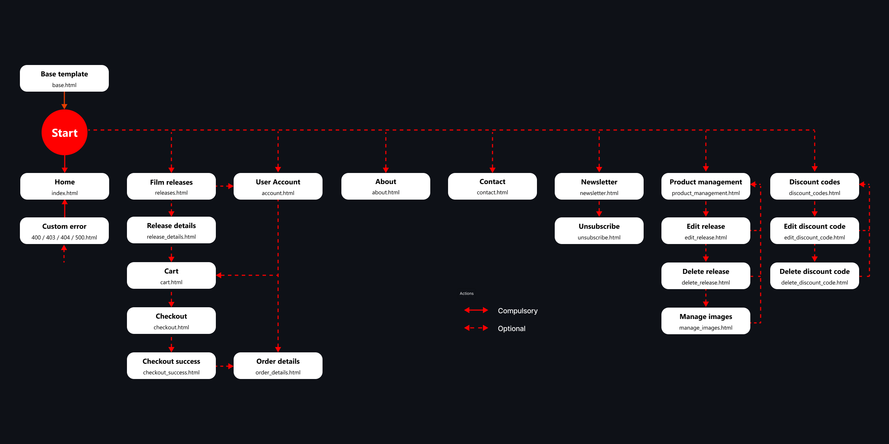

# DRAFT (NOT YET FINALISED)

# The Cult Film Club

## Overview

**The Cult Film Club – A Home for Movie Rebels!**

*Rewind the past. Collect the Future*

The Cult Film Club isn’t just an e-commerce site, it's a sanctuary - dedicated to cult cinema in all its glory. It’s a celebration of the films that defy expectations and build devoted communities, whether it's obscure horror gems, arthouse oddities, midnight-movie madness, or beloved B-movie classics, The Cult Film Club is here to help expand your collection in the best way possible…on physical media, helping to ensure you own a piece of cinematic history.

The website offers:

- **A curated selection** - from ultra-rare finds to must-have classics, our shop is packed with DVDs, Blu-rays, and 4K releases tailored to the serious and not-so-serious collector alike.
- **Exclusive & limited editions** - discover hard-to-find releases, special packaging, and collector’s items that you won’t see in retail stores.
- **The Cult Film Club loyalty card** - save money while you shop with The Cult Film Club loyalty card…collect points to exchange for discounts on any release.
- **Secure shopping & fast delivery** - browse with ease, pay securely, and have your next movie obsession delivered straight to your door.

Key features:

- **Product catalogue and search** - a comprehensive, searchable database of cult films with detailed descriptions, pricing, and availability.
- **User accounts and authentication** - secure user registration and authentication, customer order management, and customer-created "Collector's Vault" watchlist.
- **Shopping cart and checkout** - a streamlined shopping experience with basket management, discount codes, loyalty points, and free shipping for larger orders.
- **Admin dashboard** - robust backend tools for inventory management, sales tracking, and order fulfilment.
- **Community** - users can share selected films to their social media platforms.

**Why The Cult Film Club?**

At its heart, The Cult Film Club is built on the love of cinema that breaks the rules. Some films go beyond simple entertainment - they provoke thought, spark discussion, and find audiences who cherish them for life. We believe that these movies deserve physical collections, not just digital files that might disappear after the next software update.

For casual moviegoers curious about diving into the world of cult cinema, this is your gateway, and for seasoned collectors, this is your treasure trove.

Whether you're hunting down an obscure horror flick, an 80s sci-fi oddity, or a forgotten indie masterpiece, you’ve come to the right place - welcome to The Cult Film Club - where movies find their true fans.

### Site Preview


### Site Link

[live site]: https://the-cult-film-club-82f85068dd71.herokuapp.com
Heroku is the host of the [live site].

### GitHub Repository
[here]: https://github.com/dvfrancis/the-cult-film-club
The GitHub repository is [here].

## Index

1. [Overview](#overview)
    1. [Site Preview](#site-preview)
    2. [Site Link](#site-link)
    3. [GitHub Repository](#github-repository)
2. [User Experience Design](#user-experience-design)
    1. [Project Board](#project-board)
    2. [Strategy](#strategy)
        1. [Key Business Goals](#key-business-goals)
        2. [Key User Goals](#key-user-goals)
        3. [User Experience](#user-experience)
        4. [User Expectations](#user-expectations)
        5. [User Stories](#user-stories)
        6. [User Personas](#user-personas)
    3. [Scope](#scope)
        1. [Existing Features](#existing-features)
        2. [Future Features](#future-features)
    4. [Structure](#structure)
        1. [User Flow Diagram](#user-flow-diagram)
        2. [Database Architecture](#database-architecture)
            1. [C R U D Fulfilment](#c-r-u-d-fulfilment)
    5. [Skeleton](#skeleton)
        1. [Wireframes](#wireframes)
            1. [Mobile](#mobile)
            2. [Tablet](#tablet)
            3. [Desktop](#desktop)
    6. [Surface](#surface)
        1. [Colours](#colours)
        2. [Typography](#typography)
        3. [Media](#media)
        4. [Content](#content)
3. [Testing](#testing)
4. [Technologies Used](#technologies-used)
5. [Deployment](#deployment)
    1. [Database Creation](#postgresql-database-creation-and-management)
    2. [Local](#local-deployment)
    3. [Heroku](#heroku-deployment)
6. [Credits and References](#credits-and-references)
7. [Acknowledgements](#acknowledgements)

## User Experience Design

### Project Board

- A GitHub [project board](https://github.com/users/dvfrancis/projects/6) was used throughout the implementation process to keep track of all project-related tasks, such as adding features, handling bugs, and fulfilling user stories.

   <details>
    <summary>Click to view a screenshot of the project board</summary>
            
    
    </details>

- Each task was categorised with the relevant milestone and labels (including [MoSCoW](https://en.wikipedia.org/wiki/MoSCoW_method) categorisation).
- The MoSCoW prioritisation of all 89 tasks in the project is split as follows:

| Type | Total | % Total |
| --- | --- | --- |
| Must Have | 27 | 30% |
| Should Have | 6 | 7% |
| Could Have | 0 | 0% |
| Won't Have | 4 | 5% |
| Not Categorised | 52 | 58% |
| TOTALS | 89 | 100% |

These figures are well within the usual "60% Must Haves / 20% Should Haves / 20% Could Haves" percentage split.

<details>
  <summary>Click to view a screenshot of a project task</summary>

  
</details>

### Strategy

#### Key Business Goals

- Attract crafters of all levels to participate, learn something new, and share their positive experiences of the event.
- The organisers of the event will see value from increased numbers of people visiting the website, the positive word-of-mouth generated, and more sign-ups to their mailing list.
- The home page will engage visitors' interests, while encouraging them to sign up for one or more of the classes being run across the event.

#### Key User Goals

- The potential to learn a new craft, or something new about a craft with which they are familiar.
- Enjoy a positive and useful experience without having to spend any money.
- Link up with like-minded people through social media, to share their thoughts on the event.

#### User Experience

- Target audience:
    - Anyone 13 or older who enjoys using technology and being creative. 
    - Teenager, student, employed, or retired.
    - Has an interest in arts and crafts.
    - Those with an interest in the potential of taking a hobby and turning it into a source of income.
    - Someone looking for a productive but relaxing way to spend their free time.
 
#### User Expectations

- The website:
    - is intuitive, accessible, responsive, and easy to navigate.
    - has a design that visitors will immediately understand, and be able to use; for example, HTML elements behave in the way most people would expect.
    - contains useful information that will prompt a visitor to sign up for classes.
    - is designed to appeal to those who are creative, and possibly enjoy crafting, and help them feel comfortable and welcome.
    - allows a user to register their details so that they can bookmark or register for interesting classes.

#### User Stories

##### First time visitor goals
    
- "What is Craftr about?”
- “What training is being given?”
- "When do the classes happen?"
- “How do I sign up?”
        
##### Returning visitor goals
    
- “What other classes am I interested in attending?”
- "When is my class due to start?"
- "Where can I keep track of the classes I've signed up for?"
    
##### Frequent visitor goals
    
- “Who running my class?”
- "How do I cancel my class enrolment?"
- "How can I contact the organisers of this event?"

#### User Personas

The website is designed to appeal to all demographics, but the following personas are meant to represent a range of potential users:

- User 1: Female aged 20-50, enthusiast who wants to develop her crafting skills, loves creating things, unsure where to start.
- User 2: Male aged 18-35, looking for a way to relax, enjoys new hobbies, limited knowledge about the subject.
- User 3: Female aged 25-45, looking for free training, enjoys connecting with others, hasn't been able to find many beginner-friendly workshops.

##### User 1

“I really enjoy crafting but I'm not sure how to improve my abilities.”

###### Acceptance Criteria

- Ensure users of all skill levels (beginner to advanced) find suitable classes ([see issue #55](https://github.com/dvfrancis/craftr/issues/55)) .
- Provide an intuitive way to navigate the site and discover content ([see issue #56](https://github.com/dvfrancis/craftr/issues/56)).
- Enable users to create accounts and track enrolments ([see issue #59](https://github.com/dvfrancis/craftr/issues/59)).
    
###### Tasks

- Label each class with its appropriate skill level.
- Design an intuitive navigation menu for easy browsing.
- Develop a user-friendly account creation and class tracking system.
    
##### User 2

“I came across this website by accident, it looks really interesting. Where do I start?”

###### Acceptance Criteria

- Make diverse craft types visible and engaging on the homepage ([see issue #57](https://github.com/dvfrancis/craftr/issues/57)).
- Ensure information is easily accessible for first-time visitors ([see issue #58](https://github.com/dvfrancis/craftr/issues/58)).
- Create an inviting and user-friendly interface ([see issue #57](https://github.com/dvfrancis/craftr/issues/57)).
    
###### Tasks

- Design an engaging homepage that showcases various craft types.
- Ensure class details are prominently displayed and easy to locate.
- Develop a clean and welcoming website layout.

##### User 3

“I'm seeking accessible training courses that I can attend with confidence.”

###### Acceptance Criteria

- Ensure class information is detailed and easily accessible ([see issue #60](https://github.com/dvfrancis/craftr/issues/60)).
- Clearly outline instructor details and course descriptions ([see issue #60](https://github.com/dvfrancis/craftr/issues/60)).
- Make sharing information simple and effective ([see issue #54](https://github.com/dvfrancis/craftr/issues/54)).
    
###### Tasks

- Maintain a well-organized and searchable class directory.
- Provide comprehensive course descriptions, including instructor details.
- Implement easy-to-use social media sharing features.

### Scope

#### Existing Features

- Please note that all screenshots (unless otherwise stated) are taken from the desktop version of the website.

- General
    - The site should adjust to different screen sizes responsively.
    - It should be identifiable via the favicon shown in the browser tab. When bookmarking the site, this favicon appears next to the bookmarked link making it easily recognisable among other bookmarks:

        <details>
        <summary>Click to view the site favicon, in the browser tab</summary>
            
        
        </details>

- Header
    
    <details>
    <summary>Click to view the site header as it appears on a desktop device</summary>
            
    
    </details>

    <details>
    <summary>Click to view the site header as it appears on a mobile device</summary>
            
    
    </details>

    - The header stays fixed to the top of the window, allowing visitors to see the navigation bar at all times. This lets the visitor know where they are (links remain highlighted when that page is currently displayed). The high contrast between the text and the header means it is both stylish and easy to read.
    - The website logo is also shown in the header, reinforcing the site branding in the mind of the visitor.
    - Visible navigation links:
        - *Home* - brings the user to the home page, which has links to register for an account, or see a list of all classes across the event. It also has a 'Featured Classes' section to whet the visitor's appetite.
        - *Classes* - takes the use to a list of classes that are running across the event.
        - *FAQ* - a page of frequently asked questions about the event.
        - *Contact* - allows messages to be sent to the organisers.
        - *Register / Login* (changes to *Account* when a user is logged in) - users can create an account on the site from this page, and then use that account to enrol for particular classes.

    <details>
    <summary>Click to view navigation bar when a user is logged in</summary>
            
    
    </details>

    - Hidden navigation links:
        - *Base Template* - contains the code for the header and the footer and is used by all pages, which helps reduce duplication of code. It is not directly accessible to a website user.
        - *Details* - shown when a user is on the classes page and clicks the 'Details' button. It contains information specific to a chosen class, which is generated automatically from information stored in the database.
        - *Account* - shown when a user has created an account, or logs in successfully. It allows them to view all of their class enrolments, edit their profile, or delete their account.
        - *Update Profile* - shown when a user clicks 'Edit' on their account page. They can update any of the information held about them on the site.
        - *404 Error* - shown when a visitor attempts to access a non-existent page. It is not directly accessible to a website user.
        - *500 Error* - shown when a the web server encounters an problem. It is not directly accessible to a website user.
    
- Footer

    <details>
    <summary>Click to view the site footer as it appears on a desktop device</summary>
            
    
    </details>

    <details>
    <summary>Click to view the site footer as it appears on a mobile device</summary>
            
    
    </details>

    - The footer remains at the bottom of all screens, underneath any website content.
    - It contains copyright information, and also the social media buttons.

- Home (index.html)

    <details>
    <summary>Click to view the home page</summary>
            
    
    </details>

    - The home page gives background on the Craftr event, and acts as an introduction to those who know nothing about it.
    - The hero section at the top of the page includes buttons that take visitors to register for an account or to view the classes that are scheduled during the event.
    - It teases the visitor with a selection of 'Featured Classes' to entice them into registering and enrolling in some of them. 

- Diary of Classes (diary.html)

    <details>
    <summary>Click to view the diary of classes</summary>
            
    
    </details>

    - The diary page lists every class happening during the event, organised by date and time.
    - It encourages visitors to click on a specific class and view it in further detail.

- Class Details (details.html)

    <details>
    <summary>Click to view the class details page</summary>
            
    
    </details>

    - When someone clicks on the 'Details' button on the diary of classes, it brings them to a specific page that gives in-depth information about that particular class. Information includes when the class will run, an indication of difficulty level, and an overview of what will be covered. It also includes information about the instructor of the class, and their biography.
    - When not logged in, the buttons on the page are 'Login' and 'Register' to encourage sign-up. If a user clicks 'Login' it takes them to the login page to enter their username and password and, upon successful login, returns them to the class page to allow them to enrol for the class.
    - If a user clicks 'Register', it takes them to a page to create a new account, before returning them to the class page (to be able to enrol).
    - When logged in, the buttons change to 'Enrol' and 'Back to Diary'.

    <details>
    <summary>Click to view buttons when user is logged in</summary>
            
    
    </details>

    - If a user clicks 'Enrol' their account is updated accordingly (see 'User Account' further down) and the button changes to 'Withdraw', allowing them to change their mind if so desired.

    <details>
    <summary>Click to view buttons when user logged in and enrolled</summary>
            
    
    </details>

- FAQ (faq.html)

    <details>
    <summary>Click to view the faq page</summary>
            
    
    </details>

    - The FAQ page contains commonly asked questions for the event presented in a responsive accordion.
    - If the visitor cannot find an answer, it encourages them to get in touch via the contact page.

- Contact Form (contact.html)

    <details>
    <summary>Click to view the contact page</summary>
            
    
    </details>

    - Incorporates a standard contact form for visitors to send messages to the organisers of the event.
    - When they send a message an email is sent to the organisers automatically with all the details.
    - This information is also stored in the database for later reference, if required.

- User Registration (register.html)

    <details>
    <summary>Click to view the registration page</summary>
            
    
    </details>

    - The user registration page allows a visitor to create an account that they can then use to enrol on specific classes.
    - It asks for name, email, location, and experience level, with the option to add a photograph if they want to. 
    - The website does not allow them to pick a username that conflicts with an existing user.
    - The site also has standard email and password validation, so that only valid information can be entered
    - Once an account has been created, the user is logged in automatically.
    - If another user is already logged in, they are logged out beforehand.
    - If a mistake is made on the form, the user can click 'Clear' to remove any information entered.

- User Login (login.html)

    <details>
    <summary>Click to view the login page</summary>
            
    
    </details>

    - The user login page allows visitors with user accounts to login and view their account and class enrolments.
    - It also has a link for a new user to register an account.

- User Account (account.html)

    <details>
    <summary>Click to view the account page</summary>
            
    
    </details>

    - The user account page displays all of the user's information entered when the account was created.
    - The 'Edit' button takes the user to a screen where they can update any of the personal information stored about them.
    - The 'Delete Account' button allows the user to remove their account entirely. They are asked if they are sure they want to delete their account. If they do, then their account is deleted along with any class enrolments. This button does not appear for accounts with 'superuser' permissions, so that the organisers (who would be superusers) are not accidentally locked out at any time. After the account is deleted they are automatically redirected to the home page.
    - A user can also see a list of all the classes that they're enrolled on.
    - Users can 'Withdraw' from a class, or see 'Details' about any class they have enrolled on, by clicking the corresponding button beneath the enrolment. The list of enrolments updates dynamically if a user withdraws from a class (this can be seen at the bottom of the screenshot above).

- Update User Profile (update_profile.html)

    <details>
    <summary>Click to view the update profile page</summary>
            
    
    </details>

    - The update user profile page allows the user to amend any of the information held about them.
    - If they change their mind, they can click 'Cancel' and be returned to their account page.
    - If they make a mistake on the form, they can click 'Clear' to revert to the information currently stored in the database.

- Error 404 (404.html)

    <details>
    <summary>Click to view the 404 error page</summary>
            
    
    </details>

    - This page is displayed if a visitor attempts to navigate to a non-existent page.
    - It contains buttons to go to the home page, or return to whatever page they were previously viewing.
    - The visitor is also still able to click on any of the other navigation buttons to take them somewhere else.

- Error 500 (500.html)

    <details>
    <summary>Click to view the 500 error page</summary>
            
    
    </details>

    - This page is displayed if there is an internal server error.
    - It contains buttons to go to the home page, or return to whatever page they were previously viewing.
    - The visitor is also still able to click on any of the other navigation buttons to take them somewhere else.

#### Future Features

- This is a list of features that would have been nice to include in this project, but were not due to time constraints.

|Issue|Item|Description|
| ------------- | ------------- | ------------- |
| [#85](https://github.com/dvfrancis/craftr/issues/85) | Instructor portal | Add the ability for instructors to create and edit classes |
| [#86](https://github.com/dvfrancis/craftr/issues/86) | Premium classes | Add the ability to create premium paid classes that people could opt in to through a monetary purchase (which would require the ability to take payments) |
| [#66](https://github.com/dvfrancis/craftr/issues/66) | Customise the Django administration portal| Update the admin portal to match the style of the site |
| [#19](https://github.com/dvfrancis/craftr/issues/19) | JavaScript logic flowcharts| If the site were to expand with further features then it would probably require more JavaScript and, therefore, process breakdowns |

### Structure

#### User Flow Diagram

<details>
<summary>Click to view the user flow diagram</summary>


</details>

User routes through the site have been plotted as a user flow diagram; pathways can be compulsory or optional, which is shown on the diagram.

#### Database Architecture

<details>
<summary>Click to view the entity relationship diagram (ERD)</summary>


</details>

PostgreSQL was used to store the database for the site, and the ERD was created using [Figma](https://www.figma.com/).

#### Data Models

1. **User**

Django's User model was used for the creation of user accounts (and is extended by UserProfile). It is not a requirement for account creation that the email be confirmed.

|Description|Key Type|Name|Field Type|Validation|
| ------------- | ------------- | ------------- | ------------- | ------------- |
|Username|Key|`username`|CharField|*Django ensures `username` is unique and limited to 150 characters*
|Password|Key|`password`|CharField|*Django provides built-in validation for `password`, which can be customised via settings.py*
|First Name|Key|`first_name`|CharField|*Django ensures `first_name` is limited to 150 characters*
|Last Name|Key|`last_name`|CharField|*Django ensures `last_name` is limited to 150 characters*
|Email address|Key|`email`|EmailField|*Django provides built-in validation for `email`*

2. **UserProfile**

Custom model that extends Django's User model by adding site-specific fields.

|Description|Key|Name|Field Type|Validation|
| ------------- | ------------- | ------------- | ------------- | ------------- |
|Username|Foreign|`username`|CharField|*Linked to the `User` model, in a 1-2-1 relationship*
|Location|Key|`location`|CharField|`max_length=100`. Field required through validation by `def clean(self)`
|Experience Level|Key|`experience`|ChoiceField|`choices=EXPERIENCE_CHOICES, default=BEGINNER, max_length=12`. Field required through validation by `def clean(self)`
|User Photograph|Key|`photograph`|CloudinaryField|`default='placeholder', blank=True, null=True`

```Python
# Define the choices for experience levels
BEGINNER = 'Beginner'
INTERMEDIATE = 'Intermediate'
ADVANCED = 'Advanced'

EXPERIENCE_CHOICES = [
    (BEGINNER, 'Beginner'),
    (INTERMEDIATE, 'Intermediate'),
    (ADVANCED, 'Advanced'),
]
```

3. **EventDay**

Custom model that stores the days on which the event runs. `Class Meta` options ensure the day title is unique regardless of case sensitivity.

|Description|Key|Name|Field Type|Validation|
| ------------- | ------------- | ------------- | ------------- | ------------- |
|Unique Field|Primary|`id`|AutoField|`primary_key=true` (the model had a conflict with the built-in primary key, so I added this as an alternative)
|Date|Foreign|`day_date`|DateField|*Linked to the `EventClass` model, in a one-to-many relationship*. Field required through validation by `def clean(self)`
|Title|Key|`day_title`|CharField|`max_length=100, unique=True`. Field required through validation by `def clean(self)`
|Description|Key|`day_description`|TextField|

4. **EventClass**

Custom model that lists the classes that run across the entire event. `Class Meta` options ensure that multiple classes cannot be scheduled at the same time.

|Description|Key|Name|Field Type|Validation|
| ------------- | ------------- | ------------- | ------------- | ------------- |
|Date|Foreign|`event_day`|DateField|*Linked to the `EventDay` model, in a many-to-one relationship*
|Start Time|Key|`start_time`|TimeField|`start_time` cannot be later than `end_time` as validated by `def clean(self)`
|End Time|Key|`end_time`|TimeField|
|Title|Key|`class_title`|CharField|`max_length=100`
|Description|Key|`class_description`|TextField|
|Difficulty|Key|`difficulty`|ChoiceField|`choices=DIFFICULTY_CHOICES, default=BEGINNER, max_length=12`
|Image|Key|`class_image`|CloudinaryField|`default='class_placeholder', blank=True, null=True`
|Instructor|Key|`instructor`|CharField|`max_length=100`
|Instructor Photo|Key|`instructor_photo`|CloudinaryField|`default='instructor_placeholder', blank=True, null=True`
|Instructor Biography|Key|`instructor_bio`|TextField|

```Python
# Define the choices for difficulty levels
BEGINNER = 'Beginner'
INTERMEDIATE = 'Intermediate'
ADVANCED = 'Advanced'

DIFFICULTY_CHOICES = [
    (BEGINNER, 'Beginner'),
    (INTERMEDIATE, 'Intermediate'),
    (ADVANCED, 'Advanced'),
]
```
5. **Enrolment**

Custom model that tracks which classes different users are enrolled upon. `Class Meta` options ensure users cannot enrol on the same class multiple times.

|Description|Key|Name|Field Type|Validation|
| ------------- | ------------- | ------------- | ------------- | ------------- |
|Username|Foreign|`username`|CharField|*Linked to the `User` model, in a many-to-one relationship* `on_delete=models.CASCADE, related_name="enrol_status"`
|Class Title|Foreign|`class_title`|TextField|*Linked to the `EventClass` model, in a many-to-one relationship* `on_delete=models.CASCADE, related_name="enrolments"`

6. **Contact**

Custom model that stores any messages sent through the contact form, for later reference.

|Description|Key|Name|Field Type|Validation|
| ------------- | ------------- | ------------- | ------------- | ------------- |
|First Name|Key|`first_name`|CharField|`max_length=100`
|Last Name|Key|`last_name`|CharField|`max_length=100`
|Email|Key|`email`|EmailField|*Django provides built-in validation for `email`*
|Message|Key|`message`|TextField|
|Creation Date/Time|Key|`created_at`|DateTimeField|`auto_now_add=True`

#### C R U D Fulfilment

In it's current form, the classes scheduled during the event are only editable via the admin portal, by an account with superuser privileges.

However, the website still satisfies full Create (C), Read (R), Update (U), and Delete (D) functionality, in the following ways:

- C - Create a user account / Create a class enrolment
- R - Read the list of classes available / Read changes to a user profile / Read class enrolments on a user's account page
- U - Update user profile details
- D - Delete a user account (and associated user profile) / Delete a course enrolment

### Skeleton

#### Wireframes

The wireframe designs shown below were my initial ideas for each page of the website (listed by device type). They have changed in a few ways during implementation; for example, the 'Diary' menu link is now called 'Classes'.

#### Mobile

##### Home

<details>
<summary>Click to view the mobile device home wireframe</summary>


</details>

##### Classes

<details>
<summary>Click to view the mobile device classes wireframe</summary>


</details>

##### Class Details

<details>
<summary>Click to view the mobile device class details wireframe</summary>


</details>

##### FAQ

<details>
<summary>Click to view the mobile device faq wireframe</summary>


</details>

##### Contact

<details>
<summary>Click to view the mobile device contact wireframe</summary>


</details>

##### User Registration

<details>
<summary>Click to view the mobile device user registration wireframe</summary>


</details>

##### User Login

<details>
<summary>Click to view the mobile device user login wireframe</summary>


</details>

##### User Account

<details>
<summary>Click to view the mobile device user account wireframe</summary>


</details>

##### Update User Profile

<details>
<summary>Click to view the mobile device update user profile wireframe</summary>


</details>

##### 404 HTTP Error

<details>
<summary>Click to view the mobile device custom error wireframe</summary>


</details>

##### 500 HTTP Error

<details>
<summary>Click to view the mobile device server error wireframe</summary>


</details>

#### Tablet

##### Home

<details>
<summary>Click to view the tablet device home wireframe</summary>


</details>

##### Classes

<details>
<summary>Click to view the tablet device classes wireframe</summary>


</details>

##### Class Details

<details>
<summary>Click to view the tablet device class details wireframe</summary>


</details>

##### FAQ

<details>
<summary>Click to view the tablet device faq wireframe</summary>


</details>

##### Contact

<details>
<summary>Click to view the tablet device contact wireframe</summary>


</details>

##### User Registration

<details>
<summary>Click to view the tablet device user registration wireframe</summary>


</details>

##### User Login

<details>
<summary>Click to view the tablet device user login wireframe</summary>


</details>

##### User Account

<details>
<summary>Click to view the tablet device user account wireframe</summary>


</details>

##### Update User Profile

<details>
<summary>Click to view the tablet device update user profile wireframe</summary>


</details>

##### 404 HTTP Error

<details>
<summary>Click to view the tablet device custom error wireframe</summary>


</details>

##### 500 HTTP Error

<details>
<summary>Click to view the tablet device server error wireframe</summary>


</details>

#### Desktop

##### Home

<details>
<summary>Click to view the desktop device home wireframe</summary>


</details>

##### Classes

<details>
<summary>Click to view the desktop device classes wireframe</summary>


</details>

##### Class Details

<details>
<summary>Click to view the desktop device class details wireframe</summary>


</details>

##### FAQ

<details>
<summary>Click to view the desktop device faq wireframe</summary>


</details>

##### Contact

<details>
<summary>Click to view the desktop device contact wireframe</summary>


</details>

##### User Registration

<details>
<summary>Click to view the desktop device user registration wireframe</summary>


</details>

##### User Login

<details>
<summary>Click to view the desktop device user login wireframe</summary>


</details>

##### User Account

<details>
<summary>Click to view the desktop device user account wireframe</summary>


</details>

##### Update User Profile

<details>
<summary>Click to view the desktop device update user profile wireframe</summary>


</details>

##### 404 HTTP Error

<details>
<summary>Click to view the desktop device custom error wireframe</summary>


</details>

##### 500 HTTP Error

<details>
<summary>Click to view the desktop device server error wireframe</summary>


</details>

### Surface

#### Colours

<details>
<summary>Click to view the website colour scheme</summary>


</details>

- Website colours were inspired by the Sarah Renae Clarke Colour Catalogue (Volume 2), card 390:
    - Apple Green (#7db657) - this was darkened to #2e6b05, later in the project, due to poor colour contrast
    - Mint (#0091ac) - this was darkened to #006274, later in the project, due to poor colour contrast
    - Royal Purple (#753da2)
    - Crimson (#b40001) 
    - Orange (#ff8500) - this was darkened to #a55500, later in the project, due to poor colour contrast
    - Gold (#ffc500)

- Other colours used:

    - Off-White (#fafafa)
    - Off-Black (#191945)

- For buttons, colours were divided depending on intended action:

    - Apple Green for `Save` / `Register` / `Submit` / `Enrol` actions
    - Royal Purple for `Edit` / `Details` / `Home` / `Diary` / `Login` actions
    - Mint for `Clear` actions
    - Orange for `Logout` / `Withdraw` actions
    - Crimson for `Reset` / `Delete` / `Cancel` / `Go Back` actions

#### Typography

All fonts were sourced from Google Fonts, and were used as follows:
  
- h1 tags - [Montserrat](https://fonts.google.com/specimen/Montserrat)
- h2 and h3 tags - [Lora](https://fonts.google.com/specimen/Lora)
- body and p tags - [Hind Madurai](https://fonts.google.com/specimen/Hind+Madurai)

#### Media

- Images used on the website are stored in, and served from, [Cloudinary](https://cloudinary.com/).

- Images used in the README.md and TESTING.md are stored in the [GitHub repository](https://github.com/dvfrancis/craftr) for this project.

- The site logo was generated using [Artistly](https://artistly.ai/go/) with the following prompt:
    - ```"I need a visually appealing and modern rectangular logo for a digital crafting event called Craftr, with a transparent background. The logo should convey a sense of creativity, innovation, and community, and effectively communicate the event's theme and tone. Please design a logo that incorporates elements of crafting, technology, and fun, and that will appeal to a diverse range of attendees, from hobbyists to professionals. The logo should be scalable, legible, and easy to recognize, even in small sizes. Additionally, the logo should be designed with a color scheme that is limited to the palette #7db657, #0091ac, #753da2, #b40001, #ff8500, #ffc500, and that reflects the playful and creative atmosphere of the event. I don't want a registered or trademark symbol on it. I only want the word Craftr on it and no other text."```

- Instructor images were generated at [This Person Does Not Exist](https://thispersondoesnotexist.com/), a website that uses AI to randomly generate anonymous facial images.

- All other images were sourced from [Deposit Photos](https://depositphotos.com/) for the following parts of the website:

- Background Images:
    - index.html used [Background for handmade and craft ideas](https://depositphotos.com/photo/background-handmade-craft-ideas-212311048.html)
    - diary.html and details.html used [Preparation for the holiday. Gifts wrapped in kraft paper...](https://depositphotos.com/photo/preparation-for-the-holiday-gifts-wrapped-in-kraft-paper-confe-115696836.html)
    - faq.html used [Set of materials for packing holiday gifts. Kraft paper, jute twine, scissors, boxes on white background. Holiday zero waste and eco-friendly concept...](https://depositphotos.com/photo/set-materials-packing-holiday-gifts-kraft-paper-jute-twine-scissors-356425758.html)
    - contact.html used [Rocket craft space toy. Made from felt. Material for children's creativity](https://depositphotos.com/photo/rocket-craft-space-toy-made-felt-material-children-creativity-350095596.html)
    - register.html, login.html, account.html, and update.html used [Woman Making Greeting Cards Elements](https://depositphotos.com/photo/woman-making-greeting-cards-elements-501993588.html)
    - 404.html used [Pile of torn paper pieces isolated](https://depositphotos.com/photo/pile-of-torn-paper-pieces-isolated-119329320.html)
    - 500.html used [Seamstress has made a mistake](https://depositphotos.com/photo/seamstress-has-made-a-mistake-171778606.html)

- Class Images:
    - details.html/4 used [DIY made of colored paper, homemade postcard and scrapbooking tools on green mat for cutting, top view, no hands](https://depositphotos.com/photo/diy-made-colored-paper-homemade-postcard-scrapbooking-tools-green-mat-204041696.html)
    - details.html/5 used [Heap of cloth fabric](https://depositphotos.com/photo/heap-of-cloth-fabric-37163707.html)
    - details.html/6 used [The man is working with laser cutter machine and takes out the...](https://depositphotos.com/photo/the-man-is-working-with-laser-cutter-machine-and-takes-out-the-f-316435016.html)
    - details.html/7 used [Clothes with shopping bags](https://depositphotos.com/illustration/clothes-with-shopping-bags-173885524.html)
    - details.html/8 used [Party animal face stickers](https://depositphotos.com/vector/party-animal-face-stickers-10780069.html)
    - details.html/9 used [Woman embroidering white shirt with colorful threads at wooden table, closeup. Ukrainian national clothes](https://depositphotos.com/photo/woman-embroidering-white-shirt-colorful-threads-wooden-table-closeup-ukrainian-602283612.html)
    - details.html/10 used [Luxury dining table in a restaurant, Arcos de San Miguel, San Miguel de Allende, Guanajuato, Mexico](https://depositphotos.com/editorial/luxury-dining-table-restaurant-arcos-san-miguel-san-miguel-allende-189720010.html)
    - details.html/11 used [Beautiful girl with three-dimensional printer](https://depositphotos.com/photo/beautiful-girl-with-three-dimensional-printer-73995545.html)
    - details.html/12 used [Cropped image of woman adding wooden balloon to scrapbooking postcard cover](https://depositphotos.com/photo/cropped-image-woman-adding-wooden-balloon-scrapbooking-postcard-cover-174748548.html)
    - details.html/13 used [Custom t-shirt. Using heat press to print image of giraffe blowing bubble gum](https://depositphotos.com/photo/custom-shirt-using-heat-press-print-image-giraffe-blowing-bubble-684334190.html)
    - details.html/14 used [A laser engraving machine cuts out a picture on a gold glossy plastic plate. Closeup](https://depositphotos.com/photo/laser-engraving-machine-cuts-out-picture-gold-glossy-plastic-plate-362491484.html)
    - details.html/15 used [3D model review](https://depositphotos.com/photo/3d-model-review-5424533.html)
    - details.html/16 used [Business card template](https://depositphotos.com/vector/business-card-template-152005556.html)
    - details.html/18 used [Punch needle. Asian Woman making handmade Hobby knitting in studio workshop. designer workplace Handmade craft project DIY embroidery concept](https://depositphotos.com/photo/punch-needle-asian-woman-making-handmade-hobby-knitting-studio-workshop-665145098.html)
    - details.html/17 used [Man working with leather](https://depositphotos.com/photo/man-working-with-leather-99783124.html)
    - details.html/19 used [Beautiful woman with elegant jewelry on blurred background, closeup](https://depositphotos.com/photo/beautiful-woman-elegant-jewelry-blurred-background-closeup-372701716.html)
    - details.html/20 used [Golden floral decoration with marbles and colorful background](https://depositphotos.com/photo/golden-floral-decoration-marbles-colorful-background-339786702.html)
    - details.html/21 used [Scrapbook craft product handmade](https://depositphotos.com/photo/scrapbook-craft-product-handmade-104769942.html)
    - details.html/22 used [Valentine's day background with wooden heart. Red background](https://depositphotos.com/photo/valentine-day-background-wooden-heart-red-background-437749632.html)

The following images are only used when no class, instructor, or user image has been uploaded:

- Class Placeholder Image - [Craft Room](https://depositphotos.com/photo/craft-room-12770268.html)
- Instructor Placeholder Image - [Collection of characters...](https://depositphotos.com/vector/collection-of-characters-avatars-in-flat-design-style-56330559.html) 
- User Placeholder Image - [Avatars...](https://depositphotos.com/vector/avatars-characters-or-profile-pictures-72611267.html)

#### Content

[Microsoft CoPilot](https://copilot.microsoft.com/) was used to generate initial content, which I then reviewed and refined - making adjustments to ensure it was well-suited to the site’s specific needs and tone.

## Testing

- Please refer to [TESTING.md](TESTING.md) for details.

## Technologies Used

- [HTML](https://en.wikipedia.org/wiki/HTML), [CSS](https://en.wikipedia.org/wiki/CSS), and [JavaScript.](https://en.wikipedia.org/wiki/JavaScript) for page presentation / interaction.
- [Bootstrap](https://en.wikipedia.org/wiki/Bootstrap_(front-end_framework)) for website styling.
- [Python](https://www.python.org/) for website coding.
- [Django](https://www.djangoproject.com/) website framework.
- [PostgreSQL](https://www.postgresql.org/) website database.
- [Google Chrome Developer Tools](https://developer.chrome.com/docs/devtools/) troubleshooting and testing (plus [Lighthouse](https://developer.chrome.com/docs/lighthouse/overview/) feedback on performance).
- [GitHub](https://github.com/) versioning control.
- [Heroku](https://www.heroku.com/) website deployment.
- [Visual Studio Code](https://code.visualstudio.com/) local code editing.
- [Figma](https://www.figma.com/) entity relationship diagram, user flow diagram, and wireframes.
- [Microsoft CoPilot](https://copilot.microsoft.com/) for content ideas and coding advice.
- [Google Fonts](https://fonts.google.com/) fonts.
- [FontAwesome](https://fontawesome.com/) website icons.
- [Markdown](https://en.wikipedia.org/wiki/Markdown) document formatting.
- [Font Joy](https://fontjoy.com/) complementary fonts.
- [Google Chrome](https://www.google.co.uk/chrome/) browser previews and testing.
- [Microsoft Edge](https://www.microsoft.com/en-gb/edge/) browser previews and testing.
- [Firefox](https://www.mozilla.org/en-GB/firefox/new/) browser previews and testing.
- [Opera](https://www.opera.com/) browser previews and testing.
- [Safari](https://www.apple.com/uk/safari/) browser previews and testing.
- [W3C HTML Checker](https://validator.w3.org/) HTML code checker.
- [W3C CSS Checker](https://jigsaw.w3.org/css-validator/) CSS code checker.
- [JSHint](https://jshint.com/) JavaScript code checker.
- [Code Institute Python Linter](https://pep8ci.herokuapp.com/) Python code checker.
- [Web Accessibility Evaluation Tool (WAVE)](https://wave.webaim.org/) website accessibility checker.
- [Responsive Web Design Checker](https://responsivedesignchecker.com/) website responsiveness checker.
- [CSS Tools: Reset CSS](https://meyerweb.com/eric/tools/css/reset/) CSS reset code.
- [Website Mockup Generator](https://websitemockupgenerator.com/) previewing website oon different devices.
- [Deposit Photos](https://depositphotos.com/) images.
- [Sarah Renae Clarke's Colour Catalogue V2](https://sarahrenaeclark.com/color-palettes/) colours.
- [Free Convert WebP Converter](https://www.freeconvert.com/webp-converter) any image to webp converter.
- [Pixillion Image Converter Software](https://www.nchsoftware.com/imageconverter/index.html?theme=webp&kw=webp%20converter&m=e&d=c&c=76691136445782&ag=1227055160311186&msclkid=024126ffbd141fc2bb514100770aa72b&utm_source=bing&utm_medium=cpc&utm_campaign=EN-C1&utm_term=webp%20converter&utm_content=Pixillion%20-%20WebP%20Converter) any image to webp converter.
- [Image Resizer Image Converter](https://imageresizer.com/image-converter) any image to webp converter.
- [Favicon Generator](https://favicon.io/favicon-converter/) favicon generator.
- [Cloudinary](https://cloudinary.com/) image hosting.
- [Artistly AI Image Generator](https://artistly.ai/go/) AI logo and image generator.
- [This Person Does Not Exist](https://thispersondoesnotexist.com/) AI face generator.
- [Beautify](https://marketplace.visualstudio.com/items/?itemName=HookyQR.beautify) Visual Studio Code plugin - code formatting.
- [Code Spell Checker](https://marketplace.visualstudio.com/items/?itemName=streetsidesoftware.code-spell-checker) Visual Studio Code plugin - spelling checker.
- [GitHub Copilot](https://marketplace.visualstudio.com/items/?itemName=GitHub.copilot) Visual Studio Code plugin - AI coding help.
- [Flake8](https://marketplace.visualstudio.com/items/?itemName=ms-python.flake8) Visual Studio Code plugin - Python linting.
- [GoFullPage](https://gofullpage.com/) browser plugin - website previews (not supported by Firefox).
- [Responsive Viewer](https://chromewebstore.google.com/detail/responsive-viewer/inmopeiepgfljkpkidclfgbgbmfcennb?hl=en) browser plugin - responsive design tester.

## Deployment

### PostgreSQL Database Creation and Management

Create a database at [PostgreSQL from Code Institute](https://dbs.ci-dbs.net/); you will be emailed the database URL once this is completed:

<details>
<summary>Click to view step one of database creation</summary>


</details>

<details>
<summary>Click to view step two of database creation</summary>


</details>

<details>
<summary>Click to view step three of database creation</summary>


</details>

This database can be managed at [CI Database Maker](https://dbs.ci-dbs.net/manage/), which gives the option to view further information the databases you've created (it also gives you the option to delete them).

<details>
<summary>Click to view initial login page</summary>


</details>

<details>
<summary>Click to view management informational page</summary>


</details>

### Local deployment

Copy the GitHub repository locally in one of two ways:

1. Download a ZIP file from the GitHub repository page, and extract to a folder on your local computer, or
2. Clone the repository using the `git clone` command followed by the repository clone link; for example:
    - `git clone https://github.com/dvfrancis/craftr.git`

- Once this has been done, open a terminal window and install all requirements using the command:
    - `pip3 install -r requirements.txt`
- In the root of the project folder, create a `.gitignore` file, and add `env.py` and `__pycache__` to protect sensitive data.
- Add the following information to `env.py`:
    
   ```python
    import os

      os.environ['SECRET_KEY'] = 'Add your database secret key'
      os.environ['DATABASE_URL'] = 'Add your database URL'
      os.environ['DEBUG'] = 'Set this to True'
    ```
*While developing leave `DEBUG=True`, but remember to change it to `DEBUG=False` when you deploy your final project*
- Run the following commands to push everything to the database:
    
    ```Python
        python3 manage.py makemigrations
        python3 manage.py migrate
    ```

- Now create the superuser account (completing the necessary information when prompted):
    - `python3 manage.py createsuperuser`
- Run the webserver:
    - `python3 manage.py runserver`
- Ctrl + click (Cmd + Click on a Mac) the link to open the website.
- Add `/admin` to the end of the URL to enter the administration panel. You will need to enter the details for the superuser you created earlier.
- You will now be able to see the admin portal, and add, amend, or delete users.

### Heroku Deployment

- Ensure that you have pushed any changes to your GitHub repository.
- Visit the Heroku [website](https://www.heroku.com/), and create an account (if you don't already have one).
- Login, and create a new app.
- In your local environment create a `Procfile` in the root of your project folder, and add the following to it (remember to push changes to GitHub afterwards):

   ```python
        web: gunicorn <your app name>.wsgi:application
    ```

- Inside your Heroku app, click `Settings`, then click `Reveal Config Vars`, and add the following:

| Key      | Value          |
|-------------|-------------|
| `DISABLE_COLLECTSTATIC` | `1` |
| `DATABASE_URL` | *Your database URL* | 
| `SECRET_KEY` | *Your database secret key* |
| `EMAIL_USER` | *Email address from your email provider* |
| `EMAIL_PASSWORD` | *Email password from your email provider* |

- Ensure that `DATABASE_URL`, `SECRET_KEY`, `EMAIL_USER`, and `EMAIL_PASSWORD` are added to your local `env.py` file in the following format (substituting `KEY` and `VALUE` for the relevant information):
    
    ```Python
        os.environ.setdefault("KEY",("VALUE"))
    ```

- You may also need to add additional key / value pairs if you are using additional services, such as Cloudinary to serve images for your website.
- Migrate changes to your database:

    ```Python
        python3 manage.py makemigrations
        python3 manage.py migrate
    ```
- In `settings.py`, set `DEBUG=False`, and push changes to GitHub.
- In your Heroku app's `Deploy` settings, connect your repository, and click `Deploy Branch` to deploy the app (you can also set it to automatically deploy when changes are made to the repository, if desired).
- You will see the deployment building at the bottom of your Heroku app's `Deploy` settings page.
- When you are ready to finalise your project, set `DEBUG=False` in your local `settings.py` file, and delete `DISABLE_COLLECTSTATIC` from the Heroku app's config variables.
- Commit any changes to GitHub, and deploy from Heroku as before.

## Credits and References

- [Duckett, J. (2011) HTML & CSS Design and Build Websites](https://htmlandcssbook.com/) - Indianapolis: John Wiley & Sons, Inc.
- [Bootstrap Navbar](https://getbootstrap.com/docs/4.0/components/navbar/) for the navigation menus.
- [Bootstrap Grid System](https://getbootstrap.com/docs/5.3/layout/grid/) for layout of pages.
- [Bootstrap Spacing](https://getbootstrap.com/docs/5.3/utilities/spacing/) for element spacing.
- [Codecademy Build Python Web Apps with Django](https://www.codecademy.com/enrolled/paths/build-python-web-apps-with-django).

## Acknowledgements

- Andrew Parton, for his ongoing support.
- Juliia Konovalova, for pushing me to achieve my best (even when I wasn't in the mood 😁).
