# DRAFT (NOT YET FINALISED)

[Return to the Cult Film Club README.md](https://github.com/dvfrancis/the-cult-film-club)

# Testing of The Cult Film Club

## Index

1. [Code Validation](#code-validation)
2. [Manual Validation](#manual-validation)
3. [Automatic Validation](#automatic-validation)
4. [User Story Validation](#user-story-validation)
    1. [First Time Visitor Goals](#first-time-visitor-goals)
    2. [Returning Visitor Goals](#returning-visitor-goals)
    3. [Frequent Visitor Goals](#frequent-visitor-goals)
5. [User Personas](#user-personas)
6. [Browser Compatibility](#browser-compatibility)
7. [Accessibility](#accessibility)
8. [Responsiveness](#responsiveness)
9. [Performance](#performance)
10. [Bugs](#bugs)
    1. [Resolved](#resolved)
    2. [Unresolved](#unresolved)

## Code Validation

### HTML

- The [W3C Markup Validation Service](https://validator.w3.org) was used to check all HTML. The code for each page was validated by direct input of the code copied from each rendered page. Click to view the [HTML report](documentation/validation/html-report.pdf).

- I did not test base.html directly, as it is a part of all other pages.

### CSS

- The [W3C CSS Validation Service](https://jigsaw.w3.org/css-validator) was used to check base.css. Click to view the [CSS report](documentation/validation/css-report.pdf).

### JavaScript

- [JSHint](https://jshint.com/) was used to check base.js. Click to view the [JavaScript report](documentation/validation/javascript-report.pdf).

### Python

- The [CI Python Linter](https://pep8ci.herokuapp.com/) was used to check all Python code. Click to view the [Python report](documentation/validation/python-report.pdf).

## Manual Validation

The base.html page is not included here as it is validated as part of all other pages.

### index.html

| ITEM | PROCESS | EXPECTED RESULT | ACTUAL RESULT | STATUS |
| --- | --- | --- | --- | --- |
| TBC | TBC | TBC | TBC | TBC |

### bad_request.html

| ITEM | PROCESS | EXPECTED RESULT | ACTUAL RESULT | STATUS |
| --- | --- | --- | --- | --- |
| TBC | TBC | TBC | TBC | TBC |

### permission_denied.html

| ITEM | PROCESS | EXPECTED RESULT | ACTUAL RESULT | STATUS |
| --- | --- | --- | --- | --- |
| TBC | TBC | TBC | TBC | TBC |

### page_not_found.html

| ITEM | PROCESS | EXPECTED RESULT | ACTUAL RESULT | STATUS |
| --- | --- | --- | --- | --- |
| TBC | TBC | TBC | TBC | TBC |

### server_error.html

| ITEM | PROCESS | EXPECTED RESULT | ACTUAL RESULT | STATUS |
| --- | --- | --- | --- | --- |
| TBC | TBC | TBC | TBC | TBC |

### releases.html

| ITEM | PROCESS | EXPECTED RESULT | ACTUAL RESULT | STATUS |
| --- | --- | --- | --- | --- |
| TBC | TBC | TBC | TBC | TBC |

### release_details.html

| ITEM | PROCESS | EXPECTED RESULT | ACTUAL RESULT | STATUS |
| --- | --- | --- | --- | --- |
| TBC | TBC | TBC | TBC | TBC |

### product_management.html

| ITEM | PROCESS | EXPECTED RESULT | ACTUAL RESULT | STATUS |
| --- | --- | --- | --- | --- |
| TBC | TBC | TBC | TBC | TBC |

### edit_release.html

| ITEM | PROCESS | EXPECTED RESULT | ACTUAL RESULT | STATUS |
| --- | --- | --- | --- | --- |
| TBC | TBC | TBC | TBC | TBC |

### delete_release.html

| ITEM | PROCESS | EXPECTED RESULT | ACTUAL RESULT | STATUS |
| --- | --- | --- | --- | --- |
| TBC | TBC | TBC | TBC | TBC |

### manage_images.html

| ITEM | PROCESS | EXPECTED RESULT | ACTUAL RESULT | STATUS |
| --- | --- | --- | --- | --- |
| TBC | TBC | TBC | TBC | TBC |

### edit_image.html

| ITEM | PROCESS | EXPECTED RESULT | ACTUAL RESULT | STATUS |
| --- | --- | --- | --- | --- |
| TBC | TBC | TBC | TBC | TBC |

### discount_codes.html

| ITEM | PROCESS | EXPECTED RESULT | ACTUAL RESULT | STATUS |
| --- | --- | --- | --- | --- |
| TBC | TBC | TBC | TBC | TBC |

### edit_discount_code.html

| ITEM | PROCESS | EXPECTED RESULT | ACTUAL RESULT | STATUS |
| --- | --- | --- | --- | --- |
| TBC | TBC | TBC | TBC | TBC |

### delete_discount_code.html

| ITEM | PROCESS | EXPECTED RESULT | ACTUAL RESULT | STATUS |
| --- | --- | --- | --- | --- |
| TBC | TBC | TBC | TBC | TBC |

### cart.html

| ITEM | PROCESS | EXPECTED RESULT | ACTUAL RESULT | STATUS |
| --- | --- | --- | --- | --- |
| TBC | TBC | TBC | TBC | TBC |

### checkout.html

| ITEM | PROCESS | EXPECTED RESULT | ACTUAL RESULT | STATUS |
| --- | --- | --- | --- | --- |
| TBC | TBC | TBC | TBC | TBC |

### checkout_success.html

| ITEM | PROCESS | EXPECTED RESULT | ACTUAL RESULT | STATUS |
| --- | --- | --- | --- | --- |
| TBC | TBC | TBC | TBC | TBC |

### order_details.html

| ITEM | PROCESS | EXPECTED RESULT | ACTUAL RESULT | STATUS |
| --- | --- | --- | --- | --- |
| TBC | TBC | TBC | TBC | TBC |

### account.html

| ITEM | PROCESS | EXPECTED RESULT | ACTUAL RESULT | STATUS |
| --- | --- | --- | --- | --- |
| TBC | TBC | TBC | TBC | TBC |

### about.html

| ITEM | PROCESS | EXPECTED RESULT | ACTUAL RESULT | STATUS |
| --- | --- | --- | --- | --- |
| TBC | TBC | TBC | TBC | TBC |

### contact_us.html

| ITEM | PROCESS | EXPECTED RESULT | ACTUAL RESULT | STATUS |
| --- | --- | --- | --- | --- |
| TBC | TBC | TBC | TBC | TBC |

### newsletter.html

| ITEM | PROCESS | EXPECTED RESULT | ACTUAL RESULT | STATUS |
| --- | --- | --- | --- | --- |
| TBC | TBC | TBC | TBC | TBC |

### edit_newsletter_preferences.html

| ITEM | PROCESS | EXPECTED RESULT | ACTUAL RESULT | STATUS |
| --- | --- | --- | --- | --- |
| TBC | TBC | TBC | TBC | TBC |

### unsubscribe.html

| ITEM | PROCESS | EXPECTED RESULT | ACTUAL RESULT | STATUS |
| --- | --- | --- | --- | --- |
| TBC | TBC | TBC | TBC | TBC |

### signup.html

| ITEM | PROCESS | EXPECTED RESULT | ACTUAL RESULT | STATUS |
| --- | --- | --- | --- | --- |
| TBC | TBC | TBC | TBC | TBC |

### login.html

| ITEM | PROCESS | EXPECTED RESULT | ACTUAL RESULT | STATUS |
| --- | --- | --- | --- | --- |
| TBC | TBC | TBC | TBC | TBC |

### password_reset.html

| ITEM | PROCESS | EXPECTED RESULT | ACTUAL RESULT | STATUS |
| --- | --- | --- | --- | --- |
| TBC | TBC | TBC | TBC | TBC |

### logout.html

| ITEM | PROCESS | EXPECTED RESULT | ACTUAL RESULT | STATUS |
| --- | --- | --- | --- | --- |
| TBC | TBC | TBC | TBC | TBC |

## Automatic Validation

TBC

## User Story Validation

### First Time Visitor Goals

1. "What is The Cult Film Club about?”
2. "What films are available?"
3. “Which films are classed as 'Cult Classics'?”
4. "How much do different films cost?"
5. “Does the website accept discount codes?”
6. "How do other users of the site rate the films?"

<details>
<summary>Click here to see proof of first time visitor goal number 1 and 3</summary>

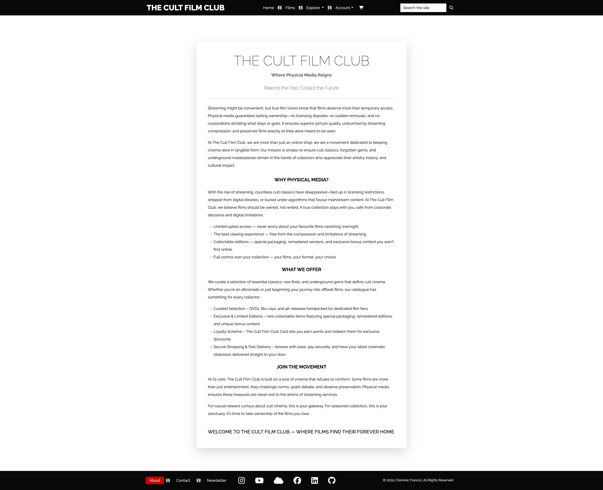
</details>

<details>
<summary>Click here to see proof of first time visitor goal number 2 and 4</summary>


</details>

<details>
<summary>Click here to see proof of first time visitor goal number 5</summary>

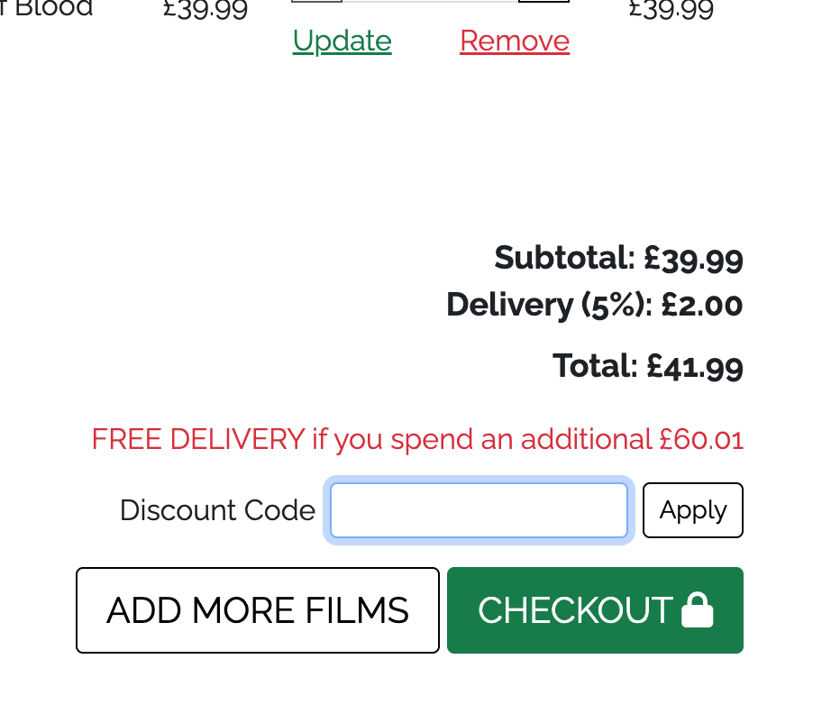
</details>

<details>
<summary>Click here to see proof of first time visitor goal number 6</summary>

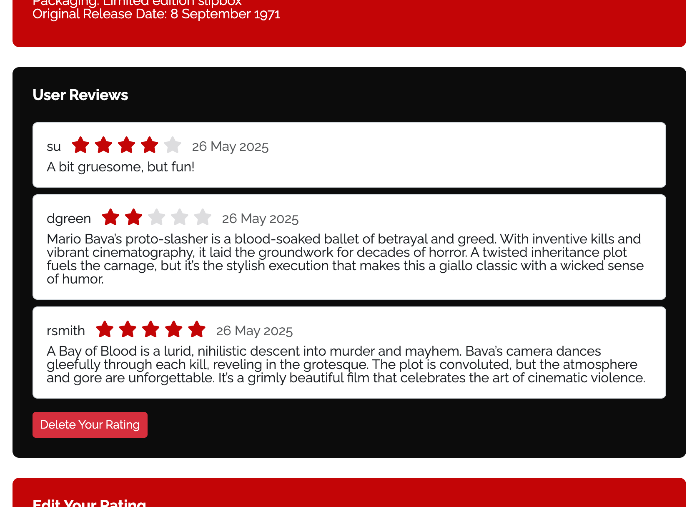
</details>

| GOAL | ITEM | PROCESS | EXPECTED RESULT | ACTUAL RESULT | STATUS |
| --- | --- | --- | --- | --- | --- |
| 1 | About page | Navigate to the about page | View information about the website's purpose | View information about the website's purpose  | WORKS AS EXPECTED |
| 2 | Releases page | Navigate to the releases page | View a list of all films available | View a list of all films available | WORKS AS EXPECTED |
| 3 | About page | Navigate to the about page | View information about types of films sold | View information about types of films sold  | WORKS AS EXPECTED |
| 4 | Releases page | Navigate to the releases page | View prices for each film | View prices for each film | WORKS AS EXPECTED |
| 5 | Shopping cart page | Add an item to the cart | A discount code can be applied before checkout | A discount code can be applied before checkout | WORKS AS EXPECTED |
| 6 | Release details page | Navigate to the release details page | View different users' star ratings for the release | View different users' star ratings for the release | WORKS AS EXPECTED |

### Returning Visitor Goals

1. “What new films are available?”
2. "Is it possible to bookmark films for later purchase?"
3. "How do I share my favourite films with others?"
4. "How do I pay for my purchases?"
5. "Where can I see a list of my orders?"

<details>
<summary>Click here to see proof of returning visitor goal number 1</summary>

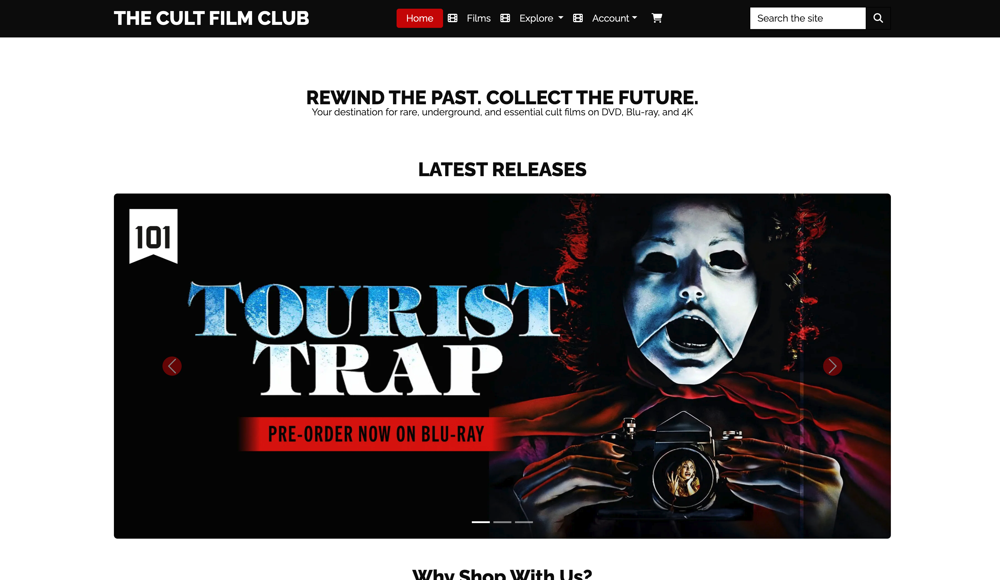
</details>

<details>
<summary>Click here to see proof of returning visitor goal number 2</summary>

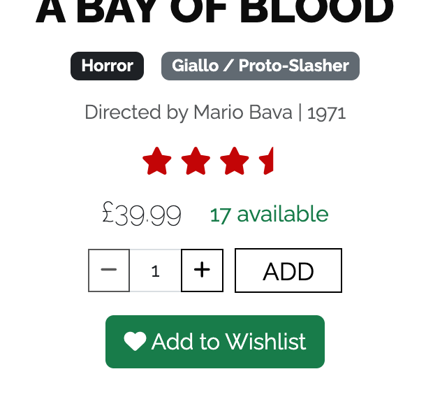
</details>

<details>
<summary>Click here to see proof of returning visitor goal number 3</summary>

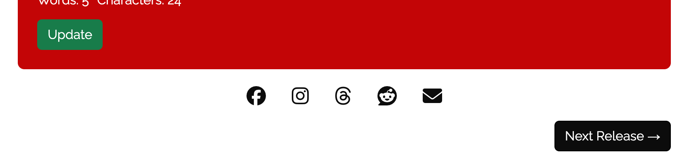
</details>

<details>
<summary>Click here to see proof of returning visitor goal number 4</summary>

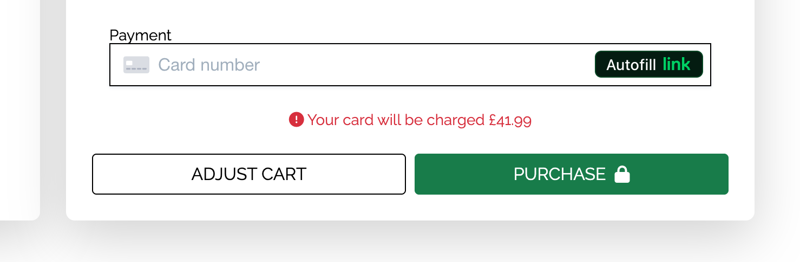
</details>

<details>
<summary>Click here to see proof of returning visitor goal number 5</summary>

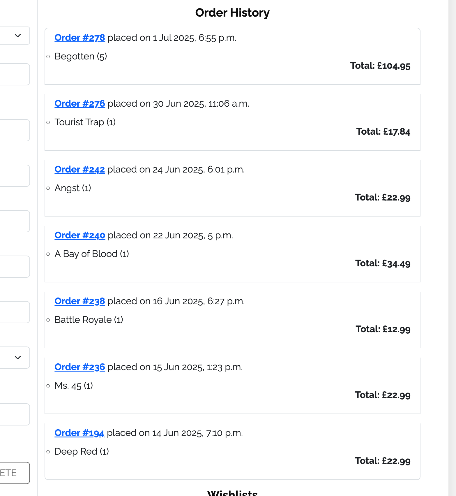
</details>

| GOAL | ITEM | PROCESS | EXPECTED RESULT | ACTUAL RESULT | STATUS |
| --- | --- | --- | --- | --- | --- |
| 1 | Home page | Navigate to home page | View latest releases featured in the hero banner | View latest releases featured in the hero banner | WORKS AS EXPECTED |
| 2 | Release details page | Login, navigate to the release details page, and click the 'Add to Wishlist' button | Add an item to any of the user's wishlists | Add an item to any of the user's wishlists | WORKS AS EXPECTED |
| 3 | Release details page | Navigate to the releases details page and click any of the social sharing buttons | Release is shared to the chosen social media platform | Release is shared to the chosen social media platform | WORKS AS EXPECTED |
| 4 | Checkout page | Add an item to the shopping cart and click the 'Checkout' button | Checkout page includes payment field | Checkout page includes payment field | WORKS AS EXPECTED |
| 5 | Account page | Navigate to the user account page | User can view a list of all previous orders | User can view a list of all previous orders | WORKS AS EXPECTED |

### Frequent Visitor Goals

1. "Are there any special, or limited, editions available?"
2. "How many copies are available of a particular film?"
3. "Does my order qualify for free shipping?"
4. "Do you have a website newsletter I can join?"

<details>
<summary>Click here to see proof of frequent visitor goal number 1</summary>

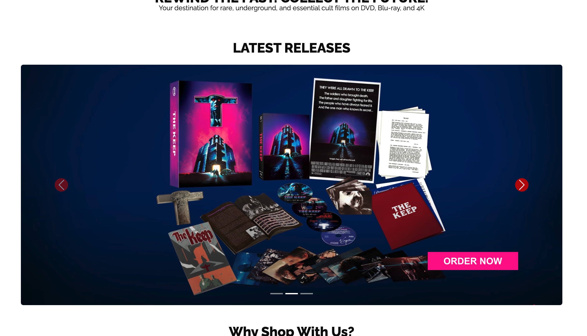
</details>

<details>
<summary>Click here to see proof of frequent visitor goal number 2</summary>


</details>

<details>
<summary>Click here to see proof of frequent visitor goal number 3</summary>


</details>

<details>
<summary>Click here to see proof of frequent visitor goal number 4</summary>

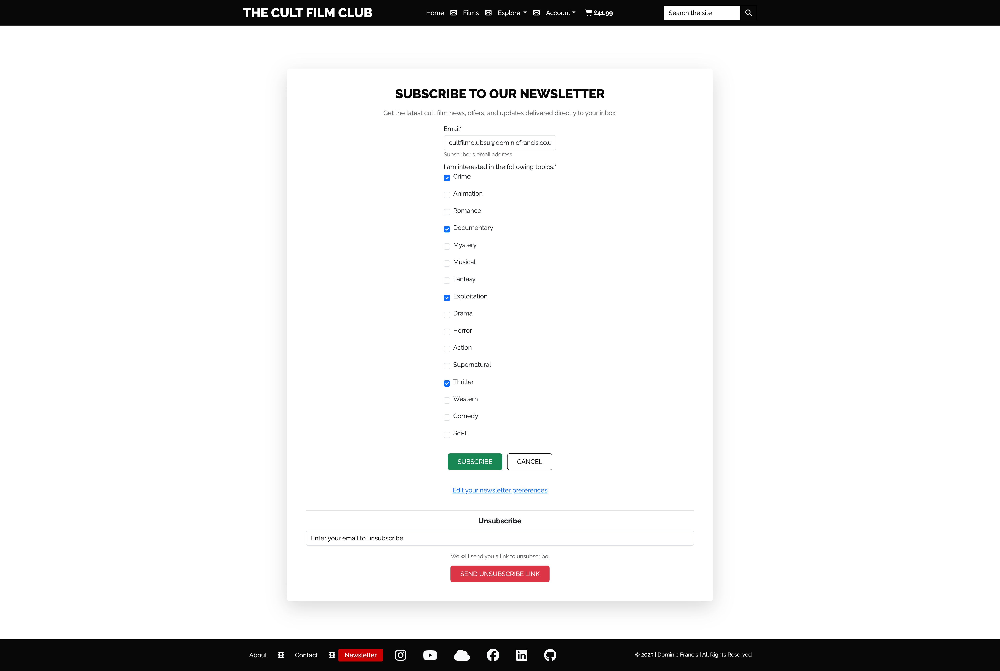
</details>

| GOAL | ITEM | PROCESS | EXPECTED RESULT | ACTUAL RESULT | STATUS |
| --- | --- | --- | --- | --- | --- |
| 1 | Home page | Navigate to home page | View latest releases featured in the hero banner | View latest releases featured in the hero banner | WORKS AS EXPECTED |
| 2 | Release details page | Navigate to the release details page | Number of copies available is shown by the price | Number of copies available is shown by the price | WORKS AS EXPECTED |
| 3 | Home page | Navigate to home page | Free delivery is explained in the 'Why Shop With Us?' section | Free delivery is explained in the 'Why Shop With Us?' section | WORKS AS EXPECTED |
| 4 | Newsletter page | Navigate to the newsletter signup page | User can subscribe to the website newsletter | User can subscribe to the website newsletter | WORKS AS EXPECTED |

## User Personas

### User 1

| ISSUE | ACCEPTANCE CRITERIA | TASKS | STATUS |
| --- | --- | --- | --- |
| [#67](https://github.com/dvfrancis/the-cult-film-club/issues/67) | Users can filter products by limited edition, collector’s sets, and special packaging | Implement a filtering system for exclusive releases, special packaging, and remastered editions | COMPLETED SUCCESSFULLY |
| [#68](https://github.com/dvfrancis/the-cult-film-club/issues/68) | Detailed descriptions include bonus features, remastered quality, and exclusive content | Add detailed information about each release, including bonus features and collector’s notes | COMPLETED SUCCESSFULLY |
| [#69](https://github.com/dvfrancis/the-cult-film-club/issues/69) | Users receive notifications for pre-orders and restocks of highly sought-after films | Set up an email newsletter to inform users of latest releases, and items being restocked | COMPLETED SUCCESSFULLY |

### User 2

| ISSUE | ACCEPTANCE CRITERIA | TASKS | STATUS |
| --- | --- | --- | ---|
| [#70](https://github.com/dvfrancis/the-cult-film-club/issues/70) | Users can filter by specific subgenres (for example, “Grindhouse”, “Psychological Horror", or “Surreal Sci-Fi”) | Implement a subgenre-based filtering system for deep-cut movie discovery | COMPLETED SUCCESSFULLY |
| [#71](https://github.com/dvfrancis/the-cult-film-club/issues/71) | Users can filter films by decade (for example, 1970s) | Implement a decade-based filter for users to explore films by era | COMPLETED SUCCESSFULLY |
| [#72](https://github.com/dvfrancis/the-cult-film-club/issues/72) | Users can sign up to a genre-specific newsletter that highlights rare or obscure films | Add ability to select a genre when signing up for the website newsletter | COMPLETED SUCCESSFULLY |

### User 3

| ISSUE | ACCEPTANCE CRITERIA | TASKS | STATUS |
| --- | --- | --- | ---|
| [#73](https://github.com/dvfrancis/the-cult-film-club/issues/73) | An about page explains the benefits of physical media, over streaming | Write and design an informational about page | COMPLETED SUCCESSFULLY |
| [#74](https://github.com/dvfrancis/the-cult-film-club/issues/74) | Users can create wishlists to track films they plan to own | Develop a wishlist system for tracking future purchases | COMPLETED SUCCESSFULLY |
| [#75](https://github.com/dvfrancis/the-cult-film-club/issues/75) | Releases highlight whether a film was / has been censored | Ensure film listings clearly highlight where films have been previously censored | COMPLETED SUCCESSFULLY |

### User 4

| ISSUE | ACCEPTANCE CRITERIA | TASKS | STATUS |
| --- | --- | --- | ---|
| [#78](https://github.com/dvfrancis/the-cult-film-club/issues/78) | Users can share film listings directly to any social media platform | Implement social media sharing buttons for easy film recommendations | COMPLETED SUCCESSFULLY |
| [#77](https://github.com/dvfrancis/the-cult-film-club/issues/77) | Users can rate any film on the website | Develop a rating system so users can leave feedback | COMPLETED SUCCESSFULLY |
| [#76](https://github.com/dvfrancis/the-cult-film-club/issues/76) | Users can sort and filter by price and film rating | Add filtering / sorting by price and film rating | COMPLETED SUCCESSFULLY |

## Browser Compatibility

### Google Chrome

<details>
<summary>Click here to view the site in Google Chrome</summary>


</details>

### Microsoft Edge

<details>
<summary>Click here to view the site in Microsoft Edge</summary>


</details>

### Firefox

<details>
<summary>Click here to view the site in Mozilla Firefox</summary>


</details>

### Opera

<details>
<summary>Click here to view the site in Opera</summary>


</details>

### Safari

<details>
<summary>Click here to view the site in Safari</summary>


</details>

## Accessibility

The [Wave Accessibility Evaluation Tool (WAVE)](https://wave.webaim.org) was used to create an [accessibility report](documentation/accessibility/accessibility-report.pdf) for this project.

## Responsiveness

The site won't load in the [Responsive Web Design Checker](https://responsivedesignchecker.com/) so I've used the Google Chrome plugin called [Responsive Viewer](https://chromewebstore.google.com/detail/responsive-viewer/inmopeiepgfljkpkidclfgbgbmfcennb?hl=en-GB&utm_source=ext_sidebar) instead.

Pages were tested for responsiveness at the following sizes:

- Mobile (Apple iPhone 14 - 393px x 852x).
- Tablet (Apple iPad Air 5 - 820px x 1180px).
- Desktop (MacBook Air - 1559px x 975px).

Click here to view the [Responsiveness report](documentation/validation/responsiveness/responsiveness-report.pdf)

## Performance

[Google Lighthouse](https://developer.chrome.com/docs/lighthouse/) was used to assess both mobile and desktop performance.

Click here to view the [performance report](documentation/performance/performance-report.pdf)

## Bugs

The numbering of the bugs shown below matches the cases raised on the project board, attached to the GitGub repository, and are linked below. They're named after their GitHub issue number (and are not sequential).

### Resolved

#### [Bug #79](https://github.com/users/dvfrancis/projects/4/views/1?filterQuery=bug&pane=issue&itemId=112365877&issue=dvfrancis%7Cthe-cult-film-club%7C79)

Films should allow ratings from different users, yet currently it only allows one rating per film in total. I changed `title` field from `models.OnetoOneField` to `models.ForeignKey` ,and films can now have multiple ratings and are calculated correctly for display on the page.

<details>
<summary>Click here to see a screenshot of bug #79 unfixed</summary>

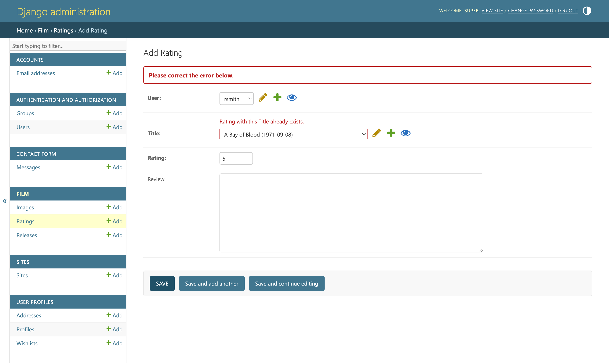
</details>

<details>
<summary>Click here to see a screenshot of bug #79 fixed</summary>

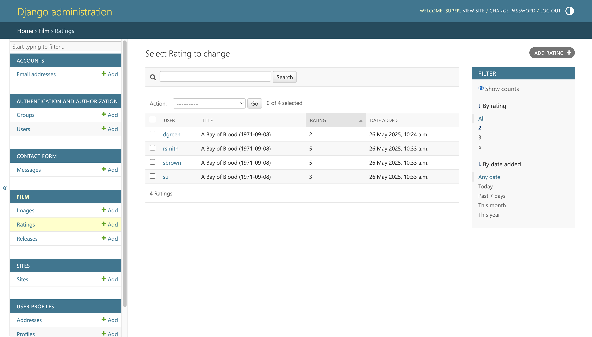
</details>

#### [Bug #80](https://github.com/users/dvfrancis/projects/4/views/1?filterQuery=bug&pane=issue&itemId=112366200&issue=dvfrancis%7Cthe-cult-film-club%7C80)

The site should only allow one Wishlist per user, but it is possible to create multiple wish lists per user (this functionality was changed later in the project to allow users to have multiple wishlists).

Added the following to the Wishlist model `Meta` class:

```
from django.db.models import UniqueConstraint

    class Meta:
        constraints = [
            UniqueConstraint(fields=['user'], name='unique_user_wishlist')
            # Restricts each user to a single wishlist
        ]
```
Users can no longer create multiple wishlists.

<details>
<summary>Click here to see a screenshot of bug #80 unfixed</summary>

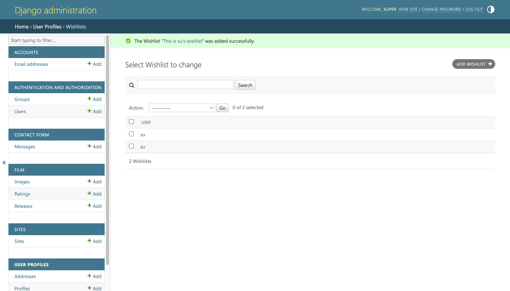
</details>

<details>
<summary>Click here to see a screenshot of bug #80 fixed</summary>

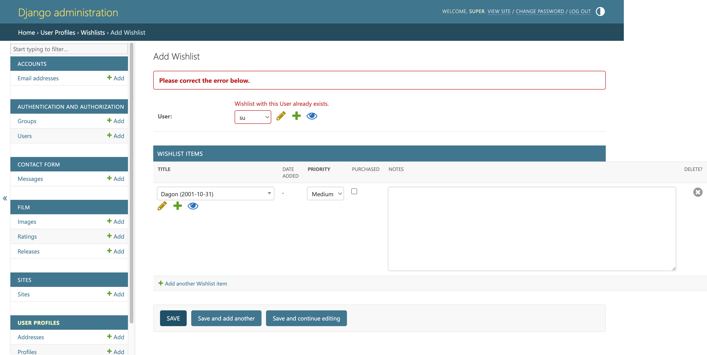
</details>

#### [Bug #81](https://github.com/users/dvfrancis/projects/4/views/1?filterQuery=bug&pane=issue&itemId=112366363&issue=dvfrancis%7Cthe-cult-film-club%7C81)

Users should only be able to create one rating per film (and edit that single rating), but currently they can create multiple ratings for a single film.

Added the following restraint to the Rating model `Meta` class:

```   
class Meta:
        unique_together = (
            ('user', 'title'),
        )
```
Users are no longer able to add duplicate ratings for a single film.

<details>
<summary>Click here to see a screenshot of bug #81 unfixed</summary>

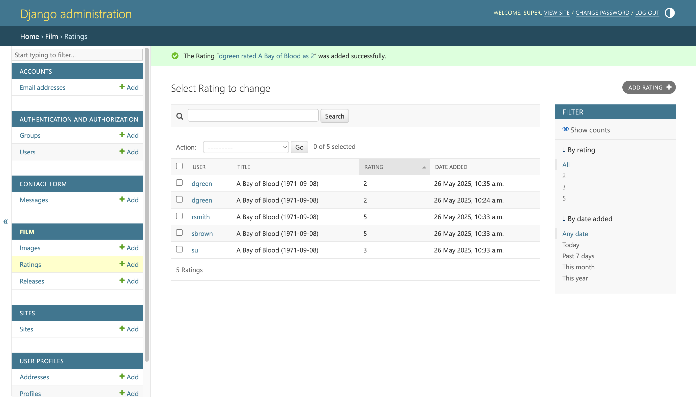
</details>

<details>
<summary>Click here to see a screenshot of bug #81 fixed</summary>

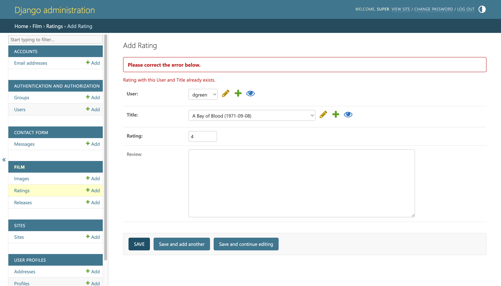
</details>

#### [Bug #82](https://github.com/users/dvfrancis/projects/4/views/1?filterQuery=bug&pane=issue&itemId=112386515&issue=dvfrancis%7Cthe-cult-film-club%7C82)

When searching images in the admin panel an error occurs.

The issue is that the `title` search_fields in ImageAdmin is a ForeignKey to `Releases`, and Django doesn't support `icontains` lookups on ForeignKey fields directly.

By changing it from

```
@admin.register(Images)
class ImageAdmin(admin.ModelAdmin):
    list_display = ['title', 'caption']
    list_filter = ['date_added']
    search_fields = ['title', 'caption']
    ordering = ['caption']
```
to 
```
@admin.register(Images)
class ImageAdmin(admin.ModelAdmin):
    list_display = ['title', 'caption']
    list_filter = ['date_added']
    search_fields = ['title__title', 'caption']
    ordering = ['caption']
```
Django searches within the `title` field of `Releases` model, rather than directly on the ForeignKey `title` in `Images`.

<details>
<summary>Click here to see a screenshot of bug #82 unfixed</summary>

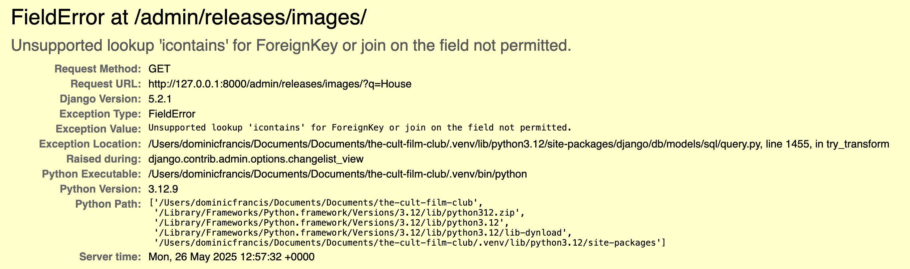
</details>

<details>
<summary>Click here to see a screenshot of bug #82 fixed</summary>

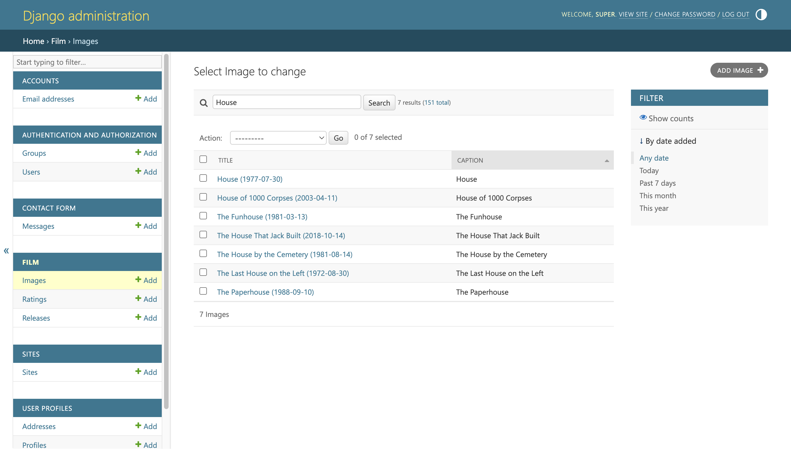
</details>

#### [Bug #83](https://github.com/users/dvfrancis/projects/4/views/1?filterQuery=bug&pane=issue&itemId=114170635&issue=dvfrancis%7Cthe-cult-film-club%7C83)

If a user is logged in and requests next day delivery, but then clears all items from the shopping cart, the balance remains at £7.99 (since this error was resolved, next day delivery has been moved to a future project release).

The issue was in the context processor code:

```
next_day_flat_rate = Decimal('7.99')
...
if delivery_option == 'next_day' and can_next_day:
    delivery = next_day_flat_rate
    free_delivery_diff = 0
elif subtotal < settings.FREE_DELIVERY:
    delivery = standard_delivery
    free_delivery_diff = settings.FREE_DELIVERY - subtotal
else:
    delivery = Decimal('0.00')
    free_delivery_diff = 0
```

If the cart is empty, subtotal is 0, so `subtotal < settings.FREE_DELIVERY` is `True`, and when delivery is set to standard delivery.

If the user has selected next day delivery (and is authenticated), delivery is set to next_day_flat_rate (of £7.99), even if the cart is empty.

Added a check to set all totals to zero when the cart is empty:

```
if not cart:
    context = {
        'purchases': [],
        'subtotal': Decimal('0.00'),
        'item_count': 0,
        'total_quantity': 0,
        'delivery_rate': settings.DELIVERY_RATE,
        'delivery': Decimal('0.00'),
        'free_delivery_diff': settings.FREE_DELIVERY,
        'free_delivery_threshold': settings.FREE_DELIVERY,
        'total': Decimal('0.00'),
        'can_next_day': can_next_day,
        'standard_delivery': Decimal('0.00'),
        'next_day_flat_rate': next_day_flat_rate,
        'delivery_option': 'standard',
        'discount_code': '',
        'discount_percent': 0,
        'discount_amount': Decimal('0.00'),
        'sorting_by_copies': sorting_by_copies,
    }
    return context
```
<details>
<summary>Click here to see a screenshot of bug #83 unfixed</summary>

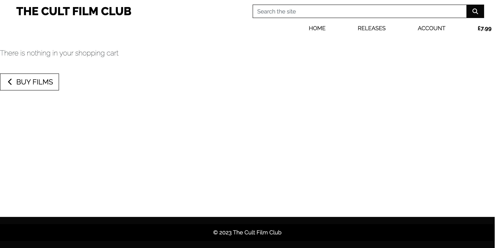
</details>

<details>
<summary>Click here to see a screenshot of bug #83 fixed</summary>

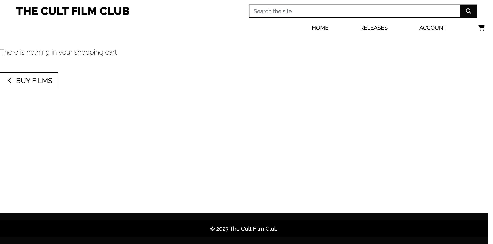
</details>

#### [Bug #92](https://github.com/users/dvfrancis/projects/4/views/1?filterQuery=bug&pane=issue&itemId=117518407&issue=dvfrancis%7Cthe-cult-film-club%7C92)

Users without superuser privileges are able to amend stock and discount codes. Only superusers (staff members) should be able to do this.

Added this to the releases and cart views to ensure people are logged in and that only superusers can manage products, and discount codes:

```
from functools import wraps
from django.core.exceptions import PermissionDenied
from django.contrib.auth.views import redirect_to_login


def superuser_required(view_func):
    """
    Decorator for views that ensures the user is both authenticated and a
    superuser.

    - If the user is not authenticated, redirects them to the login page.
    - If the user is authenticated but not a superuser, raises a
      PermissionDenied (403) error.
    - If the user is a superuser, proceeds to the view as normal.

    Example usage:
        @superuser_required
        def my_view(request):
            ...

    Returns:
        function: Wrapped view with access control applied.
    """
    @wraps(view_func)
    def _wrapped_view(request, *args, **kwargs):
        if not request.user.is_authenticated:
            return redirect_to_login(request.get_full_path())
        if not request.user.is_superuser:
            raise PermissionDenied
        return view_func(request, *args, **kwargs)
    return _wrapped_view
```

Above each relevant function I then added:

`@superuser_required`

Now when someone attempts to directly access any of the shop management URL, the site automatically asks them to login and checks they have superuser permissions. If not, they are redirected to the Permission Denied error page.

#### [Bug #93](https://github.com/users/dvfrancis/projects/4/views/1?filterQuery=bug&pane=issue&itemId=118594611&issue=dvfrancis%7Cthe-cult-film-club%7C93)

An error appears in the console when viewing the release details page.

I've added config details for the CKEditor in `settings.py` as suggested in the reference link, and this has resolved the issue:

```
# CKEditor 5 configuration for rich text editing
CKEDITOR_5_CONFIGS = {
    'default': {
        'toolbar': [
            'heading', '|', 'bold', 'italic', 'link', '|',
            'bulletedList', 'numberedList', '|', 'undo', 'redo'
        ],
        'heading': {
            'options': [
                {
                    'model': 'paragraph',
                    'title': 'Paragraph',
                    'class': 'ck-heading_paragraph'
                },
                {
                    'model': 'heading1',
                    'view': 'h1',
                    'title': 'Heading 1',
                    'class': 'ck-heading_heading1'
                },
                {
                    'model': 'heading2',
                    'view': 'h2',
                    'title': 'Heading 2',
                    'class': 'ck-heading_heading2'
                },
                {
                    'model': 'heading3',
                    'view': 'h3',
                    'title': 'Heading 3',
                    'class': 'ck-heading_heading3'
                },
            ]
        },
        'image': {
            'toolbar': ['imageTextAlternative']
        }
    },
    'extends': {
        'toolbar': [
            'heading', '|', 'bold', 'italic', 'underline', 'strikethrough',
            '|', 'bulletedList', 'numberedList', '|', 'outdent', 'indent',
            '|', 'link', 'blockQuote', '|', 'undo', 'redo'
        ],
        'heading': {
            'options': [
                {
                    'model': 'paragraph',
                    'title': 'Paragraph',
                    'class': 'ck-heading_paragraph'
                },
                {
                    'model': 'heading1',
                    'view': 'h1',
                    'title': 'Heading 1',
                    'class': 'ck-heading_heading1'
                },
                {
                    'model': 'heading2',
                    'view': 'h2',
                    'title': 'Heading 2',
                    'class': 'ck-heading_heading2'
                },
                {
                    'model': 'heading3',
                    'view': 'h3',
                    'title': 'Heading 3',
                    'class': 'ck-heading_heading3'
                },
            ]
        },
        'image': {
            'toolbar': ['imageTextAlternative']
        }
    }
}
```
<details>
<summary>Click here to see a screenshot of bug #93</summary>

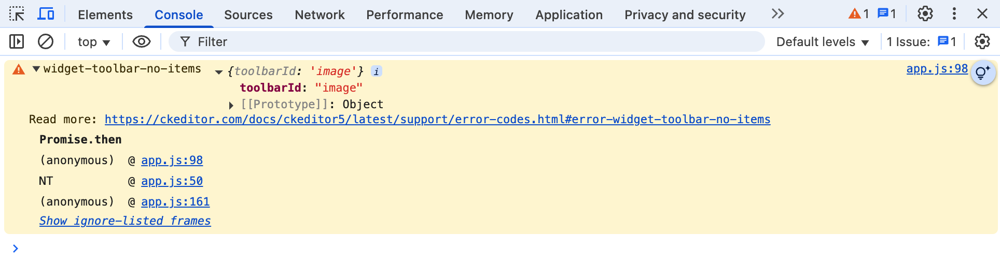
</details>

### Unresolved

#### [Bug #94](https://github.com/users/dvfrancis/projects/4/views/1?filterQuery=bug&pane=issue&itemId=118595000&issue=dvfrancis%7Cthe-cult-film-club%7C94)

This error only appears when the site is deployed to Heroku, but not locally:

"The page ... was loaded over HTTPS, but requested an insecure element ... This request was automatically upgraded to HTTPS, For more information see https://blog.chromium.org/2019/10/no-more-mixed-messages-about-https.html"

I have required that Cloudinary only server secure files in `settings.py` (as shown below), but the error persists:

```
# Cloudinary storage configuration for media files
CLOUDINARY_STORAGE = {
    "CLOUD_NAME": os.getenv("CLOUDINARY_CLOUD_NAME"),
    "API_KEY": os.getenv("CLOUDINARY_API_KEY"),
    "API_SECRET": os.getenv("CLOUDINARY_API_SECRET"),
    "SECURE": True,  # Use secure URLs for media files
}
```
I am unable to resolve this issue - I think it is a problem caused from Cloudinary's side.

<details>
<summary>Click here to see a screenshot of bug #94</summary>

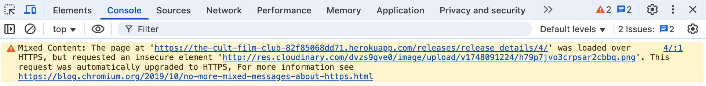
</details>
