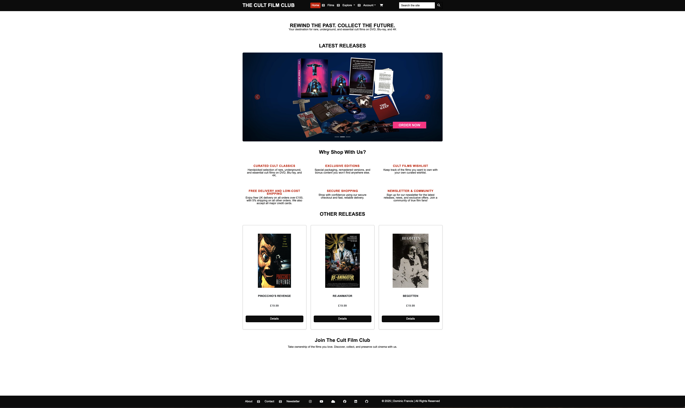

# DRAFT (NOT YET FINALISED)

[Return to the Cult Film Club README.md](https://github.com/dvfrancis/the-cult-film-club)

# Testing of The Cult Film Club

## Index

1. [Code Validation](#code-validation)
2. [Manual Validation](#manual-validation)
    1. [index.html]()
    2. [bad_request.html]()
    3. [permission_denied.html]()
    4. [page_not_found.html]()
    5. [server_error.html]()
    6. [releases.html]()
    7. [release_details.html]()
    8. [product_management.html]()
    9. [edit_release.html]()
    10. [delete_release.html]()
    11. [manage_images.html]()
    12. [edit_image.html]()
    13. [discount_codes.html]()
    14. [edit_discount_code.html]()
    15. [delete_discount_code.html]()
    16. [cart.html]()
    17. [checkout.html]()
    18. [checkout_success.html]()
    19. [order_details.html]()
    20. [account.html]()
    21. [about.html]()
    22. [contact_us.html]()
    23. [newsletter.html]()
    24. [edit_newsletter_preferences.html]()
    25. [unsubscribe.html]()
    26. [signup.html]()
    27. [login.html]()
    28. [password_reset.html]()
    29. [logout.html]()
3. [User Story Validation](#user-story-validation)
    1. [First Time Visitor Goals](#first-time-visitor-goals)
    2. [Returning Visitor Goals](#returning-visitor-goals)
    3. [Frequent Visitor Goals](#frequent-visitor-goals)
4. [User Personas](#user-personas)
5. [Browser Compatibility](#browser-compatibility)
6. [Accessibility](#accessibility)
7. [Responsiveness](#responsiveness)
8. [Performance](#performance)
9. [Bugs](#bugs)
    1. [Resolved](#resolved)
    2. [Unresolved](#unresolved)

## Code Validation

### HTML

- The [W3C Markup Validation Service](https://validator.w3.org) was used to check all HTML. The code for each page was validated by direct input of the code copied from each rendered page. Click to view the [HTML report](documentation/validation/html-report.pdf).

- I did not test base.html directly, as it is a part of all other pages.

### CSS

- The [W3C CSS Validation Service](https://jigsaw.w3.org/css-validator) was used to check base.css. Click to view the [CSS report](documentation/validation/css-report.pdf).

### JavaScript

- [JSHint](https://jshint.com/) was used to check base.js. Click to view the [JavaScript report](documentation/validation/javascript-report.pdf).

### Python

- The [CI Python Linter](https://pep8ci.herokuapp.com/) was used to check all Python code. Click to view the [Python report](documentation/validation/python-report.pdf).

## Manual Validation

The base.html page is not included here as it is validated as part of all other pages.

### index.html

| ITEM | PROCESS | EXPECTED RESULT | ACTUAL RESULT | STATUS |
| --- | --- | --- | --- | --- |
| TBC | TBC | TBC | TBC | TBC |

### bad_request.html

| ITEM | PROCESS | EXPECTED RESULT | ACTUAL RESULT | STATUS |
| --- | --- | --- | --- | --- |
| TBC | TBC | TBC | TBC | TBC |

### permission_denied.html

| ITEM | PROCESS | EXPECTED RESULT | ACTUAL RESULT | STATUS |
| --- | --- | --- | --- | --- |
| TBC | TBC | TBC | TBC | TBC |

### page_not_found.html

| ITEM | PROCESS | EXPECTED RESULT | ACTUAL RESULT | STATUS |
| --- | --- | --- | --- | --- |
| TBC | TBC | TBC | TBC | TBC |

### server_error.html

| ITEM | PROCESS | EXPECTED RESULT | ACTUAL RESULT | STATUS |
| --- | --- | --- | --- | --- |
| TBC | TBC | TBC | TBC | TBC |

### releases.html

| ITEM | PROCESS | EXPECTED RESULT | ACTUAL RESULT | STATUS |
| --- | --- | --- | --- | --- |
| TBC | TBC | TBC | TBC | TBC |

### release_details.html

| ITEM | PROCESS | EXPECTED RESULT | ACTUAL RESULT | STATUS |
| --- | --- | --- | --- | --- |
| TBC | TBC | TBC | TBC | TBC |

### product_management.html

| ITEM | PROCESS | EXPECTED RESULT | ACTUAL RESULT | STATUS |
| --- | --- | --- | --- | --- |
| TBC | TBC | TBC | TBC | TBC |

### edit_release.html

| ITEM | PROCESS | EXPECTED RESULT | ACTUAL RESULT | STATUS |
| --- | --- | --- | --- | --- |
| TBC | TBC | TBC | TBC | TBC |

### delete_release.html

| ITEM | PROCESS | EXPECTED RESULT | ACTUAL RESULT | STATUS |
| --- | --- | --- | --- | --- |
| TBC | TBC | TBC | TBC | TBC |

### manage_images.html

| ITEM | PROCESS | EXPECTED RESULT | ACTUAL RESULT | STATUS |
| --- | --- | --- | --- | --- |
| TBC | TBC | TBC | TBC | TBC |

### edit_image.html

| ITEM | PROCESS | EXPECTED RESULT | ACTUAL RESULT | STATUS |
| --- | --- | --- | --- | --- |
| TBC | TBC | TBC | TBC | TBC |

### discount_codes.html

| ITEM | PROCESS | EXPECTED RESULT | ACTUAL RESULT | STATUS |
| --- | --- | --- | --- | --- |
| TBC | TBC | TBC | TBC | TBC |

### edit_discount_code.html

| ITEM | PROCESS | EXPECTED RESULT | ACTUAL RESULT | STATUS |
| --- | --- | --- | --- | --- |
| TBC | TBC | TBC | TBC | TBC |

### delete_discount_code.html

| ITEM | PROCESS | EXPECTED RESULT | ACTUAL RESULT | STATUS |
| --- | --- | --- | --- | --- |
| TBC | TBC | TBC | TBC | TBC |

### cart.html

| ITEM | PROCESS | EXPECTED RESULT | ACTUAL RESULT | STATUS |
| --- | --- | --- | --- | --- |
| TBC | TBC | TBC | TBC | TBC |

### checkout.html

| ITEM | PROCESS | EXPECTED RESULT | ACTUAL RESULT | STATUS |
| --- | --- | --- | --- | --- |
| TBC | TBC | TBC | TBC | TBC |

### checkout_success.html

| ITEM | PROCESS | EXPECTED RESULT | ACTUAL RESULT | STATUS |
| --- | --- | --- | --- | --- |
| TBC | TBC | TBC | TBC | TBC |

### order_details.html

| ITEM | PROCESS | EXPECTED RESULT | ACTUAL RESULT | STATUS |
| --- | --- | --- | --- | --- |
| TBC | TBC | TBC | TBC | TBC |

### account.html

| ITEM | PROCESS | EXPECTED RESULT | ACTUAL RESULT | STATUS |
| --- | --- | --- | --- | --- |
| TBC | TBC | TBC | TBC | TBC |

### about.html

| ITEM | PROCESS | EXPECTED RESULT | ACTUAL RESULT | STATUS |
| --- | --- | --- | --- | --- |
| TBC | TBC | TBC | TBC | TBC |

### contact_us.html

| ITEM | PROCESS | EXPECTED RESULT | ACTUAL RESULT | STATUS |
| --- | --- | --- | --- | --- |
| TBC | TBC | TBC | TBC | TBC |

### newsletter.html

| ITEM | PROCESS | EXPECTED RESULT | ACTUAL RESULT | STATUS |
| --- | --- | --- | --- | --- |
| TBC | TBC | TBC | TBC | TBC |

### edit_newsletter_preferences.html

| ITEM | PROCESS | EXPECTED RESULT | ACTUAL RESULT | STATUS |
| --- | --- | --- | --- | --- |
| TBC | TBC | TBC | TBC | TBC |

### unsubscribe.html

| ITEM | PROCESS | EXPECTED RESULT | ACTUAL RESULT | STATUS |
| --- | --- | --- | --- | --- |
| TBC | TBC | TBC | TBC | TBC |

### signup.html

| ITEM | PROCESS | EXPECTED RESULT | ACTUAL RESULT | STATUS |
| --- | --- | --- | --- | --- |
| TBC | TBC | TBC | TBC | TBC |

### login.html

| ITEM | PROCESS | EXPECTED RESULT | ACTUAL RESULT | STATUS |
| --- | --- | --- | --- | --- |
| TBC | TBC | TBC | TBC | TBC |

### password_reset.html

| ITEM | PROCESS | EXPECTED RESULT | ACTUAL RESULT | STATUS |
| --- | --- | --- | --- | --- |
| TBC | TBC | TBC | TBC | TBC |

### logout.html

| ITEM | PROCESS | EXPECTED RESULT | ACTUAL RESULT | STATUS |
| --- | --- | --- | --- | --- |
| TBC | TBC | TBC | TBC | TBC |

## User Story Validation

### First Time Visitor Goals

"What is Craftr about?” and “How do I sign up?”

Click here to see proof of first time visitor goal number 1 and 4

| ITEM | PROCESS | EXPECTED RESULT | ACTUAL RESULT | STATUS |
| --- | --- | --- | --- | --- |
| TBC | TBC | TBC | TBC | TBC |

“What training is being given?” and "When do the classes happen?"

### Returning Visitor Goals

“What other classes am I interested in attending?” and "When is my class due to start?"

Click here to see proof of the returning visitor goals 1 and 2

| ITEM | PROCESS | EXPECTED RESULT | ACTUAL RESULT | STATUS |
| --- | --- | --- | --- | --- |
| TBC | TBC | TBC | TBC | TBC |

"Where can I keep track of the classes I've signed up for?"

### Frequent Visitor Goals

“Who running my class?”

Click here to see proof of frequent visitor goal 1

| ITEM | PROCESS | EXPECTED RESULT | ACTUAL RESULT | STATUS |
| --- | --- | --- | --- | --- |
| TBC | TBC | TBC | TBC | TBC |

"How do I cancel my class enrolment?"

## User Personas

### User 1

| ISSUE | ACCEPTANCE CRITERIA | TASKS | STATUS |
| --- | --- | --- | --- |
| [#55](https://github.com/dvfrancis/craftr/issues/55) | Ensure users of all skill levels (beginner to advanced) find suitable classes | Label each class with its appropriate skill level | COMPLETED SUCCESSFULLY |

### User 2

| ISSUE | ACCEPTANCE CRITERIA | TASKS | STATUS |
| --- | --- | --- | ---|
| [#57](https://github.com/dvfrancis/craftr/issues/57) | Make diverse craft types visible and engaging on the homepage | Design an engaging homepage that showcases various craft types | COMPLETED SUCCESSFULLY |

### User 3

| ISSUE | ACCEPTANCE CRITERIA | TASKS | STATUS |
| --- | --- | --- | ---|
| [#60](https://github.com/dvfrancis/craftr/issues/60) | Ensure class information is detailed and easily accessible | Maintain a well-organized and searchable class directory | COMPLETED SUCCESSFULLY |

### User 4

| ISSUE | ACCEPTANCE CRITERIA | TASKS | STATUS |
| --- | --- | --- | ---|
| [#60](https://github.com/dvfrancis/craftr/issues/60) | Ensure class information is detailed and easily accessible | Maintain a well-organized and searchable class directory | COMPLETED SUCCESSFULLY |

## Browser Compatibility

### Google Chrome

Click here to view the site in Google Chrome

### Microsoft Edge

Click here to view the site in Microsoft Edge

### Firefox

Click here to view the site in Mozilla Firefox

### Opera

Click here to view the site in Opera

### Safari

Click here to view the site in Safari

## Accessibility

The [Wave Accessibility Evaluation Tool (WAVE)](https://wave.webaim.org) was used to create an [accessibility report](documentation/accessibility/accessibility-report.pdf) for this project.

## Responsiveness

Pages were going to be assessed using the [Responsive Web Design Checker](https://responsivedesignchecker.com/) but, unfortunately, the site won't load there. Instead, they have been presented using the [Responsive Viewer](https://chromewebstore.google.com/detail/responsive-viewer/inmopeiepgfljkpkidclfgbgbmfcennb?hl=en-GB&utm_source=ext_sidebar) Google Chrome browser plugin.

Pages were tested for responsiveness on mobile (Apple iPhone 14 - 390px x 844px), tablet (Apple iPad Air 5 - 820px x 1180px), and desktop (MacBook Pro 16 - 1728px x 1117px).

Click here to see the [Responsiveness report](documentation/validation/responsiveness/responsiveness-report.pdf)

## Performance

Both mobile and desktop page performance was assessed with [Google Lighthouse](https://developer.chrome.com/docs/lighthouse/).

Click here to see the [Performance report](documentation/validation/performance/performance-report.pdf)

## Bugs

### Resolved

Resolved bugs match the cases raised on the project board attached to the GitGub repository. They're named after their GitHub issue number (so are not sequential).

#### Bug 61

Click here to see a screenshot of bug #61

| Issue | Bug | Fix |
| --- | --- | --- |
| [#61](https://github.com/dvfrancis/craftr/issues/61) | Fix |

### Unresolved

There are no unresolved bugs in the project.
