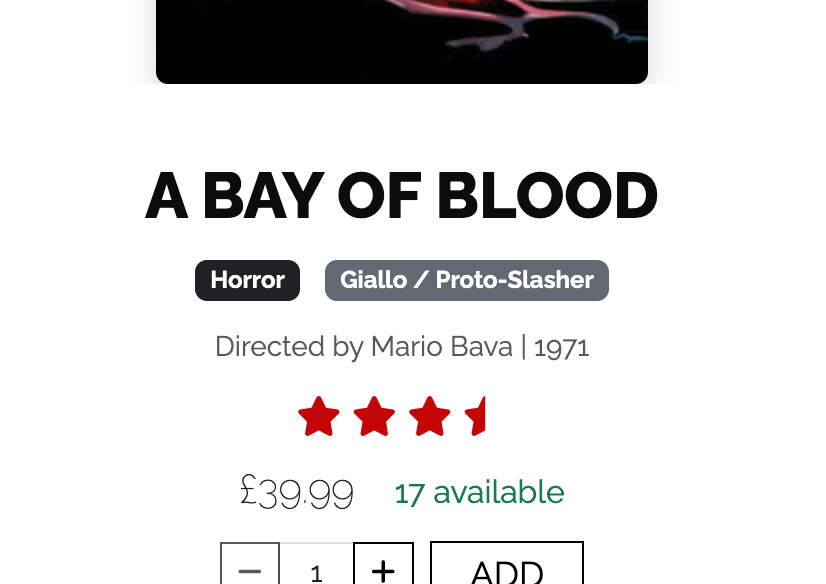

[Return to the Cult Film Club README.md](https://github.com/dvfrancis/the-cult-film-club)

# Testing of The Cult Film Club

## Index

1. [Code Validation](#code-validation)
2. [Manual Validation](#manual-validation)
3. [Automatic Validation](#automatic-validation)
4. [User Story Validation](#user-story-validation)
    1. [First Time Visitor Goals](#first-time-visitor-goals)
    2. [Returning Visitor Goals](#returning-visitor-goals)
    3. [Frequent Visitor Goals](#frequent-visitor-goals)
5. [User Personas](#user-personas)
6. [Browser Compatibility](#browser-compatibility)
7. [Accessibility](#accessibility)
8. [Responsiveness](#responsiveness)
9. [Performance](#performance)
10. [Bugs](#bugs)
    1. [Resolved](#resolved)
    2. [Unresolved](#unresolved)

## Code Validation

### HTML

- The [W3C Markup Validation Service](https://validator.w3.org) was used to check all HTML. The code for each page was validated by direct input of the code copied from each rendered page. Click to view the [HTML report](documentation/validation/html-report.pdf).

- I did not test base.html directly, as it is a part of all other pages.

- There are also four include files used for different Toast messages throughout the site (toast_error.html, toast_info.html, toast_success.html, and toast_warning.html). As these are snippets of HTML they cannot easily be validated using the W3C Markup Validation Service. However, ignoring the errors caused by taking them out of context, all of the snippets passed validation without any errors.

### CSS

- The [W3C CSS Validation Service](https://jigsaw.w3.org/css-validator) was used to check base.css. Click to view the [CSS report](documentation/validation/css-report.pdf).

### JavaScript

- [JSHint](https://jshint.com/) was used to check base.js. Click to view the [JavaScript report](documentation/validation/javascript-report.pdf).

### Python

- The [CI Python Linter](https://pep8ci.herokuapp.com/) was used to check all Python code. Click to view the [Python report](documentation/validation/python-report.pdf).

## Manual Validation

The base.html page contains the header and footer that is shared by all pages throughout the site. I've added the manual validation for those items below so they need not be repeated across every single page detailed in this section. 

### base.html

| ITEM | PROCESS | EXPECTED RESULT | ACTUAL RESULT | STATUS |
| --- | --- | --- | --- | --- |
| Header nav link for site title | Click to open index.html | The user is directed to index.html | The user is directed to index.html | WORKS AS EXPECTED |
| Header nav link for 'Home' | Click to open index.html | The user is directed to index.html, and 'Home' remains highlighted | The user is directed to index.html, and 'Home' remains highlighted | WORKS AS EXPECTED |
| Header nav link for 'Explore' | Click to activate dropdown list of link options | A list of sorting options is shown, and 'Explore' remains highlighted | A list of sorting options is shown, and 'Explore' remains highlighted | WORKS AS EXPECTED |
| Header nav link for 'Explore' > 'Rating (Low-High)' | Click to sort all film releases by rating, from low to high | Film releases are shown ordered from lowest to highest rating, both 'Explore' and 'Rating (Low-High)' remain highlighted | Film releases are shown ordered from lowest to highest rating, both 'Explore' and 'Rating (Low-High)' remain highlighted | WORKS AS EXPECTED |
| Header nav link for 'Explore' > 'Rating (High-Low)' | Click to sort all film releases by rating, from high to low | Click to sort all film releases by rating, from high to low, both 'Explore' and 'Rating (High-Low)' remain highlighted | Click to sort all film releases by rating, from high to low, both 'Explore' and 'Rating (High-Low)' remain highlighted | WORKS AS EXPECTED |
| Header nav link for 'Explore' > 'Price (Low-High)' | Click to sort all film releases by price, from low to high | Click to sort all film releases by price, from low to high, both 'Explore' and 'Price (Low-High)' remain highlighted | Click to sort all film releases by price, from low to high, both 'Explore' and 'Price (Low-High)' remain highlighted | WORKS AS EXPECTED |
| Header nav link for 'Explore' > 'Price (High-Low)' | Click to sort all film releases by price, from high to low | Click to sort all film releases by price, from high to low, both 'Explore' and 'Rating (High-Low)' remain highlighted | Click to sort all film releases by price, from high to low, both 'Explore' and 'Rating (High-Low)' remain highlighted | WORKS AS EXPECTED |
| Header nav link for 'Explore' > 'Copies (Low-High)' | Click to sort all film releases by number of available copies, from low to high | Click to sort all film releases by number of copies available, from low to high, both 'Explore' and 'Rating (Low-High)' remain highlighted | Click to sort all film releases by number of copies available, from low to high, both 'Explore' and 'Rating (Low-High)' remain highlighted | WORKS AS EXPECTED |
| Header nav link for 'Explore' > 'Copies (High-Low)' | Click to sort all film releases by number of available copies, from high to low | Click to sort all film releases by number of copies available, from high to low, both 'Explore' and 'Rating (High-Low)' remain highlighted | Click to sort all film releases by number of copies available, from high to low, both 'Explore' and 'Rating (High-Low)' remain highlighted | WORKS AS EXPECTED |
| Header nav link for 'Explore' > 'Director (A-Z)' | Click to sort all film releases by director's surname, from A to Z | Film releases are shown ordered from A to Z, by director's surname, both 'Explore' and 'Director (A-Z) remain highlighted | Film releases are shown ordered from A to Z, by director's surname, both 'Explore' and 'Director (A-Z) remain highlighted | WORKS AS EXPECTED |
| Header nav link for 'Explore' > 'Director (Z-A)' | Click to sort all film releases by director's surname, from Z to A | Film releases are shown ordered from Z to A, by director's surname, both 'Explore' and 'Director (Z-A) remain highlighted | Film releases are shown ordered from Z to A, by director's surname, both 'Explore' and 'Director (Z-A) remain highlighted  | WORKS AS EXPECTED |
| Header nav link for 'Account', when not logged in | Click text to activate dropdown list of link options | 'Register' and 'Login' links are shown, 'Account' remains highlighted  | 'Register' and 'Login' links are shown, 'Account' remains highlighted  | WORKS AS EXPECTED |
| Header nav link for 'Account', when not logged in > 'Register' | Click to open signup.html  | The user is directed to signup.html, both 'Account' and 'Register' remain highlighted  | The user is directed to signup.html, both 'Account' and 'Register' remain highlighted | WORKS AS EXPECTED |
| Header nav link for 'Account', when not logged in > 'Login' | Click to open login.html | The user is directed to login.html, both 'Account' and 'Login' remain highlighted | The user is directed to login.html, both 'Account' and 'Login' remain highlighted | WORKS AS EXPECTED |
| Header nav link for 'Account', when logged in | Click to activate dropdown list of link options | 'My Profile' and 'Logout' links are shown, 'Account' remains highlighted | 'My Profile' and 'Logout' links are shown, 'Account' remains highlighted | WORKS AS EXPECTED |
| Header nav link for 'Account', when logged in > 'My Profile' | Click to open account.html | The user is directed to account.html, both 'Account' and 'My Profile' remain highlighted | The user is directed to account.html, both 'Account' and 'My Profile' remain highlighted | WORKS AS EXPECTED |
| Header nav link for 'Account', when logged in > 'Logout' | Click to open logout.html | The user is directed to logout.html, both 'Account' and 'Login' remain highlighted | The user is directed to logout.html, both 'Account' and 'Login' remain highlighted | WORKS AS EXPECTED |
| Header nav link for 'Account', when logged in with Superuser privileges | Click to activate dropdown list of link options | 'Product Management', 'Discount Codes', 'My Profile' and 'Logout' links are shown, 'Account' remains highlighted | 'Product Management', 'Discount Codes', 'My Profile' and 'Logout' links are shown, 'Account' remains highlighted | WORKS AS EXPECTED |
| Header nav link for 'Account', when logged in with Superuser privileges > 'Product Management' | Click to open product_management.html | The user is directed to product_management.html, both 'Account' and 'Product Management' remain highlighted | The user is directed to product_management.html, both 'Account' and 'Product Management' remain highlighted | WORKS AS EXPECTED |
| Header nav link for 'Account', when logged in with Superuser privileges > 'Discount Codes' | Click to open discount_codes.html | The user is directed to discount_codes.html, both 'Account' and 'Discount Codes' remain highlighted | The user is directed to discount_codes.html, both 'Account' and 'Discount Codes' remain highlighted | WORKS AS EXPECTED |
| Header nav link for 'Account', when logged in with Superuser privileges > 'My Profile' | Click to open account.html | The user is directed to account.html, both 'Account' and 'My Profile' remain highlighted | The user is directed to account.html, both 'Account' and 'My Profile' remain highlighted | WORKS AS EXPECTED |
| Header nav link for 'Account', when logged in with Superuser privileges > 'Logout' | Click to open logout.html | The user is directed to logout.html, both 'Account' and 'Login' remain highlighted | The user is directed to logout.html, both 'Account' and 'Login' remain highlighted | WORKS AS EXPECTED |
| Header nav link for cart logo | Click text to open cart.html | The user is directed to cart.html, the cart logo remains highlighted | The user is directed to cart.html, the cart logo remains highlighted | WORKS AS EXPECTED |
| Header search bar with text entered | Type in a search term and press enter | Film releases that include the search term are shown | Film releases that include the search term are shown | WORKS AS EXPECTED |
| Header search bar without text entered | Click into the search bar and press enter | A Toast message is shown "You didn't enter a search term. Please try again.", and the user is redirected to index.html | A Toast message is shown "You didn't enter a search term. Please try again.", and the user is redirected to index.html | WORKS AS EXPECTED |
| Footer nav link for 'About' | Click to open about.html | The user is directed to about.html, 'About' remains highlighted | The user is directed to about.html, 'About' remains highlighted | WORKS AS EXPECTED |
| Footer nav link for 'Contact' | Click to open contact_us.html | The user is directed to contact_us.html, 'Contact' remains highlighted | The user is directed to contact_us.html, 'Contact' remains highlighted | WORKS AS EXPECTED |
| Footer nav link for 'Newsletter' | Click to open newsletter.html | The user is directed to newsletter.html, 'Newsletter' remains highlighted | The user is directed to newsletter.html, 'Newsletter' remains highlighted | WORKS AS EXPECTED |
| Footer nav link for Instagram | Click to open Instagram | A new tab opens, showing Instagram, the current page link and the Instagram logo remain highlighted | A new tab opens, showing Instagram, the current page link and the Instagram logo remain highlighted | WORKS AS EXPECTED |
| Footer nav link for YouTube | Click to open YouTube | A new tab opens, showing YouTube, the current page link and the YouTube logo remain highlighted | A new tab opens, showing YouTube, the current page link and the YouTube logo remain highlighted | WORKS AS EXPECTED |
| Footer nav link for Bluesky | Click to open Bluesky | A new tab opens, showing Bluesky, the current page link and the Bluesky logo remain highlighted | A new tab opens, showing Bluesky, the current page link and the Bluesky logo remain highlighted | WORKS AS EXPECTED |
| Footer nav link for Facebook | Click to open Facebook | A new tab opens, showing Facebook, the current page link and the Facebook logo remain highlighted | A new tab opens, showing Facebook, the current page link and the Facebook logo remain highlighted | WORKS AS EXPECTED |
| Footer nav link for LinkedIn | Click to open LinkedIn | A new tab opens, showing https://www.linkedin.com/in/dominicfrancis, the current page link and the LinkedIn logo remain highlighted | A new tab opens, showing https://www.linkedin.com/in/dominicfrancis, the current page link and the LinkedIn logo remain highlighted | WORKS AS EXPECTED |
| Footer nav link for GitHub | Click to open GitHub | A new tab opens, showing the project GitHub repository, the current page link and the GitHub logo remain highlighted | A new tab opens, showing the project GitHub repository, the current page link and the GitHub logo remain highlighted |WORKS AS EXPECTED |
| Footer nav link for copyright information | Click to open https://www.dominicfrancis.co.uk | A new tab opens, showing https://www.dominicfrancis.co.uk, the current page link and the copyright text remain highlighted | A new tab opens, showing https://www.dominicfrancis.co.uk, the current page link and the copyright text remain highlighted | WORKS AS EXPECTED |

### index.html

| ITEM | PROCESS | EXPECTED RESULT | ACTUAL RESULT | STATUS |
| --- | --- | --- | --- | --- |
| 'Latest Releases' image banner section | Click the banner when it shows the release of interest to navigate to the film release details | User is directed to release_details.html for the film release clicked | User is directed to release_details.html for the film release clicked | WORKS AS EXPECTED |
| 'Other Releases' film release section | Refresh the page to see three randomly chosen film releases | Each time the page is refreshed, three different film releases are shown | Each time the page is refreshed, three different film releases are shown | WORKS AS EXPECTED |
| 'Other Releases' selected film release | Click any of the film releases' picture or 'Details' button to be taken to their release details | User is directed to the release details of their chosen film release | User is directed to the release details of their chosen film release | WORKS AS EXPECTED |

### bad_request.html

| ITEM | PROCESS | EXPECTED RESULT | ACTUAL RESULT | STATUS |
| --- | --- | --- | --- | --- |
| 'Home' button | Click to navigate to index.html | User is directed to index.html | User is directed to index.html | WORKS AS EXPECTED |
| 'Back' button | Click to return to the previous page | User is directed to the previous page | User is directed to the previous page | WORKS AS EXPECTED |


### permission_denied.html

| ITEM | PROCESS | EXPECTED RESULT | ACTUAL RESULT | STATUS |
| --- | --- | --- | --- | --- |
| 'Home' button | Click to navigate to index.html | User is directed to index.html | User is directed to index.html | WORKS AS EXPECTED |
| 'Back' button | Click to return to the previous page | User is directed to the previous page | User is directed to the previous page | WORKS AS EXPECTED |

### page_not_found.html

| ITEM | PROCESS | EXPECTED RESULT | ACTUAL RESULT | STATUS |
| --- | --- | --- | --- | --- |
| 'Home' button | Click to navigate to index.html | User is directed to index.html | User is directed to index.html | WORKS AS EXPECTED |
| 'Back' button | Click to return to the previous page | User is directed to the previous page | User is directed to the previous page | WORKS AS EXPECTED |

### server_error.html

| ITEM | PROCESS | EXPECTED RESULT | ACTUAL RESULT | STATUS |
| --- | --- | --- | --- | --- |
| 'Home' button | Click to navigate to index.html | User is directed to index.html | User is directed to index.html | WORKS AS EXPECTED |
| 'Back' button | Click to return to the previous page | User is directed to the previous page | User is directed to the previous page | WORKS AS EXPECTED |

### releases.html

| ITEM | PROCESS | EXPECTED RESULT | ACTUAL RESULT | STATUS |
| --- | --- | --- | --- | --- |
| Filters > All Genres | Select a genre from the dropdown list | Film releases that match the genre are shown, and 'All Subgenres', 'All Directors' and 'All Decades' are filtered to show entries matching that genre | Film releases that match the genre are shown, and 'All Subgenres', 'All Directors' and 'All Decades' are filtered to show entries matching that genre | WORKS AS EXPECTED |
| Filters > All Subgenres | Select a subgenre from the dropdown list | Film releases that match the subgenre are shown, and 'All Genres', 'All Directors' and 'All Decades' are filtered to show entries matching that genre | Film releases that match the genre are shown, and 'All Genres', 'All Directors' and 'All Decades' are filtered to show entries matching that genre | WORKS AS EXPECTED |
| Filters > All Directors | Select a director from the dropdown list | Film releases that match the director are shown, and 'All Genres', 'All Subgenres' and 'All Decades' are filtered to show entries matching that genre | Film releases that match the genre are shown, and 'All Genres', 'All Subgenres' and 'All Decades' are filtered to show entries matching that genre | WORKS AS EXPECTED |
| Filters > All Decades | Select a decade from the dropdown list | Film releases that match the decade are shown, and 'All Genres', 'All Subgenres' and 'All Directors' are filtered to show entries matching that genre | Film releases that match the genre are shown, and 'All Genres', 'All Subgenres' and 'All Directors' are filtered to show entries matching that genre | WORKS AS EXPECTED |
| 'Reset' button | Click reset button to reset all filters | All filters are reset | All filters are reset | WORKS AS EXPECTED |
| Release card | Click to navigate to release_details.html | User is directed to release_details.html | User is directed to release_details.html | WORKS AS EXPECTED |
| When the first breadcrumb navigation button is selected | Click the first breadcrumb navigation button | The first page of results is shown, the button is highlighted, and the '<<' button is disabled | The first page of results is shown, the button is highlighted, and the '<<' button is disabled | WORKS AS EXPECTED |
| When a breadcrumb navigation button is selected, other than the first or the last | Click any breadcrumb navigation button, except the first or last | The selected page of results is shown, its button if highlighted, and both the '<<' and '>>' buttons are enabled | The selected page of results is shown, its button if highlighted, and both the '<<' and '>>' buttons are enabled | WORKS AS EXPECTED |
| When the last breadcrumb navigation button is selected | Click the last breadcrumb navigation button | The last page of results is shown, the button is highlighted, and the '>>' button is disabled | The last page of results is shown, the button is highlighted, and the '>>' button is disabled | WORKS AS EXPECTED |

### release_details.html

| ITEM | PROCESS | EXPECTED RESULT | ACTUAL RESULT | STATUS |
| --- | --- | --- | --- | --- |
| Invalid entry in the quantity input field | Enter a number that is below the minimum available quantity into the quantity input field manually | A tool tip is displayed showing the minimum available, and the field is set to that minimum | A tool tip is displayed showing the minimum available, and the field is set to that minimum | WORKS AS EXPECTED |
| Invalid entry in the quantity input field | Enter a number that is above the maximum available quantity into the quantity input field manually | A tool tip is displayed showing the maximum available, and the field is set to that maximum | A tool tip is displayed showing the maximum available, and the field is set to that maximum | WORKS AS EXPECTED |
| Valid entry in the quantity input field | Enter a number between the minimum and maximum available quantity into the quantity input field and click 'Add' | The quantity specified for that film release is added to the shopping cart | The quantity specified for that film release is added to the shopping cart | WORKS AS EXPECTED |
| Quantity selector buttons at minimum available quantity | Click the '-' button | '-' button is disabled, '+' is enabled | '-' button is disabled, '+' is enabled | WORKS AS EXPECTED |
| Quantity selector buttons at maximum available quantity | Click the '+' button | '-' button is enabled, '+' is disabled | '-' button is enabled, '+' is disabled | WORKS AS EXPECTED |
| Quantity selector buttons at any quantity between minimum and maximum available quantity | Click either the '-' or '+' button | Both buttons are enabled | Both buttons are enabled | WORKS AS EXPECTED |
| 'Add to Wishlist' button when not logged in | Look for the 'Add to Wishlist' button | The 'Add to Wishlist' button does not appear on the page | The 'Add to Wishlist' button does not appear on the page | WORKS AS EXPECTED |
| 'Add to Wishlist' button when logged in | Click the 'Add to Wishlist' button | 'Add to Wishlist' modal appears | 'Add to Wishlist' modal appears | WORKS AS EXPECTED |
| 'Add to Wishlist' modal, when user has no wishlists | Look for wishlist dropdown list | Wishlist dropdown list is not shown, and a message appears "You don't have any wishlists, so a new one called 'My Wishlist' will be created automatically."; a Toast message is displayed - "'`RELEASE NAME`' added to your wishlist."| Wishlist dropdown list is not shown, and a message appears "You don't have any wishlists, so a new one called 'My Wishlist' will be created automatically."; a Toast message is displayed - "'`RELEASE NAME`' added to your wishlist." | WORKS AS EXPECTED |
| 'Add to Wishlist' modal, when user has wishlists | Select the wishlist to add the release to, add a priority and note (optional), and click 'Add to Wishlist' button | The film release is added to the specified wishlist, and a Toast message is displayed - "'`RELEASE NAME`' added to your wishlist." | The film release is added to the specified wishlist, and a Toast message is displayed - "'`RELEASE NAME`' added to your wishlist." | WORKS AS EXPECTED |
| 'Add to Wishlist' modal > 'Add to Wishlist' button | Select the wishlist to add the release to, add a priority and note (optional), and click 'Add to Wishlist' button | The film release is added to the specified wishlist, and a Toast message is displayed - "'`RELEASE NAME`' added to your wishlist."  | The film release is added to the specified wishlist, and a Toast message is displayed - "'`RELEASE NAME`' added to your wishlist."  | WORKS AS EXPECTED |
| 'Add to Wishlist' modal > 'Cancel' button | Click the 'Cancel' button | The modal closes and the user is returned to release_details.html | The modal closes and the user is returned to release_details.html | WORKS AS EXPECTED |
| User Reviews section, when the user is not logged in | Look for the 'Add / Edit Your Rating' form | The 'Add / Edit Your Rating' form is not shown beneath the ratings left by users, instead a message appears "Log in to add / edit your rating"; a link is provided to login | The 'Add / Edit Your Rating' form is not shown beneath the ratings left by users, instead a message appears "Log in to add / edit your rating"; a link is provided to login | WORKS AS EXPECTED |
| User Reviews section, when there are reviews and user is not logged in | Look for the 'Delete Your Rating' button | The 'Delete Your Rating' button is not shown beneath the ratings left by users | The 'Delete Your Rating' button is not shown beneath the ratings left by users | WORKS AS EXPECTED |
| User Reviews section, when there are reviews, the user is logged in and has left a rating and/or review | Look for the 'Delete Your Rating' button | The 'Delete Your Rating' button is shown beneath the ratings left by users | The 'Delete Your Rating' button is shown beneath the ratings left by users | WORKS AS EXPECTED |
| User Reviews section, when a user is logged in and has left a rating and/or review > 'Delete Your Rating' button | Click the 'Delete Your Rating' button | The user's rating is deleted, and the average rating for the film release adjusted accordingly | The user's rating is deleted, and the average rating for the film release adjusted accordingly | WORKS AS EXPECTED |
| User Reviews section, when a user is logged in and has left a rating and/or review | Update user rating and/or review (optional), and click 'Update' button | The user's rating and/or review is updated, and the average rating for the film release adjusted accordingly | The user's rating and/or review is updated, and the average rating for the film release adjusted accordingly | WORKS AS EXPECTED |
| Social share buttons | Click a social sharing button | The release is shared to the selected social media platform | The release is shared to the selected social media platform | WORKS AS EXPECTED |
| 'Previous Release' button | | | | |
| 'Next Release' button | | | | |

### product_management.html

| ITEM | PROCESS | EXPECTED RESULT | ACTUAL RESULT | STATUS |
| --- | --- | --- | --- | --- |
| 'Add New Release' accordion button | Click to reveal form to add a release | Add new release form is shown | Add new release form is shown | WORKS AS EXPECTED |
| 'Add New Release' form > 'Title' input field | With no other input fields completed, enter a film title and click 'Add Release' | User is prompted to enter a release date | User is prompted to enter a release date | WORKS AS EXPECTED |
| 'Add New Release' form > 'Release Date' input field | With the 'Title' input field completed, enter a release date and click 'Add Release' | User is prompted to enter a price | User is prompted to enter a price | WORKS AS EXPECTED |
| 'Add New Release' form > 'Price' input field | With the 'Release Date' input field completed, enter a price and click 'Add Release' | Film release is added to the database, and a Toast message is displayed - "Release added successfully", the 'Add new release' form is hidden | Film release is added to the database, and a Toast message is displayed - "Release added successfully", the 'Add new release' form is hidden | WORKS AS EXPECTED |
| 'Add New Release' form > 'Add Release' button | With valid information entered, click 'Add Release' | Film release is added to the database, and a Toast message is displayed - "Release added successfully", the 'Add new release' form is hidden | Film release is added to the database, and a Toast message is displayed - "Release added successfully", the 'Add new release' form is hidden | WORKS AS EXPECTED |
| Current Releases section > 'Edit' button | Click 'Edit' button to open edit_release.html  | User is directed to edit_release.html | User is directed to edit_release.html | WORKS AS EXPECTED |
| Current Releases section > 'Delete' button | Click 'Delete' button to open delete_release.html  | User is directed to delete_release.html | User is directed to delete_release.html | WORKS AS EXPECTED |
| Current Releases section > 'Manage Images' button | Click 'Manage Images' to open manage_images.html  | User is directed to manage_images.html | User is directed to manage_images.html | WORKS AS EXPECTED |

### edit_release.html

| ITEM | PROCESS | EXPECTED RESULT | ACTUAL RESULT | STATUS |
| --- | --- | --- | --- | --- |
| Valid entry in 'Title' input field | Update the film title and click 'Save' | Film release is updated, user is directed to product_management.html, and a Toast message is displayed - "Release updated successfully" | Film release is updated, user is directed to product_management.html, and a Toast message is displayed - "Release updated successfully" | WORKS AS EXPECTED |
| Valid entry in 'Release Date' input field | Update the release date and click 'Save' | Film release is updated, user is directed to product_management.html, and a Toast message is displayed - "Release updated successfully" | Film release is updated, user is directed to product_management.html, and a Toast message is displayed - "Release updated successfully" | WORKS AS EXPECTED |
| Valid entry in 'Copies Available' input field | Update the number of copies available and click 'Save' | Film release is updated, user is directed to product_management.html, and a Toast message is displayed - "Release updated successfully" | Film release is updated, user is directed to product_management.html, and a Toast message is displayed - "Release updated successfully" | WORKS AS EXPECTED |
| Valid entry in 'Price' input field | Update the price and click 'Save' | Film release is updated, user is directed to product_management.html, and a Toast message is displayed - "Release updated successfully" | Film release is updated, user is directed to product_management.html, and a Toast message is displayed - "Release updated successfully" | WORKS AS EXPECTED |
| Invalid entry in 'Title' input field | Delete the film title and click 'Save' | User is prompted to enter a film title | User is prompted to enter a film title | WORKS AS EXPECTED |
| Invalid entry in 'Release Date' input field | Delete the release date and click 'Save' | User is prompted to enter a release date | User is prompted to enter a release date | WORKS AS EXPECTED |
| Invalid entry in 'Copies Available' input field | Delete the number of copies available and click 'Save' | User is prompted to enter the number of copies available | User is prompted to enter the number of copies available | WORKS AS EXPECTED |
| Invalid entry in 'Price' input field | Delete the price and click 'Save' | User is prompted to enter a price | User is prompted to enter a price | WORKS AS EXPECTED |
| 'Save' button | With valid information entered, click 'Save' | Film release is updated, user is directed to product_management.html, and a Toast message is displayed - "Release updated successfully" | Film release is updated, user is directed to product_management.html, and a Toast message is displayed - "Release updated successfully" | WORKS AS EXPECTED |
| 'Cancel' button | Click to return to product_management.html | User is directed to product_management.html | User is directed to product_management.html | WORKS AS EXPECTED |

### delete_release.html

| ITEM | PROCESS | EXPECTED RESULT | ACTUAL RESULT | STATUS |
| --- | --- | --- | --- | --- |
| 'Delete' button | Click to delete the selected film release | The film release is deleted, user is redirected to product_management.html, and a Toast message is displayed - "Release deleted successfully" | The film release is deleted, user is redirected to product_management.html, and a Toast message is displayed - "Release deleted successfully" | WORKS AS EXPECTED |
| 'Cancel' button | Click to return to product_management.html | User is directed to product_management.html | User is directed to product_management.html | WORKS AS EXPECTED |

### manage_images.html

| ITEM | PROCESS | EXPECTED RESULT | ACTUAL RESULT | STATUS |
| --- | --- | --- | --- | --- |
| 'Image' input field | Click 'Choose file' and select an image | Image is loaded, ready to save | Image is loaded, ready to save | WORKS AS EXPECTED |
| 'Caption' input field | Enter a caption for the image | Caption is ready to save | Caption is ready to save | WORKS AS EXPECTED |
| 'Add Image' button | With both fields completed, click 'Add Image' button | Image is added with caption | Image is added with caption | WORKS AS EXPECTED |
| 'Add Image' button | With no fields completed, click 'Add Image' button | Holding image is added with default "Image coming soon" picture, and no caption | Holding image is added with default "Image coming soon" picture, and no caption | WORKS AS EXPECTED |
| 'Cancel' button | Click to return to product_management.html | User is directed to product_management.html | User is directed to product_management.html | WORKS AS EXPECTED |
| Image > 'Delete' button | Click to delete the image | Pop-up message asks user "Are you sure you want to delete this image?". If 'OK' is clicked, the image is deleted. If 'Cancel' is clicked, the image is not deleted | Pop-up message asks user "Are you sure you want to delete this image?". If 'OK' is clicked, the image is deleted. If 'Cancel' is clicked, the image is not deleted | WORKS AS EXPECTED |
| Image > 'Edit' button | Click to open edit_image.html | User is directed to edit_image.html | User is directed to edit_image.html | WORKS AS EXPECTED |

### edit_image.html

| ITEM | PROCESS | EXPECTED RESULT | ACTUAL RESULT | STATUS |
| --- | --- | --- | --- | --- |
| 'Clear' checkbox | Select the 'Clear' checkbox, and click 'Save' | The selected image is removed, and the holding image is displayed instead | The selected image is removed, and the holding image is displayed instead | WORKS AS EXPECTED |
| 'Image' input field | Click 'Choose file' and select an image | Image is loaded, ready to save | Image is loaded, ready to save | WORKS AS EXPECTED |
| 'Caption' input field | Enter a caption for the image | Caption is ready to save | Caption is ready to save | WORKS AS EXPECTED |
| 'Featured Image' checkbox | Select the 'Featured Image' checkbox, and click 'Save' | The selected image becomes the featured image for the film release, other images, that were previously set as featured image, are unset as featured image | The selected image becomes the featured image for the film release, other images, that were previously set as featured image, are unset as featured image | WORKS AS EXPECTED |
| 'Save' button | Click to save changes | Changes are saved, user is returned to manage_images.html  | Changes are saved, user is returned to manage_images.html | WORKS AS EXPECTED |
| 'Cancel' button | Click to return to manage_images.html | User is directed to manage_images.html | User is directed to manage_images.html | WORKS AS EXPECTED |

### discount_codes.html

| ITEM | PROCESS | EXPECTED RESULT | ACTUAL RESULT | STATUS |
| --- | --- | --- | --- | --- |
| TBC | TBC | TBC | TBC | WORKS AS EXPECTED |
| TBC | TBC | TBC | TBC | WORKS AS EXPECTED |
| TBC | TBC | TBC | TBC | WORKS AS EXPECTED |
| TBC | TBC | TBC | TBC | WORKS AS EXPECTED |
| TBC | TBC | TBC | TBC | WORKS AS EXPECTED |
| TBC | TBC | TBC | TBC | WORKS AS EXPECTED |
| TBC | TBC | TBC | TBC | WORKS AS EXPECTED |

### edit_discount_code.html

| ITEM | PROCESS | EXPECTED RESULT | ACTUAL RESULT | STATUS |
| --- | --- | --- | --- | --- |
| TBC | TBC | TBC | TBC | WORKS AS EXPECTED |
| TBC | TBC | TBC | TBC | WORKS AS EXPECTED |
| TBC | TBC | TBC | TBC | WORKS AS EXPECTED |
| TBC | TBC | TBC | TBC | WORKS AS EXPECTED |
| TBC | TBC | TBC | TBC | WORKS AS EXPECTED |
| TBC | TBC | TBC | TBC | WORKS AS EXPECTED |
| TBC | TBC | TBC | TBC | WORKS AS EXPECTED |

### delete_discount_code.html

| ITEM | PROCESS | EXPECTED RESULT | ACTUAL RESULT | STATUS |
| --- | --- | --- | --- | --- |
| 'Delete' button | Click to delete the selected discount code | The discount code is deleted, user is redirected to discount_codes.html, and a Toast message is displayed - "Discount code deleted successfully" | The discount code is deleted, user is redirected to discount_codes.html, and a Toast message is displayed - "Discount code deleted successfully" | WORKS AS EXPECTED |
| 'Cancel' button | Click to return to discount_codes.html | User is directed to discount_codes.html | User is directed to discount_codes.html | WORKS AS EXPECTED |
### cart.html

| ITEM | PROCESS | EXPECTED RESULT | ACTUAL RESULT | STATUS |
| --- | --- | --- | --- | --- |
| TBC | TBC | TBC | TBC | WORKS AS EXPECTED |
| TBC | TBC | TBC | TBC | WORKS AS EXPECTED |
| TBC | TBC | TBC | TBC | WORKS AS EXPECTED |
| TBC | TBC | TBC | TBC | WORKS AS EXPECTED |
| TBC | TBC | TBC | TBC | WORKS AS EXPECTED |
| TBC | TBC | TBC | TBC | WORKS AS EXPECTED |
| TBC | TBC | TBC | TBC | WORKS AS EXPECTED |

### checkout.html

| ITEM | PROCESS | EXPECTED RESULT | ACTUAL RESULT | STATUS |
| --- | --- | --- | --- | --- |
| TBC | TBC | TBC | TBC | WORKS AS EXPECTED |
| TBC | TBC | TBC | TBC | WORKS AS EXPECTED |
| TBC | TBC | TBC | TBC | WORKS AS EXPECTED |
| TBC | TBC | TBC | TBC | WORKS AS EXPECTED |
| TBC | TBC | TBC | TBC | WORKS AS EXPECTED |
| TBC | TBC | TBC | TBC | WORKS AS EXPECTED |
| TBC | TBC | TBC | TBC | WORKS AS EXPECTED |

### checkout_success.html

| ITEM | PROCESS | EXPECTED RESULT | ACTUAL RESULT | STATUS |
| --- | --- | --- | --- | --- |
| 'Back to Films' button | Click to return to releases.html | User is directed to releases.html | User is directed to releases.html | WORKS AS EXPECTED |

### order_details.html

| ITEM | PROCESS | EXPECTED RESULT | ACTUAL RESULT | STATUS |
| --- | --- | --- | --- | --- |
| 'My Profile' button | Click to return to account.html | User is directed to account.html | User is directed to account.html | WORKS AS EXPECTED |

### account.html

| ITEM | PROCESS | EXPECTED RESULT | ACTUAL RESULT | STATUS |
| --- | --- | --- | --- | --- |
| TBC | TBC | TBC | TBC | WORKS AS EXPECTED |
| TBC | TBC | TBC | TBC | WORKS AS EXPECTED |
| TBC | TBC | TBC | TBC | WORKS AS EXPECTED |
| TBC | TBC | TBC | TBC | WORKS AS EXPECTED |
| TBC | TBC | TBC | TBC | WORKS AS EXPECTED |
| TBC | TBC | TBC | TBC | WORKS AS EXPECTED |
| TBC | TBC | TBC | TBC | WORKS AS EXPECTED |

### about.html

There are no items that require testing on this page.

### contact_us.html

| ITEM | PROCESS | EXPECTED RESULT | ACTUAL RESULT | STATUS |
| --- | --- | --- | --- | --- |
| 'First Name' input field | Enter a first name and click 'Send' | The user is prompted to complete all remaining form fields | The user is prompted to complete all remaining form fields | WORKS AS EXPECTED |
| 'Last Name' input field | Enter a last name and click 'Send' | The user is prompted to complete all remaining form fields | The user is prompted to complete all remaining form fields | WORKS AS EXPECTED |
| An incorrectly formatted entry in the 'Email address' input field | Enter an incorrectly formatted email address and click 'Send' | The user is prompted to enter a valid email address | The user is prompted to enter a valid email address | WORKS AS EXPECTED |
| A correct entry in the 'Email address' input field | Enter a valid email address and click 'Send' | The user is prompted to complete all remaining form fields | The user is prompted to complete all remaining form fields | WORKS AS EXPECTED |
| 'Message' input field | Enter a message and click 'Send' | Message is added to the database and a Toast message is displayed - "Thank you for contacting us! We'll respond as soon as we can." | Message is added to the database and a Toast message is displayed - "Thank you for contacting us! We'll respond as soon as we can." | WORKS AS EXPECTED |
| 'Send' button | With all information completed correctly, click 'Send' | Message is added to the database and a Toast message is displayed - "Thank you for contacting us! We'll respond as soon as we can." | Message is added to the database and a Toast message is displayed - "Thank you for contacting us! We'll respond as soon as we can." | WORKS AS EXPECTED |

### newsletter.html

| ITEM | PROCESS | EXPECTED RESULT | ACTUAL RESULT | STATUS |
| --- | --- | --- | --- | --- |
| An empty 'Email address' input field | Leave this field empty and click 'Subscribe' | The user is prompted to enter an email address | The user is prompted to enter an email address | WORKS AS EXPECTED |
| An incorrectly formatted entry in the 'Email address' input field | Enter an incorrectly formatted email address and click 'Subscribe' | The user is prompted to enter a valid email address | The user is prompted to enter a valid email address | WORKS AS EXPECTED |
| A correct entry in the 'Email address' input field | Enter a valid email address and click 'Subscribe' | The user is prompted to choose specific topics for their newsletter | The user is prompted to choose specific topics for their newsletter | WORKS AS EXPECTED |
| Unticked topic checkboxes | With a valid email address entered, and no topics selected, click 'Subscribe' | The user is prompted to choose specific topics for their newsletter | The user is prompted to choose specific topics for their newsletter | WORKS AS EXPECTED |
| 'Subscribe' button | With valid information entered, click 'Subscribe' | The user's email address is added to the database, and a Toast message is displayed - "Thanks! You've been subscribed to The Cult Film Club newsletter." | The user's email address is added to the database, and a Toast message is displayed - "Thanks! You've been subscribed to The Cult Film Club newsletter." | WORKS AS EXPECTED |
| When a user is logged in and subscribed | Navigate to newsletter.html | User will see an 'Edit your newsletter preferences' link beneath the form | User will see an 'Edit your newsletter preferences' link beneath the form | WORKS AS EXPECTED |
| When a user is logged in but not subscribed | Navigate to newsletter.html | User will not see the 'Edit your newsletter preferences' link beneath the form | User will not see the 'Edit your newsletter preferences' link beneath the form | WORKS AS EXPECTED |
| When a user is not logged in | Navigate to newsletter.html | User will not see the 'Edit your newsletter preferences' link beneath the form | User will not see the 'Edit your newsletter preferences' link beneath the form | WORKS AS EXPECTED |
| An empty 'Unsubscribe' input field | Click 'Send unsubscribe link' | User will see the Toast message "Email not found" | User will see the Toast message "Email not found" | WORKS AS EXPECTED |
| An incorrectly formatted entry in the 'Unsubscribe' input field | Click 'Send unsubscribe link' | User will see the Toast message "Email not found" | User will see the Toast message "Email not found" | WORKS AS EXPECTED |
| A correct entry in the 'Unsubscribe' input field | Enter a valid email address and click 'Send unsubscribe link' | User will see the Toast message "Check your email for an unsubscribe link.", and receive an unsubscribe link via email | User will see the Toast message "Check your email for an unsubscribe link.", and receive an unsubscribe link via email | WORKS AS EXPECTED |
| 'Send Unsubscribe Link' button | With valid information entered, click 'Send Unsubscribe Link' | The user's email address is removed from the database, and a Toast message is displayed - "You have been unsubscribed from The Cult Film Club newsletter." | The user's email address is added to the database, and a Toast message is displayed - "You have been unsubscribed from The Cult Film Club newsletter." | WORKS AS EXPECTED |
| 'Cancel' button | Click to return to index.html | User is directed to index.html | User is directed to index.html | WORKS AS EXPECTED |

### edit_newsletter_preferences.html

| ITEM | PROCESS | EXPECTED RESULT | ACTUAL RESULT | STATUS |
| --- | --- | --- | --- | --- |
| An empty 'Email address' input field | Leave this field empty and click 'Save' | The user is prompted to enter an email address | The user is prompted to enter an email address | WORKS AS EXPECTED |
| An incorrectly formatted entry in the 'Email address' input field | Enter an incorrectly formatted email address and click 'Save' | The user is prompted to enter a valid email address | The user is prompted to enter a valid email address | WORKS AS EXPECTED |
| A correct entry in the 'Email address' input field | Enter a valid email address and click 'Save' | The user is prompted to choose specific topics for their newsletter | The user is prompted to choose specific topics for their newsletter | WORKS AS EXPECTED |
| Unticked topic checkboxes | With a valid email address entered, and no topics selected, click 'Save' | The user is prompted to choose specific topics for their newsletter | The user is prompted to choose specific topics for their newsletter | WORKS AS EXPECTED |
| 'Save' button | With valid information entered, click 'Save' | The user's preferences are updated, and a Toast message is displayed - "Your newsletter preferences have been updated."; the user is also directed to newsletter.html | The user's preferences are updated, and a Toast message is displayed - "Your newsletter preferences have been updated."; the user is also directed to newsletter.html | WORKS AS EXPECTED |
| 'Cancel' button | Click to return to newsletter.html | User is directed to newsletter.html | User is directed to newsletter.html | WORKS AS EXPECTED |

### unsubscribe.html

| ITEM | PROCESS | EXPECTED RESULT | ACTUAL RESULT | STATUS |
| --- | --- | --- | --- | --- |
| 'Unsubscribe' button | Click to unsubscribe form the newsletter | User's email address is unsubscribed with the Toast message "You have been unsubscribed from The Cult Film Club newsletter." | User's email address is unsubscribed with the Toast message "You have been unsubscribed from The Cult Film Club newsletter." | WORKS AS EXPECTED |
| 'Cancel' button | Click to return to index.html | User is directed to index.html | User is directed to index.html | WORKS AS EXPECTED |

### signup.html

| ITEM | PROCESS | EXPECTED RESULT | ACTUAL RESULT | STATUS |
| --- | --- | --- | --- | --- |
| An empty 'Email address' input field | Leave this field empty and click 'Sign Up' | The user is prompted to enter an email address | The user is prompted to enter an email address | WORKS AS EXPECTED |
| An incorrectly formatted entry in the 'Email address' input field | Enter an incorrectly formatted email address and click 'Sign Up' | The user is prompted to enter a valid email address | The user is prompted to enter a valid email address | WORKS AS EXPECTED |
| A correct entry in the 'Email address' input field | Enter a valid email address and click 'Sign Up' | The user is asked to repeat the email address in the 'Email address confirmation' field | The user is asked to repeat the email address in the 'Email address confirmation' field | WORKS AS EXPECTED |
| An empty 'Email address confirmation' input field | Leave this field empty and click 'Sign Up' | The user is prompted to repeat their email address | The user is prompted to repeat their email address | WORKS AS EXPECTED |
| An incorrectly formatted entry in the 'Email address confirmation' input field | Enter an incorrectly formatted email address and click 'Sign Up' | The user is prompted to enter a valid email address | The user is prompted to enter a valid email address | WORKS AS EXPECTED |
| A non-matching entry in the 'Email address confirmation' input field | Enter a non-matching email address and click 'Sign Up' | The user is prompted to enter their email address again with the message "You must type the same email each time" | The user is prompted to enter their email address again with the message "You must type the same email each time" | WORKS AS EXPECTED |
| A correct entry in the 'Email address confirmation' input field | Enter a valid email address and click 'Sign Up' | The user is asked to enter a username | The user is asked to enter a username | WORKS AS EXPECTED |
| 'Username' input field | Enter a username and click 'Sign Up' | The user is asked to enter the first line of their address | The user is asked to enter the first line of their address | WORKS AS EXPECTED |
| 'Address line 1' input field | Enter the first line of an address and click 'Sign Up' | The user is asked to enter their city | The user is asked to enter their city | WORKS AS EXPECTED |
| 'City' input field | Enter a city and click 'Sign Up' | The user is asked to enter their postcode | The user is asked to enter their postcode | WORKS AS EXPECTED |
| 'Password' input field | Enter a password and click 'Sign Up' | The user is asked to enter their password again | The user is asked to enter their password again | WORKS AS EXPECTED |
| An empty 'Password (again)' input field | Leave the field blank and click 'Sign Up' | The user is prompted to enter their password again | The user is prompted to enter their password again | WORKS AS EXPECTED |
| A non-matching entry in the 'Password (again)' input field | Enter a non-matching password and click 'Sign Up' | The user is prompted to enter their password again with the message "You must type the same password each time", and the field is cleared | The user is prompted to enter their password again with the message "You must type the same password each time", and the field is cleared | WORKS AS EXPECTED |
| A matching entry in the 'Password (again)' input field | Enter a matching password and click 'Sign Up' | The user account is created, and the user is sent an email verification email to action | The user account is created, and the user is sent an email verification email to action | WORKS AS EXPECTED |
| 'Sign Up' button | Click to register an account | If all information is completed correctly, a new user account is created - otherwise the request is rejected | If all information is completed correctly, a new user account is created - otherwise the request is rejected | WORKS AS EXPECTED |

### login.html

| ITEM | PROCESS | EXPECTED RESULT | ACTUAL RESULT | STATUS |
| --- | --- | --- | --- | --- |
| Link to 'sign up' | Click to open signup.html | User is directed to signup.html | User is directed to signup.html | WORKS AS EXPECTED |
| 'Username or email' input field | Where other fields are empty, enter username and click 'Sign In' | The user is prompted for their password | The user is prompted for their password | WORKS AS EXPECTED |
| 'Password' input field | Where all other fields are empty, enter password and click 'Sign In' | The user is prompted for their username | The user is prompted for their username | WORKS AS EXPECTED |
| When entering a valid 'Username' and 'Password' | Enter valid details, and click 'Sign In' | The user logs in, and is redirected to account.html, and receives the Toast message "Successfully signed in as `USERNAME`" | The user logs in, and is redirected to account.html, and receives the Toast message "Successfully signed in as `USERNAME`" | WORKS AS EXPECTED |
| When entering a correct 'Username' but incorrect 'Password' | Enter a correct username and incorrect password, and click 'Sign In' | A message appears saying "The username and/or password you specified are not correct", and the password field is emptied | A message appears saying "The username and/or password you specified are not correct", and the password field is emptied | WORKS AS EXPECTED |
| When entering an incorrect 'Username' but correct 'Password' | Enter an incorrect username and correct password, and click 'Sign In' | A message appears saying "The username and/or password you specified are not correct", and the password field is emptied | A message appears saying "The username and/or password you specified are not correct", and the password field is emptied | WORKS AS EXPECTED |
| 'Remember Me' checkbox | Select the 'Remember Me' checkbox to save login details | Login details are saved | Login details are saved | WORKS AS EXPECTED |
| 'Forgot your password?' link | Click 'Forgot your password?' link to open password_reset.html | User is directed to password_reset.html | User is directed to password_reset.html | WORKS AS EXPECTED |
| 'Sign In' button | Click to sign in to a user account | The user is either logged in, or the login is rejected | The user is either logged in, or the login is rejected | WORKS AS EXPECTED |

### password_reset.html

| ITEM | PROCESS | EXPECTED RESULT | ACTUAL RESULT | STATUS |
| --- | --- | --- | --- | --- |
| 'Enter your email address' input field, with no entry | Click 'Reset My Password' | User is prompted to enter their email address | User is prompted to enter their email address | WORKS AS EXPECTED |
| 'Enter your email address' input field, with an incorrect email address | Enter incorrectly formatted email address, and click 'Reset My Password' | User is prompted to enter a correctly formatted email address | User is prompted to enter a correctly formatted email address | WORKS AS EXPECTED |
| 'Enter your email address' input field, with a correct email address | Enter correctly formatted email address, and click 'Reset My Password' | User is sent a password reset email, and the message "We have sent you an email. If you have not received it please check your spam folder. Otherwise contact us if you do not receive it in a few minutes." is displayed | User is sent a password reset email, and the message "We have sent you an email. If you have not received it please check your spam folder. Otherwise contact us if you do not receive it in a few minutes." is displayed | WORKS AS EXPECTED |
| 'Reset My Password' button | Click to reset a password | The user is either sent a password reset email, or the request is rejected | The user is either sent a password reset email, or the request is rejected | WORKS AS EXPECTED |

### logout.html

| ITEM | PROCESS | EXPECTED RESULT | ACTUAL RESULT | STATUS |
| --- | --- | --- | --- | --- |
| 'Sign Out' button | Click to sign out of user account | User is signed out, and redirected to index.html | User is signed out, and redirected to index.html | WORKS AS EXPECTED |
| 'Cancel' button | Click to return to the previous page | User is directed to the previous page | User is directed to the previous page | WORKS AS EXPECTED |

## Automatic Validation

TBC

## User Story Validation

### First Time Visitor Goals

1. "What is The Cult Film Club about?
2. "What films are available?"
3. Which films are classed as 'Cult Classics'?
4. "How much do different films cost?"
5. Does the website accept discount codes?
6. "How do other users of the site rate the films?"

<details>
<summary>Click here to see proof of first time visitor goal number 1 and 3</summary>


</details>

<details>
<summary>Click here to see proof of first time visitor goal number 2 and 4</summary>


</details>

<details>
<summary>Click here to see proof of first time visitor goal number 5</summary>


</details>

<details>
<summary>Click here to see proof of first time visitor goal number 6</summary>


</details>

| GOAL | ITEM | PROCESS | EXPECTED RESULT | ACTUAL RESULT | STATUS |
| --- | --- | --- | --- | --- | --- |
| 1 | About page | Navigate to the about page | View information about the website's purpose | View information about the website's purpose  | WORKS AS EXPECTED |
| 2 | Releases page | Navigate to the releases page | View a list of all films available | View a list of all films available | WORKS AS EXPECTED |
| 3 | About page | Navigate to the about page | View information about types of films sold | View information about types of films sold  | WORKS AS EXPECTED |
| 4 | Releases page | Navigate to the releases page | View prices for each film | View prices for each film | WORKS AS EXPECTED |
| 5 | Shopping cart page | Add an item to the cart | A discount code can be applied before checkout | A discount code can be applied before checkout | WORKS AS EXPECTED |
| 6 | Release details page | Navigate to the release details page | View different users' star ratings for the release | View different users' star ratings for the release | WORKS AS EXPECTED |

### Returning Visitor Goals

1. What new films are available?
2. "Is it possible to bookmark films for later purchase?"
3. "How do I share my favourite films with others?"
4. "How do I pay for my purchases?"
5. "Where can I see a list of my orders?"

<details>
<summary>Click here to see proof of returning visitor goal number 1</summary>


</details>

<details>
<summary>Click here to see proof of returning visitor goal number 2</summary>


</details>

<details>
<summary>Click here to see proof of returning visitor goal number 3</summary>


</details>

<details>
<summary>Click here to see proof of returning visitor goal number 4</summary>


</details>

<details>
<summary>Click here to see proof of returning visitor goal number 5</summary>


</details>

| GOAL | ITEM | PROCESS | EXPECTED RESULT | ACTUAL RESULT | STATUS |
| --- | --- | --- | --- | --- | --- |
| 1 | Home page | Navigate to home page | View latest releases featured in the hero banner | View latest releases featured in the hero banner | WORKS AS EXPECTED |
| 2 | Release details page | Login, navigate to the release details page, and click the 'Add to Wishlist' button | Add an item to any of the user's wishlists | Add an item to any of the user's wishlists | WORKS AS EXPECTED |
| 3 | Release details page | Navigate to the releases details page and click any of the social sharing buttons | Release is shared to the chosen social media platform | Release is shared to the chosen social media platform | WORKS AS EXPECTED |
| 4 | Checkout page | Add an item to the shopping cart and click the 'Checkout' button | Checkout page includes payment field | Checkout page includes payment field | WORKS AS EXPECTED |
| 5 | Account page | Navigate to the user account page | User can view a list of all previous orders | User can view a list of all previous orders | WORKS AS EXPECTED |

### Frequent Visitor Goals

1. "Are there any special, or limited, editions available?"
2. "How many copies are available of a particular film?"
3. "Does my order qualify for free shipping?"
4. "Do you have a website newsletter I can join?"

<details>
<summary>Click here to see proof of frequent visitor goal number 1</summary>


</details>

<details>
<summary>Click here to see proof of frequent visitor goal number 2</summary>


</details>

<details>
<summary>Click here to see proof of frequent visitor goal number 3</summary>


</details>

<details>
<summary>Click here to see proof of frequent visitor goal number 4</summary>


</details>

| GOAL | ITEM | PROCESS | EXPECTED RESULT | ACTUAL RESULT | STATUS |
| --- | --- | --- | --- | --- | --- |
| 1 | Home page | Navigate to home page | View latest releases featured in the hero banner | View latest releases featured in the hero banner | WORKS AS EXPECTED |
| 2 | Release details page | Navigate to the release details page | Number of copies available is shown by the price | Number of copies available is shown by the price | WORKS AS EXPECTED |
| 3 | Home page | Navigate to home page | Free delivery is explained in the 'Why Shop With Us?' section | Free delivery is explained in the 'Why Shop With Us?' section | WORKS AS EXPECTED |
| 4 | Newsletter page | Navigate to the newsletter signup page | User can subscribe to the website newsletter | User can subscribe to the website newsletter | WORKS AS EXPECTED |

## User Personas

### User 1

| ISSUE | ACCEPTANCE CRITERIA | TASKS | STATUS |
| --- | --- | --- | --- |
| [#67](https://github.com/dvfrancis/the-cult-film-club/issues/67) | Users can filter products by limited edition, collectors sets, and special packaging | Implement a filtering system for exclusive releases, special packaging, and remastered editions | COMPLETED SUCCESSFULLY |
| [#68](https://github.com/dvfrancis/the-cult-film-club/issues/68) | Detailed descriptions include bonus features, remastered quality, and exclusive content | Add detailed information about each release, including bonus features and collectors notes | COMPLETED SUCCESSFULLY |
| [#69](https://github.com/dvfrancis/the-cult-film-club/issues/69) | Users receive notifications for pre-orders and restocks of highly sought-after films | Set up an email newsletter to inform users of latest releases, and items being restocked | COMPLETED SUCCESSFULLY |

### User 2

| ISSUE | ACCEPTANCE CRITERIA | TASKS | STATUS |
| --- | --- | --- | ---|
| [#70](https://github.com/dvfrancis/the-cult-film-club/issues/70) | Users can filter by specific subgenres (for example, Grindhouse, Psychological Horror", or Surreal Sci-Fi) | Implement a subgenre-based filtering system for deep-cut movie discovery | COMPLETED SUCCESSFULLY |
| [#71](https://github.com/dvfrancis/the-cult-film-club/issues/71) | Users can filter films by decade (for example, 1970s) | Implement a decade-based filter for users to explore films by era | COMPLETED SUCCESSFULLY |
| [#72](https://github.com/dvfrancis/the-cult-film-club/issues/72) | Users can sign up to a genre-specific newsletter that highlights rare or obscure films | Add ability to select a genre when signing up for the website newsletter | COMPLETED SUCCESSFULLY |

### User 3

| ISSUE | ACCEPTANCE CRITERIA | TASKS | STATUS |
| --- | --- | --- | ---|
| [#73](https://github.com/dvfrancis/the-cult-film-club/issues/73) | An about page explains the benefits of physical media, over streaming | Write and design an informational about page | COMPLETED SUCCESSFULLY |
| [#74](https://github.com/dvfrancis/the-cult-film-club/issues/74) | Users can create wishlists to track films they plan to own | Develop a wishlist system for tracking future purchases | COMPLETED SUCCESSFULLY |
| [#75](https://github.com/dvfrancis/the-cult-film-club/issues/75) | Releases highlight whether a film was / has been censored | Ensure film listings clearly highlight where films have been previously censored | COMPLETED SUCCESSFULLY |

### User 4

| ISSUE | ACCEPTANCE CRITERIA | TASKS | STATUS |
| --- | --- | --- | ---|
| [#78](https://github.com/dvfrancis/the-cult-film-club/issues/78) | Users can share film listings directly to any social media platform | Implement social media sharing buttons for easy film recommendations | COMPLETED SUCCESSFULLY |
| [#77](https://github.com/dvfrancis/the-cult-film-club/issues/77) | Users can rate any film on the website | Develop a rating system so users can leave feedback | COMPLETED SUCCESSFULLY |
| [#76](https://github.com/dvfrancis/the-cult-film-club/issues/76) | Users can sort and filter by price and film rating | Add filtering / sorting by price and film rating | COMPLETED SUCCESSFULLY |

## Browser Compatibility

### Google Chrome

<details>
<summary>Click here to view the site in Google Chrome</summary>


</details>

### Microsoft Edge

<details>
<summary>Click here to view the site in Microsoft Edge</summary>


</details>

### Firefox

<details>
<summary>Click here to view the site in Mozilla Firefox</summary>


</details>

### Opera

<details>
<summary>Click here to view the site in Opera</summary>


</details>

### Safari

<details>
<summary>Click here to view the site in Safari</summary>


</details>

## Accessibility

The [Wave Accessibility Evaluation Tool (WAVE)](https://wave.webaim.org) was used to create an [accessibility report](documentation/accessibility/accessibility-report.pdf) for this project.

## Responsiveness

The site won't load in the [Responsive Web Design Checker](https://responsivedesignchecker.com/) so I've used the Google Chrome plugin called [Responsive Viewer](https://chromewebstore.google.com/detail/responsive-viewer/inmopeiepgfljkpkidclfgbgbmfcennb?hl=en-GB&utm_source=ext_sidebar) instead.

Pages were tested for responsiveness at the following sizes:

- Mobile (Apple iPhone 14 - 393px x 852x).
- Tablet (Apple iPad Air 5 - 820px x 1180px).
- Desktop (MacBook Air - 1559px x 975px).

Click here to view the [Responsiveness report](documentation/validation/responsiveness/responsiveness-report.pdf)

## Performance

[Google Lighthouse](https://developer.chrome.com/docs/lighthouse/) was used to assess both mobile and desktop performance.

Click here to view the [performance report](documentation/performance/performance-report.pdf)

## Bugs

The numbering of the bugs shown below matches the cases raised on the project board, attached to the GitGub repository, and are linked below. They're named after their GitHub issue number (and are not sequential).

### Resolved

#### [Bug #79](https://github.com/users/dvfrancis/projects/4/views/1?filterQuery=bug&pane=issue&itemId=112365877&issue=dvfrancis%7Cthe-cult-film-club%7C79)

Films should allow ratings from different users, yet currently it only allows one rating per film in total. I changed `title` field from `models.OnetoOneField` to `models.ForeignKey` ,and films can now have multiple ratings and are calculated correctly for display on the page.

<details>
<summary>Click here to see a screenshot of bug #79 unfixed</summary>


</details>

<details>
<summary>Click here to see a screenshot of bug #79 fixed</summary>


</details>

#### [Bug #80](https://github.com/users/dvfrancis/projects/4/views/1?filterQuery=bug&pane=issue&itemId=112366200&issue=dvfrancis%7Cthe-cult-film-club%7C80)

The site should only allow one Wishlist per user, but it is possible to create multiple wish lists per user (this functionality was changed later in the project to allow users to have multiple wishlists).

Added the following to the Wishlist model `Meta` class:

```
from django.db.models import UniqueConstraint

    class Meta:
        constraints = [
            UniqueConstraint(fields=['user'], name='unique_user_wishlist')
            # Restricts each user to a single wishlist
        ]
```
Users can no longer create multiple wishlists.

<details>
<summary>Click here to see a screenshot of bug #80 unfixed</summary>


</details>

<details>
<summary>Click here to see a screenshot of bug #80 fixed</summary>


</details>

#### [Bug #81](https://github.com/users/dvfrancis/projects/4/views/1?filterQuery=bug&pane=issue&itemId=112366363&issue=dvfrancis%7Cthe-cult-film-club%7C81)

Users should only be able to create one rating per film (and edit that single rating), but currently they can create multiple ratings for a single film.

Added the following restraint to the Rating model `Meta` class:

```   
class Meta:
        unique_together = (
            ('user', 'title'),
        )
```
Users are no longer able to add duplicate ratings for a single film.

<details>
<summary>Click here to see a screenshot of bug #81 unfixed</summary>


</details>

<details>
<summary>Click here to see a screenshot of bug #81 fixed</summary>


</details>

#### [Bug #82](https://github.com/users/dvfrancis/projects/4/views/1?filterQuery=bug&pane=issue&itemId=112386515&issue=dvfrancis%7Cthe-cult-film-club%7C82)

When searching images in the admin panel an error occurs.

The issue is that the `title` search_fields in ImageAdmin is a ForeignKey to `Releases`, and Django doesn't support `icontains` lookups on ForeignKey fields directly.

By changing it from

```
@admin.register(Images)
class ImageAdmin(admin.ModelAdmin):
    list_display = ['title', 'caption']
    list_filter = ['date_added']
    search_fields = ['title', 'caption']
    ordering = ['caption']
```
to 
```
@admin.register(Images)
class ImageAdmin(admin.ModelAdmin):
    list_display = ['title', 'caption']
    list_filter = ['date_added']
    search_fields = ['title__title', 'caption']
    ordering = ['caption']
```
Django searches within the `title` field of `Releases` model, rather than directly on the ForeignKey `title` in `Images`.

<details>
<summary>Click here to see a screenshot of bug #82 unfixed</summary>


</details>

<details>
<summary>Click here to see a screenshot of bug #82 fixed</summary>


</details>

#### [Bug #83](https://github.com/users/dvfrancis/projects/4/views/1?filterQuery=bug&pane=issue&itemId=114170635&issue=dvfrancis%7Cthe-cult-film-club%7C83)

If a user is logged in and requests next day delivery, but then clears all items from the shopping cart, the balance remains at 7.99 (since this error was resolved, next day delivery has been moved to a future project release).

The issue was in the context processor code:

```
next_day_flat_rate = Decimal('7.99')
...
if delivery_option == 'next_day' and can_next_day:
    delivery = next_day_flat_rate
    free_delivery_diff = 0
elif subtotal < settings.FREE_DELIVERY:
    delivery = standard_delivery
    free_delivery_diff = settings.FREE_DELIVERY - subtotal
else:
    delivery = Decimal('0.00')
    free_delivery_diff = 0
```

If the cart is empty, subtotal is 0, so `subtotal < settings.FREE_DELIVERY` is `True`, and when delivery is set to standard delivery.

If the user has selected next day delivery (and is authenticated), delivery is set to next_day_flat_rate (of 7.99), even if the cart is empty.

Added a check to set all totals to zero when the cart is empty:

```
if not cart:
    context = {
        'purchases': [],
        'subtotal': Decimal('0.00'),
        'item_count': 0,
        'total_quantity': 0,
        'delivery_rate': settings.DELIVERY_RATE,
        'delivery': Decimal('0.00'),
        'free_delivery_diff': settings.FREE_DELIVERY,
        'free_delivery_threshold': settings.FREE_DELIVERY,
        'total': Decimal('0.00'),
        'can_next_day': can_next_day,
        'standard_delivery': Decimal('0.00'),
        'next_day_flat_rate': next_day_flat_rate,
        'delivery_option': 'standard',
        'discount_code': '',
        'discount_percent': 0,
        'discount_amount': Decimal('0.00'),
        'sorting_by_copies': sorting_by_copies,
    }
    return context
```
<details>
<summary>Click here to see a screenshot of bug #83 unfixed</summary>


</details>

<details>
<summary>Click here to see a screenshot of bug #83 fixed</summary>


</details>

#### [Bug #92](https://github.com/users/dvfrancis/projects/4/views/1?filterQuery=bug&pane=issue&itemId=117518407&issue=dvfrancis%7Cthe-cult-film-club%7C92)

Users without superuser privileges are able to amend stock and discount codes. Only superusers (staff members) should be able to do this.

Added this to the releases and cart views to ensure people are logged in and that only superusers can manage products, and discount codes:

```
from functools import wraps
from django.core.exceptions import PermissionDenied
from django.contrib.auth.views import redirect_to_login


def superuser_required(view_func):
    """
    Decorator for views that ensures the user is both authenticated and a
    superuser.

    - If the user is not authenticated, redirects them to the login page.
    - If the user is authenticated but not a superuser, raises a
      PermissionDenied (403) error.
    - If the user is a superuser, proceeds to the view as normal.

    Example usage:
        @superuser_required
        def my_view(request):
            ...

    Returns:
        function: Wrapped view with access control applied.
    """
    @wraps(view_func)
    def _wrapped_view(request, *args, **kwargs):
        if not request.user.is_authenticated:
            return redirect_to_login(request.get_full_path())
        if not request.user.is_superuser:
            raise PermissionDenied
        return view_func(request, *args, **kwargs)
    return _wrapped_view
```

Above each relevant function I then added:

`@superuser_required`

Now when someone attempts to directly access any of the shop management URL, the site automatically asks them to login and checks they have superuser permissions. If not, they are redirected to the Permission Denied error page.

#### [Bug #93](https://github.com/users/dvfrancis/projects/4/views/1?filterQuery=bug&pane=issue&itemId=118594611&issue=dvfrancis%7Cthe-cult-film-club%7C93)

An error appears in the console when viewing the release details page.

I've added config details for the CKEditor in `settings.py` as suggested in the reference link, and this has resolved the issue:

```
# CKEditor 5 configuration for rich text editing
CKEDITOR_5_CONFIGS = {
    'default': {
        'toolbar': [
            'heading', '|', 'bold', 'italic', 'link', '|',
            'bulletedList', 'numberedList', '|', 'undo', 'redo'
        ],
        'heading': {
            'options': [
                {
                    'model': 'paragraph',
                    'title': 'Paragraph',
                    'class': 'ck-heading_paragraph'
                },
                {
                    'model': 'heading1',
                    'view': 'h1',
                    'title': 'Heading 1',
                    'class': 'ck-heading_heading1'
                },
                {
                    'model': 'heading2',
                    'view': 'h2',
                    'title': 'Heading 2',
                    'class': 'ck-heading_heading2'
                },
                {
                    'model': 'heading3',
                    'view': 'h3',
                    'title': 'Heading 3',
                    'class': 'ck-heading_heading3'
                },
            ]
        },
        'image': {
            'toolbar': ['imageTextAlternative']
        }
    },
    'extends': {
        'toolbar': [
            'heading', '|', 'bold', 'italic', 'underline', 'strikethrough',
            '|', 'bulletedList', 'numberedList', '|', 'outdent', 'indent',
            '|', 'link', 'blockQuote', '|', 'undo', 'redo'
        ],
        'heading': {
            'options': [
                {
                    'model': 'paragraph',
                    'title': 'Paragraph',
                    'class': 'ck-heading_paragraph'
                },
                {
                    'model': 'heading1',
                    'view': 'h1',
                    'title': 'Heading 1',
                    'class': 'ck-heading_heading1'
                },
                {
                    'model': 'heading2',
                    'view': 'h2',
                    'title': 'Heading 2',
                    'class': 'ck-heading_heading2'
                },
                {
                    'model': 'heading3',
                    'view': 'h3',
                    'title': 'Heading 3',
                    'class': 'ck-heading_heading3'
                },
            ]
        },
        'image': {
            'toolbar': ['imageTextAlternative']
        }
    }
}
```
<details>
<summary>Click here to see a screenshot of bug #93</summary>


</details>

### Unresolved

#### [Bug #94](https://github.com/users/dvfrancis/projects/4/views/1?filterQuery=bug&pane=issue&itemId=118595000&issue=dvfrancis%7Cthe-cult-film-club%7C94)

This error only appears when the site is deployed to Heroku, but not locally:

"The page ... was loaded over HTTPS, but requested an insecure element ... This request was automatically upgraded to HTTPS, For more information see https://blog.chromium.org/2019/10/no-more-mixed-messages-about-https.html"

I have required that Cloudinary only server secure files in `settings.py` (as shown below), but the error persists:

```
# Cloudinary storage configuration for media files
CLOUDINARY_STORAGE = {
    "CLOUD_NAME": os.getenv("CLOUDINARY_CLOUD_NAME"),
    "API_KEY": os.getenv("CLOUDINARY_API_KEY"),
    "API_SECRET": os.getenv("CLOUDINARY_API_SECRET"),
    "SECURE": True,  # Use secure URLs for media files
}
```
I am unable to resolve this issue - I think it is a problem caused from Cloudinary's side.

<details>
<summary>Click here to see a screenshot of bug #94</summary>


</details>
